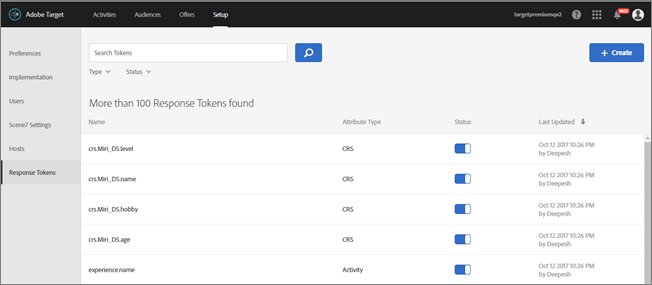
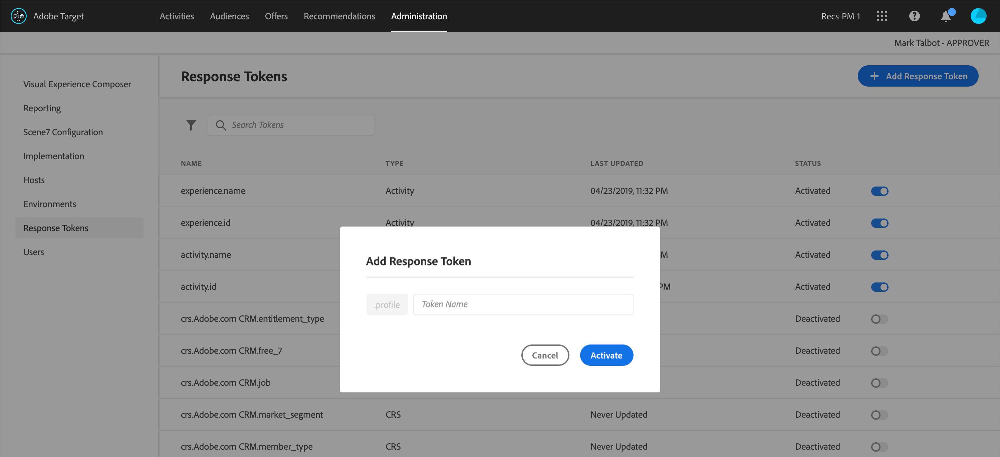

# Response tokens{#response-tokens}

Response tokens let you automatically output Target-specific information (campaign details, user profile information, geo information, and so forth) to use in debugging or integrating with 3rd-party systems (such as Clicktale)

Adobe Target Classic had a feature called server plug-ins that lets you send JavaScript that executes with an mbox response. Response tokens are similar to plug-ins: they let you surface Target-specific information to use elsewhere. Response tokens let you choose which variables to leverage and then enable them to be sent as part of an mbox response. In order to do so, you simply enable a variable using the switch and the variable will be sent with mbox responses, which can be validated in network calls. Response tokens work in Preview mode as well.

A key difference between plug-ins and response tokens is that while plug-ins deliver JavaScript to the page that would execute upon delivery, response tokens deliver an object that can then can be read and acted upon using event listeners. For more information, see [at.js custom events](/help/c-implementing-target/c-implementing-target-for-client-side-web/atjs-custom-events.md) and the examples later in this article. The response tokens approach is safer and should allow for easier development and maintenance of 3rd-party integrations.

>[!NOTE]
>
>Response tokens are available with [!DNL at.js] 1.1 or later. Response tokens are not supported with mbox.js.

| Target Library in Use | Suggested Actions |
|--- |--- |
|at.js|Ensure that you are using at.js version 1.1 or later. For information about downloading the latest version of at.js, see [Download at.js](/help/c-implementing-target/c-implementing-target-for-client-side-web/how-to-deployatjs/implementing-target-without-a-tag-manager.md). For information about new functionality in each version of at.js, see [at.js Version Details](/help/c-implementing-target/c-implementing-target-for-client-side-web/target-atjs-versions.md).<br>Customers using at.js are encouraged to use response tokens and move away from plugins. Some plugins that rely on internal methods that exist in mbox.js, but not in at.js, will be delivered but will fail. For more information, see [at.js Limitations](/help/c-implementing-target/c-implementing-target-for-client-side-web/t-mbox-download/c-target-atjs-implementation/target-atjs-limitations.md).|
|mbox.js|Plugins will continue to be supported and delivered when using mbox.js.<br>However, customers using mbox.js and plugins are encouraged to move to at.js and response tokens. For information about the advantages of using at.js over mbox.js, see [at.js Frequently Asked Questions](/help/c-implementing-target/c-implementing-target-for-client-side-web/c-target-atjs-faq/target-atjs-faq.md). For information about migrating, see [Migrate to at.js from mbox.js](/help/c-implementing-target/c-implementing-target-for-client-side-web/t-mbox-download/c-target-atjs-implementation/target-migrate-atjs.md).<br>After the deprecation of Target Classic (November 2017), you might need to contact Client Care to edit or disable existing plugins. You should have audited your plugins before Target Classic was deprecated and disabled unwanted plugins.<br>You cannot create new plugins in Target Standard/Premium. Instead, use response tokens.<br>Old SiteCatalyst plugins should be disabled and replaced with [Adobe Analytics as the Reporting Source for Adobe Target](/help/c-integrating-target-with-mac/a4t/a4t.md) (A4T). The ttMeta plugin should be disabled and replaced with the [Adobe Experience Cloud Debugger](https://chrome.google.com/webstore/detail/adobe-experience-cloud-de/ocdmogmohccmeicdhlhhgepeaijenapj).|

## Using Response Tokens {#section_A9E141DDCBA84308926E68D05FD2AC62}

1. Ensure that you are using [!DNL at.js] version 1.1 or later.

   For more information, see [Download at.js](../c-implementing-target/c-implementing-target-for-client-side-web/how-to-deployatjs/implementing-target-without-a-tag-manager.md#concept_1E1F958F9CCC4E35AD97581EFAF659E2). 

1. In [!DNL Target], click **[!UICONTROL Setup]** > **[!UICONTROL Response Tokens]**.

   

1. Activate the desired response tokens, such as `activity.id`, `option.id`, and so forth.

   The following parameters are available by default:

   | Type | Parameter | Notes |
   |--- |--- |--- |
   |Built-in Profiles|`profile.activeActivities`|Returns an array of the `activityIds` the visitor is qualified for. It increments as users are qualified. For example, on a page with two mboxes delivering two different activities, the second mbox will include both activities.|
   ||`profile.isFirstSession`|Returns "true" or "false."|
   ||`profile.isNewSession`|Returns "true" or "false."|
   ||`profile.daysSinceLastVisit`|Returns the number of days since the visitor's last visit.|
   ||`profile.tntId`|Returns the visitor's tntID|
   ||`profile.marketingCloudVisitorId`|Returns the visitor's Experience Cloud Visitor ID.|
   ||`profile.thirdPartyId`|Returns the visitor's third-party ID.|
   ||`profile.categoryAffinity`|Returns the visitor's favorite category.|
   ||`profile.categoryAffinities`|Returns an array of the visitor's top 5 categories as strings.|
   |Activity|`activity.name`<br>`activity.id`<br>`experience.name`<br>`experience.id`<br>`option.name`<br>`option.id`|Details of the current activity. Note that "option" equals "offer."|
   |Geo|`geo.country`<br>`geo.state`<br>`geo.city`<br>`geo.zip`<br>`geo.dma`<br>`geo.domainName`<br>`geo.ispName`<br>`geo.connectionSpeed`<br>`geo.mobileCarrier`|See [Geo](/help/c-target/c-audiences/c-target-rules/geo.md) for more information about using geo targeting in activities.|

   User profile attributes and Customer Attributes also display in the list.

   >[!NOTE]
   >
   >Parameters with special characters do not display in the list. Only alphanumeric characters and underscores are supported.

1. (Conditional) If you want to use a profile parameter as a response token, but the parameter has not been passed through an mbox call and, thus, has not loaded into the Target UI, you can use the Create button to add the profile to the UI.

   Click **[!UICONTROL Create]**, provide the token name, then click **[!UICONTROL Activate]**.

   

1. Create an activity.

Use [at.js custom events](/help/c-implementing-target/c-implementing-target-for-client-side-web/atjs-custom-events.md) to listen for the mbox response and read the response tokens.

The following code sample adds an [!DNL at.js] custom event handler directly to the HTML page:

```
<html> 
  <head> 
    .... 
    <script src="at.js"></script> 
    <script> 
      document.addEventListener(adobe.target.event.REQUEST_SUCCEEDED, function(e) { 
        console.log("Request succeeded", e.detail); 
      }); 
    </script> 
  <head> 
  <body> 
  ... 
  </body> 
</html>
```

The following instructions show how to add an [!DNL at.js] custom event handler using Adobe Dynamic Tag Manager (DTM):

1. Log in to DTM. 
1. Browse to the appropriate property. 
1. Open Target tool.

   Because DTM doesn't support at.js natively, you'll have to use code editor. 

1. In the code editor, append the following code to [!DNL at.js]:

   ```
   document.addEventListener(adobe.target.event.REQUEST_SUCCEEDED, function(e) { 
     console.log("Request succeeded", e.detail); 
   });
   ```

You can add the following snippet to the library footer [at.js Setup page](../c-implementing-target/c-implementing-target-for-client-side-web/how-to-deployatjs/implementing-target-without-a-tag-manager.md#concept_2FA0456607D04F82B0539C5BF5309812) if you want to have everything is a single file.

```
document.addEventListener(adobe.target.event.REQUEST_SUCCEEDED, function(e) { 
  console.log("Request succeeded", e.detail); 
});
```

## Response Token FAQs {#section_3DD5F32C668246289CDF9B4CDE1F536D}

**Which role is required to activate or deactivate response tokens?**

Response tokens can be activated or deactivated only by users with the Target Admin role.

**What will happen if I am running at.js 1.0 or below?**

You will see the response tokens, but at.js won't be able to use them.

**What will happen if I'm using at.js 1.1 (or later) on some pages on my site but mbox.js on other pages?**

Response tokens will be delivered to the [!DNL at.js] mbox responses, but not to the [!DNL mbox.js] responses.

**Can I have both Target Classic plugins and response tokens active at the same time?**

Plugins and response tokens will be available in parallel; however, plugins will be deprecated in the future.

**Are response tokens delivered through all mbox responses or only through mboxes delivering an activity?**

Response tokens are delivered only through mboxes delivering an activity.

**My Target Classic plugin included JavaScript. How do I replicate its functionality using response tokens?**

When migrating to response tokens, this type of JavaScript will need to be kept in your codebase or tag management solution. You can trigger this code using [!DNL at.js] custom events and pass the response token values to your JavaScript functions.

**Why does my profile/Customer Attributes parameter not display in the response tokens list?**

Target normally refreshes parameters every 15 minute. This refresh is dependent on user action and data is refreshed only when you view the response tokens page. If your parameters do not display in the response token list, it might because Target has not yet refreshed the data.

Also, if your parameter contains anything but non-alphanumeric characters or any symbol other than underscores, the parameter will not appear in the list. Currently, only alphanumeric and underscore characters are supported.

**If I create a response token using a profile script or a profile parameter and then delete that profile script or parameter, will the response token still deliver content?**

Response tokens extract information from user profiles and then deliver that information. If you delete a profile script or parameter, that does not mean that the information has been removed from the user profiles. The user profiles will still have data corresponding to the profile script. The response token will continue delivering the content. For users that do not have that information saved in their profiles, or for new visitors, that token will not be delivered because the data is not present in their profiles.

Target will not toggle the token off automatically. If you delete a profile script and no longer want the token to be delivered, you must toggle off the token yourself.

**I renamed my profile script, but why is the token using that script still active with the old name?**

As mentioned above, response tokens work on the profile information saved for users. Even though you renamed your profile script, the users that have visited your website have the old profile script value saved in their profiles and the token will continue to pick up the old value that is already saved in the user profiles. If you now want to deliver content on the new name, you must toggle off the previous token and toggle on the new token.

**If my attributes have changed, when will they be removed from the list?**

Target performs a refresh of attributes at regular intervals. Any attribute that is not toggled on will be removed during the next refresh. However, if you have an attribute that was toggled on and has been removed (for example, you removed a profile script that was used as a token), that script will not be removed from the attribute list until you toggle it off. Target removes only the toggled-off attributes from the list when they are deleted or renamed.

## Sending Data to Google Analytics via at.js {#section_04AA830826D94D4EBEC741B7C4F86156}

Google Analytics can be sent data via at.js by adding the following code in the HTML page:

```
<script type="text/javascript"> 
  (function(i, s, o, g, r, a, m) { 
    i['GoogleAnalyticsObject'] = r; 
    i[r] = i[r] || function() { 
      (i[r].q = i[r].q || []).push(arguments) 
    }, i[r].l = 1 * new Date(); 
    a = s.createElement(o), 
      m = s.getElementsByTagName(o)[0]; 
    a.async = 1; 
    a.src = g; 
    m.parentNode.insertBefore(a, m) 
  })(window, document, 'script', 'https://www.google-analytics.com/analytics.js', 'ga'); 
  ga('create', 'Google Client Id', 'auto'); 
</script> 
 
<script type="text/javascript"> 
  document.addEventListener(adobe.target.event.REQUEST_SUCCEEDED, function(e) { 
    var tokens = e.detail.responseTokens; 
 
    if (isEmpty(tokens)) { 
      return; 
    } 
 
    var activityNames = []; 
    var experienceNames = []; 
    var uniqueTokens = distinct(tokens); 
 
    uniqueTokens.forEach(function(token) { 
      activityNames.push(token["activity.name"]); 
      experienceNames.push(token["experience.name"]); 
    }); 
 
    ga('send', 'event', { 
      eventCategory: "target", 
      eventAction: experienceNames, 
      eventLabel: activityNames 
    }); 
  }); 
 
  function isEmpty(val) { 
    return (val === undefined || val == null || val.length <= 0) ? true : false; 
  } 
 
  function key(obj) { 
     return Object.keys(obj) 
    .map(function(k) { return k + "" + obj[k]; }) 
    .join(""); 
  } 
 
  function distinct(arr) { 
    var result = arr.reduce(function(acc, e) { 
      acc[key(e)] = e; 
      return acc; 
    }, {}); 
   
    return Object.keys(result) 
    .map(function(k) { return result[k]; }); 
  } 
</script>
```

## Debugging (similar to the ttMeta plugin) {#section_DB3392B6E80749C1BFB520732EDF3BCE}

The equivalent of the ttMeta plugin for debugging purposes can be created by adding following code to HTML page:

```
<script type="text/javascript" > 
  document.addEventListener(adobe.target.event.REQUEST_SUCCEEDED, function (e) { 
    window.ttMETA= typeof(window.ttMETA)!="undefined" ? window.ttMETA : []; 
 
    var tokens=e.detail.responseTokens; 
 
    if (isEmpty(tokens)) { 
      return; 
    } 
     
    var uniqueTokens = distinct(tokens); 
 
    uniqueTokens.forEach(function(token) { 
      window.ttMETA.push({ 
        'CampaignName': token["activity.name"], 
        'CampaignId' : token["activity.id"], 
        'RecipeName': token["experience.name"], 
        'RecipeId': token["experience.id"], 
        'OfferId': token["option.id"], 
        'OfferName': token["option.name"], 
        'MboxName': e.detail.mbox}); 
      console.log(ttMETA); 
    }); 
  }); 
 
  function isEmpty(val){ 
    return (val === undefined || val == null || val.length <= 0) ? true : false; 
  } 
 
  function key(obj) { 
     return Object.keys(obj) 
    .map(function(k) { return k + "" + obj[k]; }) 
    .join(""); 
  } 
 
  function distinct(arr) { 
    var result = arr.reduce(function(acc, e) { 
      acc[key(e)] = e; 
      return acc; 
    }, {}); 
   
    return Object.keys(result) 
    .map(function(k) { return result[k]; }); 
  } 
</script>
```

>[!NOTE]
>
>The ttMETA plug-in is no longer supported. For more information, see [at.js plug-ins](/help/c-implementing-target/c-implementing-target-for-client-side-web/t-mbox-download/c-target-atjs-implementation/target-atjs-plugins.md).

## Training Video: Response Tokens and at.js Custom Events {#section_3AA0A6C8DBD94A528337A2525E3E05D5}

Watch the following video to learn how to use Response Tokens and at.js Custom Events to share profile information from Target to third-party systems.

>[!VIDEO](https://video.tv.adobe.com/v/23253/)
