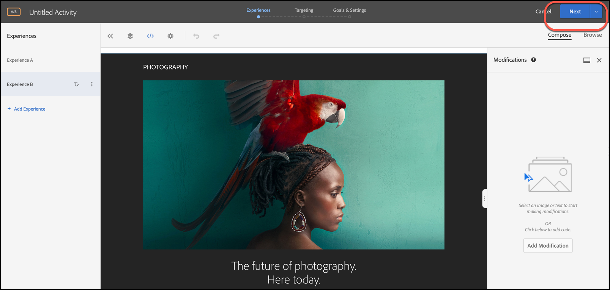
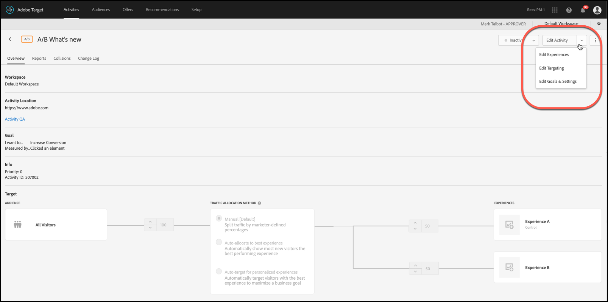

# Edit an activity or save as draft{#edit-an-activity-or-save-as-draft}

Information about the different ways you can edit an existing activity, including saving an activity in draft form.

Target provides various places in the UI where you can edit existing activities. The process varies depending on the method you choose.

## Edit an Activity by Using the Hover Button on the Activities Page {#section_29EE2ECA6B88473A8F9AC5600FFBB174}

1. From the **[!UICONTROL Activities]** page, hover over the activity you want to edit, then click the **[!UICONTROL Edit]** icon.

   

   Target opens the activity and you see the Experiences page (the first step in the three-step guided workflow). A split button displays at the top right fo the page, as shown below:

   

1. Edit the activity, as desired using the split button:

   

    * **Next:** To edit another page in the three-step workflow, click **[!UICONTROL Next]** to advance to the desired step. For example, in the illustration above, clicking [!UICONTROL Next] displays the Targeting step. 
    * **Save & Close:** Make the desired changes on the current step, click the drop-down on the split button, then select **[!UICONTROL Save and Close]** to save your changes and display the activity's [!UICONTROL Overview] page. 
    * **Save:** Make the desired changes on a step, click the drop-down on the split button, then select **[!UICONTROL Save]** to save your changes and remain on that step where you can continue to make changes. Wait for the save to complete before making additional changes. The VEC reloads with the refreshed changes after the save is complete.

## Edit an Activity by Opening the Activity by Clicking Its Name on the Activities Page {#section_176180DAD17E40CEA441903F39E0AA1C}

1. To avoid having to step through the workflow, click the desired activity from the Activities page to open it, then select an option from the **[!UICONTROL Edit Activity]** drop-down list.

   

1. Select the desired option::

    * **Edit Experiences:** Takes you directly to the [!UICONTROL Experiences] page (the first step in the guided workflow). Make your desired changes, then use the split button (explained above) to save the activity.

        * Click **[!UICONTROL Save & Close]** to save your changes and display the activity's Overview page. 
        * Click **[!UICONTROL Save]** to save your changes and remain on that step where you can continue to make changes. Wait for the save to complete before making additional changes. The VEC reloads with the refreshed changes after the save is complete.

    * **Edit Targeting:** Takes you directly to the [!UICONTROL Targeting] page (the second step in the guided workflow). Make your desired changes, then use the split button (explained above) to save the activity.

        * Click **[!UICONTROL Save & Close]** to save your changes and display the activity's Overview page. 
        * Click **[!UICONTROL Save]** to save your changes and remain on that step where you can continue to make changes. Wait for the save to complete before making additional changes. The VEC reloads with the refreshed changes after the save is complete.

    * **Edit Goals & Settings:** Takes you directly to the [!UICONTROL Goals & Settings] page (the final step in the guided workflow). Make your desired changes, then use the split button (explained above) to save the activity.

        * Click **[!UICONTROL Save & Close]** to save your changes and display the activity's Overview page. 
        * Click **[!UICONTROL Save]** to save your changes and remain on that step where you can continue to make changes. Wait for the save to complete before making additional changes. The VEC reloads with the refreshed changes after the save is complete.

## Save an Activity in Draft Form {#section_968CD7A63027432EBD8FAE3A0F7404C3}

When you are creating a new activity that has not yet been saved, or you are editing an activity that was previously saved in draft form, the Save Draft options display in the split button.

You can save an activity in draft mode if the activity setup has been started but it is not ready to run.

1. Create new activity or edit an existing activity that is in draft form. 
1. Select the desired option from the split button:

   

    * **Next:** To edit another page in the three-step workflow, click **[!UICONTROL Next]** to advance to the desired step. 
    * **Save Draft & Close:** Make the desired changes on the current step, click the drop-down on the split button, then select **[!UICONTROL Save Draft and Close]** to save your changes and display the activity's [!UICONTROL Overview] page. 
    * **Save Draft:** Make the desired changes on a step, click the drop-down on the split button, then select **[!UICONTROL Save Draft]** to save your changes and remain on that step.

## Copying/Editing an Activity When Using Workspaces {#section_45A92E1DD3934523B07E71EF90C4F8B6}

A workspace lets an organization assign a specific set of users to a specific set of properties. In many ways, a workspace is similar to a report suite in [!DNL Adobe Analytics].

>[!NOTE]
>
>Workspaces are part of the Properties and Permissions functionality available as part of the [!DNL Target Premium] solution. They are not available in [!DNL Target Standard] without a [!DNL Target Premium] license.

If you are part of a multi-national organization, you might have a workspace for your European web pages, properties, or sites and another workspace for your American web pages, properties, or sites. If you are part of a multi-brand organization, you might have a separate workspace for each of your brands.

For more information about workspaces and the Enterprise User Permissions functionality, see [Enterprise User Permissions](../administrating-target/c-user-management/property-channel/property-channel.md#concept_E396B16FA2024ADBA27BC056138F9838).

If you have Enterprise User Permissions enabled in your environment, you can copy activities to the same workspace or to another workspace. You cannot currently move an activity from one workspace to another. To copy an activity to another workspace, from the [!UICONTROL Activities] page, hover over the activity you want to copy, click the [!UICONTROL Copy] icon, then select the desired workspace from the drop-down list.

Consider the following information when using the copy/edit functionality with workspaces:

* When you copy an activity within same workspace, the first step of the creation flow of the newly copied activity opens in edit mode. 
* When you copy an activity to a different workspace, the activity is copied to the other workspace without opening it in the activity creation flow. After the activity is copied successfully, a message displays indicating that the activity was copied successfully and includes a link to open the new activity.

If your environment does not have the Enterprise User Permissions functionality enabled, all activities open in edit mode before copying. 
