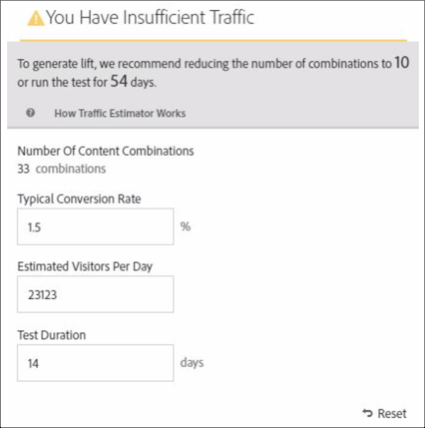

# Create a Multivariate Test{#create-a-multivariate-test}

The [!UICONTROL Visual Experience Composer] (VEC) in [!DNL Target] makes it easy to create your test right on a Target-enabled page and to modify portions of the page within [!DNL Target].

The Target point-and-click editor enables you to pick any location and add multiple offers.

The [!UICONTROL Multivariate Test] (MVT) takes a page-first report. In other words, the test runs on a specific URL, with the experiences you design for that page. 

1. Click **[!UICONTROL Create Activity]** > **[!UICONTROL Multivariate Test]**.

   

   >[!NOTE]
   >
   >The available activity types depend on your Target account. Some activity types might not appear in your list. For example, [!UICONTROL Automated Personalization] is a [Target Premium feature](/help/c-intro/intro.md#premium).
   >
   >For more information about the various activity types available in [!DNL Target] and their differences, see [Activities](../../../c-activities/activities.md#concept_D317A95A1AB54674BA7AB65C7985BA03). See [Target Activity types](/help/c-activities/target-activities-guide.md) to help you decide which activity type best suites your needs.

1. Select **[!UICONTROL Visual (Default)]**, if necessary.

   

   >[!NOTE]
   >
   >For troubleshooting information about the VEC, should you have problems, see [Troubleshooting the Visual Experience Composer](/help/c-experiences/c-visual-experience-composer/r-troubleshoot-composer/troubleshoot-composer.md).
   >
   >The [!UICONTROL Choose Workplace] option in the preceding illustration is a [Target Premium](/help/c-intro/intro.md) feature. Your organization has a Target Standard license if you do not see this option.]

1. (Conditional) If you are a Target Premium customer, [choose a workspace](/help/administrating-target/c-user-management/property-channel/property-channel.md).

1. [Specify the URL](../../../c-activities/c-multivariate-testing/t-create-multivariate-test/url.md#concept_C12E4A85FF3B4E518E3110F6CF1AF9C0) for the page you want to test, then click **[!UICONTROL Next]**.
   
   >[!NOTE]
   >
   >Use a complete URL, including the HTTP or HTTPS at the beginning.

   If a message appears, asking you to enable your browser for mixed content, follow the instructions in the message. After enabling your browser for mixed content, begin again at Step 1.

   The Visual Experience Composer opens.

1. Type a name for the activity.

   

   The following characters are not allowed in an activity name:

   | Character | Description |
   |--- |--- |
   |/|Forward slash|
   |?|Question mark|
   |#|Number sign|
   |:|Colon|
   |=|Equals to|
   |+|Plus|
   |-|Minus|
   |@|At sign|

1. [Create the offers in each location](../../../c-activities/c-multivariate-testing/t-create-multivariate-test/add-offers.md#concept_DCE6B45C30F7419B8EC17AFDEE8D8AA6).

   

   You can add the following kinds of offers:

    * HTML 
    * Image 
    * Text

1. Click **[!UICONTROL Preview]** to [preview your experiences](/help/c-activities/c-multivariate-testing/t-create-multivariate-test/preview-experiences.md).

   

   You can view each experience, and exclude any you do not want to include in your test. To exclude one or more experiences, select the desired checkboxes, then click **[!UICONTROL Exclude]** .

   

1. [Use the Traffic Estimator](../../../c-activities/c-multivariate-testing/t-create-multivariate-test/traffic-estimator.md#task_71AA6922AFD447EA8C5E610A78ABA714) to test the feasibility of your test plan.

   

   The following illustration indicates that the activity has insufficient traffic.

   

   The following illustration indicates that the activity has insufficient traffic.

   

1. Click **[!UICONTROL Next]** to advance to the [!UICONTROL Targeting] page.]

1. Choose the audience and percentage of qualifying visitors that you want to enter the activity.

   

   For example, you might limit entries to 50% of all visitors or 45% of your "Californians" audience.

   >[!NOTE]
   >
   >In addition to selecting an existing audience, you can combine multiple audiences to create ad hoc combined audiences rather than creating a new audience. For more information, see [Combining Multiple Audiences](../../../c-target/combining-multiple-audiences.md#concept_A7386F1EA4394BD2AB72399C225981E5).

1. [Review the test summary](../../../c-activities/c-multivariate-testing/t-create-multivariate-test/test-summary.md#reference_971AB225963A4DC18EEB5B0E20F0A4A7) and make any desired changes, then click **[!UICONTROL Next]**.

1. [Specify the goals and settings](../../../c-activities/c-multivariate-testing/t-create-multivariate-test/goals-and-settings.md#reference_B25389FD6F3A4989801E740364B089CC) for the test.

1. Click **[!UICONTROL Save and Close]** to create the activity.

## Training video: Creating Multivariate Tests (9:25)

This video demonstrates how to plan and create a multivariate test using the Target three-step guided workflow.

* Define and design a multivariate test 
* Create a multivariate test

>[!VIDEO](https://video.tv.adobe.com/v/17395)
