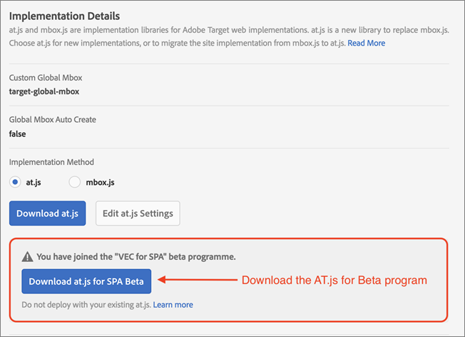
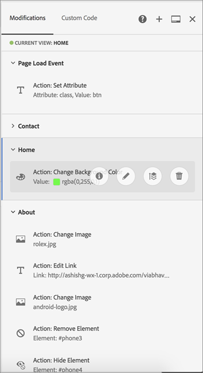

# Single Page App (SPA) Visual Experience Composer{#single-page-app-spa-visual-experience-composer}

The Visual Experience Composer (VEC) for Single Page Apps (SPAs) enables marketers to create tests and personalize content on SPAs in a do-it-yourself fashion without continuous development dependencies. The VEC can be used to create activities on most popular frameworks, such as React and Angular.

>[!NOTE]
>
>The Visual Experience Composer for SPAs is currently offered as a Beta feature available to select customers to obtain feedback to help us improve the feature before making it available to all customers. Please talk to your Customer Success Manager or Adobe Client Care to participate in this Beta program.

## Overview {#section_3E8FBB7381744320AE7F4BB5AEAF4D83}

The existing [Visual Experience Composer](../c-experiences/experiences.md#section_34265986611B4AB8A0E4D6ACC25EF91D) gives marketers a do-it-yourself capability to create activities and personalize experiences that can be dynamically delivered on their web properties via Target's Global Mbox without any developer intervention. With the adoption of popular SPA frameworks the construct of the web has changed and URLs are not longer a reliable method to represent page transitions. With this version of the VEC, Adobe is creating a reliable way to author and deliver Target activities for SPAs. The VEC can be used for creating [A/B Test](../c-activities/t-test-ab/t-test-ab.md#task_05E33EB15C4D4459B5EAFF90A94A7977) and [Experience Targeting](../c-activities/t-experience-target/t-experience-target.md#task_A53DF336CB9F4D7BB87EF2106099EFC4) (XT) activities for SPAs. Support for other activity types will be available in the future.

SPAs, unlike traditional websites, have the following atypical behavior:

* Lazy loading of the webpages—even for the initial page load when the website is first opened in the browser. 
* Transitions between URLs are not always associated with URL changes. 
* Sections on the website can change selectively depending on user interactions on the page.

## Target Views and Single Page Applications {#section_B547F393C72549108382A82A70704839}

The Target VEC 2.0 takes advantage of a new concept of Views: a logical group of visual elements that together make up an SPA experience. An SPA can, therefore, be considered as transitioning through views (instead of URLs) based on user interactions.

**Introducing Target Views**

Let us consider a bank's credit card web app that is built on an SPA framework, such as [!DNL React.js].

The app has the following single pages:

<table id="table_71B5EE5869BD4E16B6A1BE8AF9D7AAAE"> 
 <thead> 
  <tr> 
   <th colname="col1" class="entry"> Page </th> 
   <th colname="col2" class="entry"> Description </th> 
  </tr> 
 </thead>
 <tbody> 
  <tr> 
   <td colname="col1"> <p> /dashboard </p> </td> 
   <td colname="col2"> <p> Gives a summary of the outstanding amount, number of cards, payment due dates, and so forth. Each of these could be components that are rendered on the client side after the page load. </p> </td> 
  </tr> 
  <tr> 
   <td colname="col1"> <p> /current-activity </p> </td> 
   <td colname="col2"> <p> Lists this month's charges on the card. If you have multiple cards, it has a component that allows users to select the card. </p> </td> 
  </tr> 
  <tr> 
   <td colname="col1"> <p> /apply-new </p> </td> 
   <td colname="col2"> <p> Apply for a new credit card. This a multi-stage form, with all components of the form displayed on the same page. Based on the selections in the form components, the application is re-rendered. </p> </td> 
  </tr> 
  <tr> 
   <td colname="col1"> <p> /make-payment </p> </td> 
   <td colname="col2"> <p> Select a mode of payment and process payment to card. </p> </td> 
  </tr> 
 </tbody> 
</table>

The simplest way to understand Target Views is to consider each of these pages as a View. In this scenario, your SPA is built up of four views with each page being a view. If you are using React or Angular Routers, these are routes in your SPA and can be associated with a view each.

With this version of the VEC, Adobe has upgraded Target's client-side library, [!DNL at.js]. The [!DNL at.js] library has a new function, `adobe.target.triggerView(View_Name)`, that allows developers to communicate with Target when a view is rendered and passes a unique name for the view. If you are using an SPA Router, all you need to do is to add this function in your Route Change listener.

**Example of a React.js Implementation**

In the banking app we discussed above, our [!DNL Routes.js] file, with a hash change listener, will look like this:

Route Change Listener:

```
class Routes extends Component { 
    render() { 
        function targetView(){ 
          // Validate if the Target Libraries are available on your website 
          if (typeof adobe != 'undefined' && adobe.target && typeof adobe.target.triggerView === 'function') { 
            // A really simple example where we are assigning the location as the view name 
            adobe.target.triggerView(window.location.hash); 
          } 
        } 
          
        return ( 
            <Router onUpdate={targetView} history={hashHistory}> 
                <Redirect from="/" to="dashboard"></Redirect> 
                <Route path="/" component={Left}> 
                    <Route path="/dashboard" component={Home}/> 
                    <Route path="/current-activity" component={CurrentActivity}/> 
                    <Route path="/apply-new" component={ApplyNew}/> 
                    <Route path="/make-payment" component={MakePayment}/> 
                </Route> 
            </Router> 
  
        ) 
    } 
}
```

But what if you have a complex scenario such as the "New Card Application" page that has a multi-stage form. As a marketer you might want to personalize and test offers as your customers select different options in this multi-stage form. This is a great example of where you can create Dynamic Views. These Dynamic Views can have unique names, depending on the value or state of different form components. If you are using Redux for React or Angular, you can simply create this in your Reducer by combining the form components along with their state values on the page in a sorted sequence and hashing it into a unique string.

This is a one-time setup that enables marketers to create Target activities for SPAs using the VEC.

## Download at.js for the SPA Beta Program {#section_C8A99829F2F742E6984E88A8EA0D64FD}

To download the required [!DNL at.js] version needed to participate in the SPA Beta program:

1. Log in to your Target account. 
1. Click **[!UICONTROL Setup]** > **[!UICONTROL Implementation]**.

   If your account has been enabled for the Beta Program, you will see a [!UICONTROL Download at.js for SPA Beta] button.

   If you are part of the Beta program and don't see this download button, please reach out to your Beta Program contact or your Customer Success Manager.

   

1. Download the [!DNL at.js] file for the SPA Beta program and use this in your website instead of the default [!DNL at.js] file.

   >[!IMPORTANT]
   >
   >Ensure that you don't have both [!DNL at.js] libraries on your page.

## Visual Experience Composer for SPA {#section_1F7816B3D921428982E638B964553A1E}

There are two major improvements in the VEC:

* Modifications Panel 
* Actions

**Modifications Panel**

The Modifications Panel, as shown below, captures the VEC actions created as part of an experience. Notice that the actions are grouped by Target Views. The view named "Page Load Event" is an abstract view whose actions are applied whenever the visitor first visits the website and the page load event is fired for the first time. Actions that need to be applied on shared components, such as header and footer, can be created under this abstract view.



**Actions**

Clicking an action highlights the element on the page where this action will be applied. Each VEC action created under a view has four icons as shown below: Information, Edit, Move to "Page Load" and Delete.


The following table describes each action:

<table id="table_703E3C12D18A44E6A28F0B54247CFD56"> 
 <thead> 
  <tr> 
   <th colname="col1" class="entry"> Page </th> 
   <th colname="col2" class="entry"> Description </th> 
  </tr> 
 </thead>
 <tbody> 
  <tr> 
   <td colname="col1"> <p>Information </p> </td> 
   <td colname="col2"> <p>Displays the details of this action. </p> </td> 
  </tr> 
  <tr> 
   <td colname="col1"> <p>Edit </p> </td> 
   <td colname="col2"> <p>Allows you to edit the properties of this action directly. </p> </td> 
  </tr> 
  <tr> 
   <td colname="col1"> <p>Move to "Page Load" </p> </td> 
   <td colname="col2"> <p>Moves the action to the page-load event. You might accidentally create an action, such as reordering the menu link in the header, under a view that you can move to page load. </p> </td> 
  </tr> 
  <tr> 
   <td colname="col1"> <p>Delete </p> </td> 
   <td colname="col2"> <p>Deletes the activity. </p> </td> 
  </tr> 
 </tbody> 
</table>

## Known Limitations {#section_F5B6506B86B0488FBEC870FB5AA4A435}

* The VEC for SPAs can be used for creating [A/B Test](../c-activities/t-test-ab/t-test-ab.md#task_05E33EB15C4D4459B5EAFF90A94A7977) and [Experience Targeting](../c-activities/t-experience-target/t-experience-target.md#task_A53DF336CB9F4D7BB87EF2106099EFC4) (XT) activities only. Support for other activity types will be available in the future. 
* [Analytics for Target](../c-integrating-target-with-mac/a4t/a4t.md#concept_7540C8C04259434AB6EE33B09F47A1DE) (A4T) reporting will be available in a future Target release.

