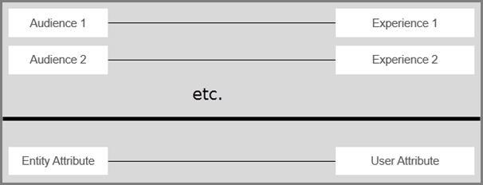
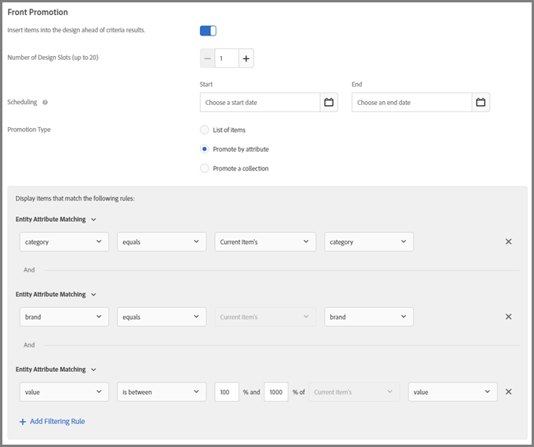
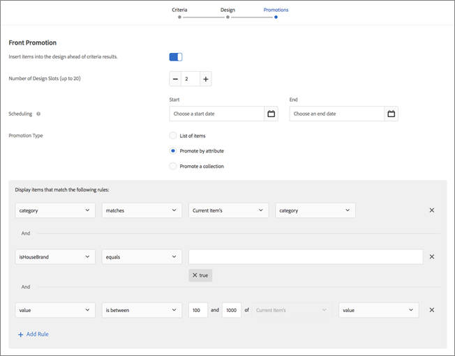
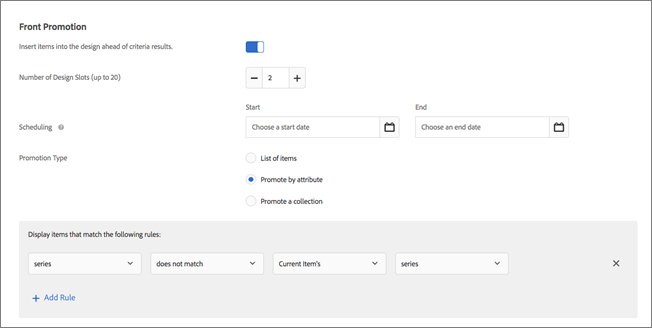
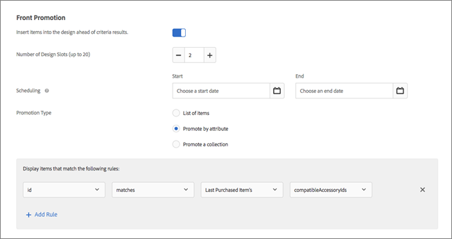
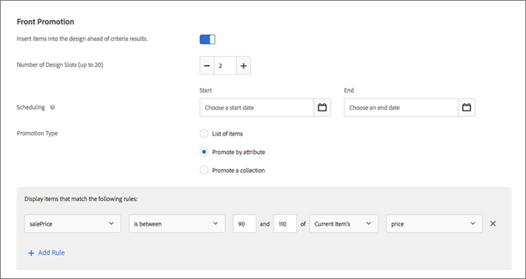

# Use dynamic and static inclusion rules{#use-dynamic-and-static-inclusion-rules}

Information about creating inclusion rules for criteria and promotions, and adding additional dynamic or static filtering rules to achieve better results.

The process for creating and using inclusion rules for criteria and promotions is similar, as are the use cases and examples. Both criteria and promotions and the use of inclusion rules are covered in this topic.

## Adding Filtering Rules to Criteria {#section_CD0D74B8D3BE4A75A78C36CF24A8C57F}

While you are [creating criteria](../../c-recommendations/c-algorithms/t-create-new-algorithm.md#task_8A9CB465F28D44899F69F38AD27352FE), click **[!UICONTROL Add Filtering Rule]** under **[!UICONTROL Inclusion Rules]**.


The available options vary depending on the selected industry vertical and recommendation key.

## Adding Filtering Rules to Promotions {#section_D59AFB62E2EE423086281CF5D18B1076}

While [creating a promotion](../../c-recommendations/t-create-recs-activity/t-adding-promotions.md#task_CC5BD28C364742218C1ACAF0D45E0E14), select **[!UICONTROL Promote by Attribute]**, then click **[!UICONTROL Add Filtering Rule]**.


## Filter Types {#section_0125F1ED10A84C0EB45325122460EBCD}

The following table lists the types of filtering options for both criteria and promotions:

<table id="table_605D70D1824340279387637819AD1A05"> 
 <thead> 
  <tr> 
   <th colname="col1" class="entry"> Type </th> 
   <th colname="col2" class="entry"> Option </th> 
   <th colname="col3" class="entry"> Available Operators </th> 
  </tr> 
 </thead>
 <tbody> 
  <tr> 
   <td colname="col1"> <p><b>Dynamic Filtering</b> </p> </td> 
   <td colname="col2"> <p><b>Entity Attribute Matching:</b> Filter dynamically by comparing a pool of potential recommendations items to a specific item that the users has interacted with. </p> <p>For example, only recommend items that match the current item’s brand. </p> </td> 
   <td colname="col3"> <p>equals </p> <p>does not equal </p> <p>is between </p> <p>contains </p> <p>does not contain </p> <p>starts with </p> <p>ends with </p> <p>value is present </p> <p>value is not present </p> <p>is greater than or equal to </p> <p>is less than or equal to </p> </td> 
  </tr> 
  <tr> 
   <td colname="col1"> </td> 
   <td colname="col2"> <p><b>Profile Attribute Matching:</b> Filter dynamically by comparing items (entities) against a value in the user's profile. </p> <p>For example, only recommend items that match the visitor’s favorite brand. </p> </td> 
   <td colname="col3"> <p>equals </p> <p>does not equal </p> <p>contains </p> <p>does not contain </p> <p>starts with </p> <p>ends with </p> <p>is greater than or equal to </p> <p>is less than or equal to </p> <p>is between </p> </td> 
  </tr> 
  <tr> 
   <td colname="col1"> </td> 
   <td colname="col2"> <p><b>Parameter Matching:</b> Filter dynamically by comparing items (entities) against a value in the request (API or mbox). </p> <p>For example, only recommend content that matches the "industry" page parameter. </p> <p> <p>Important:  If the activity was created before October 31, 2016, its delivery will fail if it uses the "Parameter Matching" filter. To work around this problem: <p> 
       <ul id="ul_0F41B82D21A940CC94A1155D19E890E0"> 
        <li id="li_CBACB09973FB4A65949E34826B7FD72C">Create a new activity and add your criteria in it. </li> 
        <li id="li_9FEF18BCB138488DAC8460764F9A143C">Use a criteria that does not contain the "Parameter Matching" filter. </li> 
        <li id="li_7A20F76AD7C44A19BB9E1516D8663C50">Remove the "Parameter Matching" filter from your criteria. </li> 
       </ul> </p> </p> </p> </td> 
   <td colname="col3"> <p>equals </p> <p>does not equal </p> <p>contains </p> <p>does not contain </p> <p>starts with </p> <p>ends with </p> <p>is greater than or equal to </p> <p>is less than or equal to </p> <p>is between </p> </td> 
  </tr> 
  <tr> 
   <td colname="col1"> <p><b>Filter by Value</b> </p> </td> 
   <td colname="col2"> <p><b>Static Filter:</b> Manually enter one or more static values to filter. </p> <p>For example, only recommend content with an MPAA rating of "G" or "PG." </p> </td> 
   <td colname="col3"> <p>equals </p> <p>does not equal </p> <p>contains </p> <p>does not contain </p> <p>starts with </p> <p>ends with </p> <p>value is present </p> <p>value is not present </p> <p>is greater than or equal to </p> <p>is less than or equal to </p> </td> 
  </tr> 
 </tbody> 
</table>

>[!NOTE]
>
>If you are familiar with how inclusion rules were configured prior to the Target 17.6.1 release (June 2017), you'll notice that some of the options and operators have changed. Only those operators applicable to the selected option display and some operators were renamed ("matches" is now "equals") to be more consistent and intuitive. All existing exclusion rules created prior to this release were automatically migrated into the new structure. No restructuring is necessary on your part.

You can create as many inclusion rules as necessary. The inclusion rules are joined with an AND operator. All rules must be met to include an item in a recommendation.

Dynamic criteria and promotions are much more powerful than static criteria and promotions, and yield better results and engagement. The following examples will give you ideas about how you can use dynamic promotions in your marketing efforts:

**Equals:** Using the "equals" operator in dynamic promotions, when a visitor is viewing an item on your website (such as a product, article, or movie), you can promote other items from:

<ul class="simplelist"> 
 <li> the same brand </li> 
 <li> the same category </li> 
 <li> the same category AND from the house brand </li> 
 <li> the same store </li> 
</ul>

**Does Not Equal:** Using the "does not equal" operator in dynamic promotions, when a visitor is viewing an item on your website (such as a product, article, or movie), you can promote other items from:

<ul class="simplelist"> 
 <li> a different TV series </li> 
 <li> a different genre </li> 
 <li> a different product series </li> 
 <li> a different style ID </li> 
</ul>

**Is Between:** Using the "is between" operator in dynamic promotions, when a visitor is viewing an item on your website (such as a product, article, or movie), you can promote other items that are:

<ul class="simplelist"> 
 <li> more expensive </li> 
 <li> less expensive </li> 
 <li> cost plus or minus 30% </li> 
 <li> later episodes in the same season </li> 
 <li> prior books in a series </li> 
</ul>

## Handling Empty Values when Filtering by Entity Attribute Matching, Profile Attribute Matching, and Parameter Matching {#section_7D30E04116DB47BEA6FF840A3424A4C8}

You can choose several options to handle empty values when filtering by Entity Attribute Matching, Profile Attribute Matching, and Parameter Matching for exit criteria and promotions.

Previously, no results were returned if a value was empty. The "If *x* is Empty" drop-down list lets you choose the appropriate action to perform if the criteria has empty values, as shown in the following illustration:


To select the desired action, hover over the gear icon (), then choose the desired action:

<table id="table_DB442803C2654F18A62517E19B4E3974"> 
 <thead> 
  <tr> 
   <th colname="col1" class="entry"> Action </th> 
   <th colname="col02" class="entry"> Available For </th> 
   <th colname="col2" class="entry"> Details </th> 
  </tr> 
 </thead>
 <tbody> 
  <tr> 
   <td colname="col1"> <p>Ignore this filtering rule </p> </td> 
   <td colname="col02"> <p>Profile Attribute Matching </p> <p>Parameter Matching </p> </td> 
   <td colname="col2"> <p>This is the default action for Profile Attribute Matching and Parameter Matching. </p> <p>This option specifies that the rule is ignored. For example, if there are three filtering rules and the third rule doesn't pass any values, instead of not returning any results, you can simply ignore the third rule with the empty values. </p> </td> 
  </tr> 
  <tr> 
   <td colname="col1"> <p>Do not show any results for this criteria </p> </td> 
   <td colname="col02"> <p>Entity Attribute Matching </p> <p>Profile Attribute Matching </p> <p>Parameter Matching </p> </td> 
   <td colname="col2"> <p>This is the default action for Entity Attribute Matching. </p> <p>This action is how Target handled empty values before the addition of this option: no results will be shown for this criteria. </p> </td> 
  </tr> 
  <tr> 
   <td colname="col1"> <p>Use a static value </p> </td> 
   <td colname="col02"> <p>Entity Attribute Matching </p> <p>Profile Attribute Matching </p> <p>Parameter Matching </p> </td> 
   <td colname="col2"> <p>If a value is empty, you can choose to use a static value. </p> </td> 
  </tr> 
 </tbody> 
</table>

As an example of handling empty values, consider [Scenario 9](../../c-recommendations/c-algorithms/c-use-dynamic-and-static-inclusion-rules.md#section_9873E2F22E094E479569D05AD5BB1D40) below:

## Dynamic Filter Scenarios {#section_9873E2F22E094E479569D05AD5BB1D40}

**Scenario 1:** Instead of matching an item in a catalog to other items in a catalog using a static filter, you can use a dynamic filter to match an item in a catalog to an attribute from the visitor's profile.

For example, you could use the [!UICONTROL Profile Attribute Matching] option to create a rule that recommends items only where the brand equals the value or text stored in `profile.favoritebrand`. With such a rule, if a visitor is looking at running shorts from a particular brand, only recommendations will display that match that user's favorite brand (the value stored in `profile.favoritebrand` in the visitor's profile).

**Scenario 2:** Before Target added the ability to use attribute information from a visitor's profile, if you were setting up job listings that would display only to job seekers from a specific location and with a specific college degree, you would have had to set up many activities with different audiences (one for each city and degree). If you have job listings in many cities, this task became burdensome.

You can now use inclusion rules to match a job seeker's location and degree from his or her visitor's profile to a job listing, as shown in the following example:


The job listing on the left side requires that the visitor is in San Francisco, New York, or Los Angeles ( `entity.jobCity`) and have either a BSCS or MBA degree ( `entity.requiredDegree`).

This job seeker on the right side is in Los Angeles ( `profile.usersCity`) and has an MBA degree ( `profile.degree`).

Using a dynamic filter with profile attribute matching, you can create the filter displayed in the lower portion of the above illustration that will recommend only job listings that this visitor qualifies for based on location and degree.

The criteria for these filters are as follows:

```
entity.jobCity - equals - the value/text stored in - profile.usersCity
```

and

```
entity.requiredDegree - equals - the value/text stored in - profile.degree
```

Dynamic filters using profile attribute matching allows you to do more with fewer activities, as shown below:


The diagram in the top of the above illustration depicts how dynamic filters using profile attributes work. You can create one audience that uses criteria (in the above scenario, city and degree) to display a job listing that the visitor qualifies for. This filter works for an almost infinite number of possibilities regarding location and degree.

The diagrams in the bottom of the illustration depicts just two of the many audiences that you would have had to set up if you are not configuring a criteria or promotion with dynamic filters using profile attributes. You would have to set up a different audience for each city and for each degree. The number of needed audiences could quickly become unmanageable, especially if you had a large number of job listings in various cities.

Without using profile attributes, your audiences and experiences would look like the top half of the following illustration, but with additional audience/experience pairs for every conceivable scenario.



Dynamic filters using profile attributes that match entity attributes to user attributes let you set up one audience that dynamically, on the fly, delivers the desired experience, as shown in the bottom half of the above illustration.

As long as you have the required information embedded into each job listing and you are capturing the required information within the user profiles, creating and managing audiences and experiences is greatly simplified.

**Scenario 3:** A sports company wants to show articles on its website for teams that a person cares about. Every article could have a field with `entity.featuredTeams` that includes all teams discussed in the article. Every profile attribute could have a list of favorite teams the user is "subscribing" to.

A sample inclusion rule would could look like the following:

Include only when `entity.featuredTeam` has one or more values that match `profile.favoriteTeams`.

When considering the following examples, remember that at least one entire string value needs to match (completely). There is no match if none of the strings match. Note the de-coupling of the entity attributes in the matching rules. This allows for matching between different metadata fields.

<table id="table_E5EB0F6494804183B358E5F17D0B4BCC"> 
 <thead> 
  <tr> 
   <th colname="col1" class="entry"> Examples/Descriptions </th> 
  </tr> 
 </thead>
 <tbody> 
  <tr> 
   <td colname="col1"> 
    <codeblock>
      "entity.featuredTeam"&amp;nbsp;-&amp;nbsp;"Athletics,Red&amp;nbsp;Sox"&amp;nbsp;equals&amp;nbsp;"profile.favoriteTeams"&amp;nbsp;-&amp;nbsp;"Athletics" 
    </codeblock> <p>Considered a match because "Athletics" equals, even though "Red Sox" does not. </p> </td> 
  </tr> 
  <tr> 
   <td colname="col1"> 
    <codeblock>
      "entity.featuredTeam"&amp;nbsp;-&amp;nbsp;"Athletics,Red&amp;nbsp;Sox"&amp;nbsp;equals&amp;nbsp;"profile.favoriteTeams"&amp;nbsp;-&amp;nbsp;"Athletics,Red&amp;nbsp;Sox" 
    </codeblock> <p>Considered a match because both "Athletics" and "Red Sox" equals, although it is not necessary for both teams to match. </p> </td> 
  </tr> 
  <tr> 
   <td colname="col1"> 
    <codeblock>
      "entity.featuredTeam"&amp;nbsp;-&amp;nbsp;"Athletics"&amp;nbsp;equals&amp;nbsp;"profile.favoriteTeams"&amp;nbsp;-&amp;nbsp;"Athletics,Red&amp;nbsp;Sox" 
    </codeblock> <p>Considered a match because "Athletics" equals, even though "Red Sox" does not. </p> </td> 
  </tr> 
  <tr> 
   <td colname="col1"> 
    <codeblock>
      "entity.featuredTeam"&amp;nbsp;-&amp;nbsp;"Athletics"&amp;nbsp;equals&amp;nbsp;"profile.favoriteTeams"&amp;nbsp;-&amp;nbsp;"Athletic" 
    </codeblock> <p>Does not match because "Athletics" (plural) does not equal "Athletic" (singular). </p> <p>Alternatively, you could use "contains" instead of "equals" to make this a match. </p> </td> 
  </tr> 
  <tr> 
   <td colname="col1"> 
    <codeblock>
      "entity.featuredTeam"&amp;nbsp;-&amp;nbsp;"Athletic"&amp;nbsp;equals&amp;nbsp;"profile.favoriteTeams"&amp;nbsp;-&amp;nbsp;"Athletics" 
    </codeblock> <p>Does not match because "Athletic" (singular) does not equal "Athletics" (plural). </p> <p>Alternatively, you could use "starts with" instead of "equals" to make this a match. </p> </td> 
  </tr> 
 </tbody> 
</table>

**Scenario 4:** The following illustration demonstrates how to use the "equals" and "is between" operators to promote more expensive items that are from the same category and the same brand. For example, a sporting apparel company can promote more expensive running shoes in an effort to up-sell a visitor looking at running shorts.



The following rules are used in this example:

```
category - equals - current item's - category 
And 
brand - equals - current item's - brand 
And 
value - is between - 100% and 1000% of - current item's - value
```

>[!NOTE]
>
>You cannot change the key in a dynamic promotion with multiple rules (the third drop-down list in the first two rules labeled "Current Item's" in the illustration).

**Scenario 5:** The second illustration demonstrates how to use the "equals" and "is between" operators to promote more expensive items that are from the same category, the same brand, and the house brand. For example, an office supply company can promote more expensive toner cartridges, of both the same brand and the company's house brand, in an effort to up-sell a visitor looking at printers.



The following rules are used in this example:

```
category - equals - current item's - category 
And 
IsHouseBrand - equals - true 
And 
value - is between - 100% and 1000% of - current item's - value
```

Notice that this example uses two dynamic rules and one static rule.

**Scenario 6:** The third illustration demonstrates how to use the"does not equal" operator to promote a series that does not equal the series that the visitor is currently viewing. For example, a media website could promote a television series that is different than the series the visitor is currently viewing.



The following rule is used in this example:

```
series - does not equal - current item's - series
```

**Scenario 7:** The fourth illustration demonstrates how to promote compatible accessory items for the visitor's last-purchased item. For example, if someone purchased a new TV, you could dynamically promote an HDMI cable.



The following rules are used in this example:

```
id - equals - last purchased item's - compatibleAccessoryids
```

**Scenario 8:** The next illustration demonstrates how to promote items that are on sale for between 90 and 110 percent of the item the visitor is currently viewing. For example, if someone is looking at a TV, you could dynamically promote similar TVs that are on sale in approximately the same price range.



The following rules are used in this example:

```
salesPrice - is between - 90% and 110% of - current item's - price
```

**Scenario 9:** Consider the following scenario for a sport's media site about how to handle empty values, as explained in [Handling Empty Values when Filtering by Entity Attribute Matching, Profile Attribute Matching, and Parameter Matching](../../c-recommendations/c-algorithms/c-use-dynamic-and-static-inclusion-rules.md#section_7D30E04116DB47BEA6FF840A3424A4C8) above:

The content team for a sport's media site wants to show content to users for their favorite teams. If a user has specified a favorite team, the team wants to show media for that team. If a user has not specified a favorite team, the team can use the "If *x* is Empty" drop-down list to do one of the following:

* Use the [!UICONTROL Ignore This Filtering Rule] option to ignore the team filter altogether, as shown in the following illustration:

  

* Use the [!UICONTROL Do Not Show Any Results for This Criteria] option to not show any media as part of this criteria, as shown in the following illustration:

  

* Use the [!UICONTROL Use a Static Value] option to show media for a specific team (49ers, for example), as in the following illustration:

  

## Caveats {#section_A889FAF794B7458CA074DEE06DD0E345}

>[!IMPORTANT]
>
>Different data type attributes might not be compatible in dynamic criteria or promotions during runtime with the "equals" and "does not equal" operators. You should use Value, Margin, Inventory, and Environment values wisely on the right hand side if the left hand side has predefined attributes or custom attributes.


The following table shows effective rules and rules that might not be compatible during runtime:

<table id="table_CDDDC41C55EA4D23A910CC0747F31435"> 
 <thead> 
  <tr> 
   <th colname="col1" class="entry"> Compatible Rules </th> 
   <th colname="col2" class="entry"> Potential Incompatible Rules </th> 
  </tr> 
 </thead>
 <tbody> 
  <tr> 
   <td colname="col1"> <p> <span class="codeph"> value - is between - 90% and 110% of current item's - salesValue </span> </p> </td> 
   <td colname="col2"> <p> <span class="codeph"> salesValue - is between - 90% and 110% of current item's - value </span> </p> </td> 
  </tr> 
  <tr> 
   <td colname="col1"> <p> <span class="codeph"> value - is between - 90% and 110% of current item's - value </span> </p> </td> 
   <td colname="col2"> <p> <span class="codeph"> clearancePrice - is between - 90% and 110% of current item's - margin </span> </p> </td> 
  </tr> 
  <tr> 
   <td colname="col1"> <p> <span class="codeph"> margin - is between - 90% and 110% of current item's - margin </span> </p> </td> 
   <td colname="col2"> <p> <span class="codeph"> storeInventory - equals - current item's - inventory </span> </p> </td> 
  </tr> 
  <tr> 
   <td colname="col1"> <p> <span class="codeph"> inventory - equals - current item's - inventory </span> </p> </td> 
   <td colname="col2"> </td> 
  </tr> 
 </tbody> 
</table>

