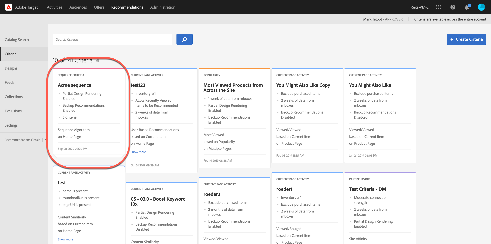

#  Create criteria sequences{#create-criteria-sequences}

Use sequences of up to five criteria to exercise greater control of the items that appear in your Recommendations activities.

>[!NOTE]
>
>Criteria sequences cannot be used with [!UICONTROL Recommendations] activities created before the October 2016 Release of [!DNL Target Premium].

To create a criteria sequence, you must first create the criteria you want to include in the sequence. See [Creating Criteria](../../c-recommendations/c-algorithms/t-create-new-algorithm.md#task_8A9CB465F28D44899F69F38AD27352FE) for more information.

By using a criteria sequence, you can provide additional targeted recommendations, instead of using more generic backup recommendations, when a criteria doesn't return enough results to fill your design. Typically, a criteria sequence will proceed from more specific targeting, which may return fewer results, to more general targeting, which usually returns more results.

For example, a product page criteria sequence might follow this order:

1. Based on current item, from same brand 
1. Based on current item, from all brands 
1. Based on content similarity 
1. Based on top sellers 
1. Based on most-viewed items across the site

A home page criteria sequence might follow this order:

1. Based on visitor's last purchase 
1. Based on visitor's favorite item 
1. Based on visitor's favorite category 
1. Based on top sellers 
1. Based on most-viewed across site

There are multiple ways to reach the [!UICONTROL Create Criteria Sequence] screen. Some screen options vary depending on how you reach the screen.

* When you are creating a [!UICONTROL Recommendations] activity, click **[!UICONTROL Create New]** > **[!UICONTROL Create Criteria Sequence]** on the [!UICONTROL Select Criteria] screen. You will have the option to save your new criteria sequence for use with other [!UICONTROL Recommendations] activities. 
* When you are editing a [!UICONTROL Recommendations] activity, click in a [!UICONTROL Recommendations Location] box on your page, and select **[!UICONTROL Change Criteria]**. On the [!UICONTROL Select Criteria] screen, click **[!UICONTROL Create New]** > **[!UICONTROL Create Criteria Sequence]**. You will have the option to save your new criteria for use with other [!UICONTROL Recommendations] activities. 
* On the **[!UICONTROL Recommendations]** > **[!UICONTROL Criteria]** library screen, click **[!UICONTROL Create Criteria]** > **[!UICONTROL Create Criteria Sequence]**. Criteria you create here are automatically made available for all [!UICONTROL Recommendations] activities.

1. Click **[!UICONTROL Create Criteria]** or **[!UICONTROL Create New]**.

   

1. Select **[!UICONTROL Create Criteria Sequence]**.

   

1. Type a **[!UICONTROL Name]** for the sequence.

   This is the "internal" name used to describe the criteria sequence. Visitors to your site will not see this name. 
1. Type a public-facing **[!UICONTROL Generic Display Title]** to appear on the page if multiple criteria in the sequence are used to fill the [!UICONTROL Recommendations] design.

   For example, you might want to replace "Customers who viewed this also viewed..." with "Recommended for You" if the design might include items based on more than one [!UICONTROL Recommendations] key. 
1. Type a short **[!UICONTROL Description]** of the criteria sequence.

   The description should help you identify the criteria sequence, and might include information about its purpose. 
1. Select an **[!UICONTROL Industry Vertical]**.

   Your default industry vertical appears automatically. 
1. Select a **[!UICONTROL Page Type]**.

   You can select multiple page types.

   Together, the industry vertical and page types are used to categorize your saved criteria sequence, making it easier to reuse sequences for other [!UICONTROL Recommendations] activities. 
1. Set your **[!UICONTROL Content]** rules.

   When you create a criteria sequence, backup recommendation and partial design rendering settings are ignored for the individual criteria the make up the sequence. To use backup recommendations and partial design rendering you must enable them for the sequence. Select the appropriate toggles. If you choose to allow backup recommendations, you can also choose whether to apply inclusion rules to the backups. 
1. Set the sequence order.

1. Click **[!UICONTROL Add Criteria]**. 
1. On the Add Criteria screen, select a criteria. 
1. Click **[!UICONTROL Add]**.

   You can add up to five criteria to a sequence. 
1. Click **[!UICONTROL Save]**.

   The criteria sequence will appear in the Criteria list.

   

   For more information about recommendation logic options, see [Criteria](../../c-recommendations/c-algorithms/c-algorithms.md#concept_4BD01DC437F543C0A13621C93A302750). 
