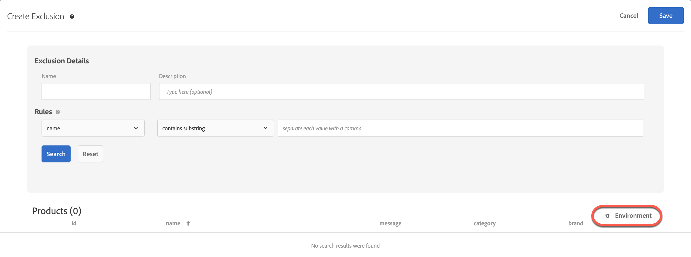

# Exclusions{#exclusions}

Create an exclusion list to prevent items from being recommended.

>[!IMPORTANT]
>
>Static and dynamic exclusion rules are powerful features that can help you with your marketing efforts. For detailed information, examples, and use-case scenarios, see [Use Dynamic and Static Inclusion Rules](../../c-recommendations/c-algorithms/c-use-dynamic-and-static-inclusion-rules.md#concept_4CB5C0FA705D4E449BD0B37B3D987F9F).

1. Click **[!UICONTROL Recommendations]** > **[!UICONTROL Exclusions]** to display the list of existing exclusions.

   >[!NOTE]
   >
   >The "Number of Items" reported for each exclusion on the [!UICONTROL Exclusions] list view is the number of products matching the rules for that exclusion within the configured default Recommendations host group (environment). See [Settings](../../c-recommendations/c-plan-implement.md#concept_C1E1E2351413468692D6C21145EF0B84) to change the default host group.

   

1. Click **[!UICONTROL Create Exclusion]**.

   

1. Type an exclusion **[!UICONTROL Name]** and enter an optional description.
1. Use the rule builder to create your exclusions.

   Select a parameter in the Rules list, select an operator, and then enter one or more values to identify the products. Separate multiple values with commas. 
1. Click **[!UICONTROL Save]**.

   You can also create exclusions using Advanced Search on the Catalog Search page ( [!UICONTROL Recommendations] > [!UICONTROL Catalog Search] > [!UICONTROL Advanced Search]). After creating a search using "id > contains," for example, you can then click [!UICONTROL Save As] > [!UICONTROL Exclusion]. 
>
>>[!IMPORTANT]
>>
>>The Advanced Search functionality is case-insensitive; however, products returned at the time of delivery are based on case-sensitive search. This mismatch might lead to confusion. Ensure that you consider case-sensitivity when you create exclusions based on results using the Advanced Search functionality. For example, if you perform a search for "Holiday," that initial search lists results containing "Holiday" and "holiday." If you then create an exclusion with the intent to exclude products containing "holiday," only products containing "holiday" are excluded. Products containing "Holiday" are not excluded. 
>

