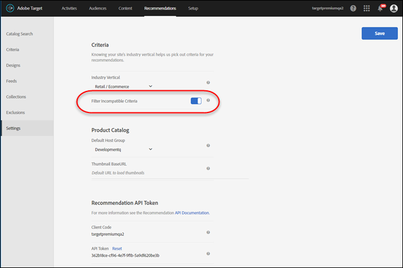
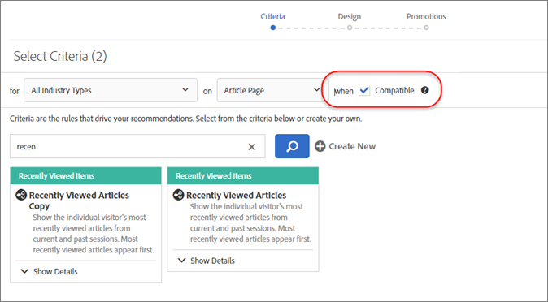

#  Recommendations FAQ{#recommendations-faq}

List of frequently asked questions (FAQs) about Recommendations activities.

## What is the expected ingest timeframe for Recommendations operations?

The following changes should be reflected within approximately 60 minutes:

* Item attributes that are returned in the Design template.
* Item attributes used in global exclusion rules that prevent the item from being included in returned recommendations.
* Item attributes used in inclusion rules within the criteria that impact whether the item is included or excluded in returned recommendations.

The following changes are not reflected until the next algorithm run (12-24 hrs):

* Item attributes used in the Collection rules used for the activity.
* Item attributes used in a promotion based on an attribute or collection associated with the activity.
* Item category that the item appears in for a "Current Category" or "Favorite Category" in the Top Sellers or Most Viewed algorithm.
* Ranking of recommended items when the attribute changed is a custom attribute that is used as the custom key for an algorithm.
* Ranking of recommended items based on the changed attribute(s) when the recommendation logic is "Items with similar attributes," when "Content Similarity" weighting factors are used, or when "Attribute Weighting" factors are used.

## What should I do if special characters are breaking my array? {#section_D27214116EE443638A60887C7D1C534E}

Use escaped values in JavaScript. Quotation marks ( " ) can break the array. The following code snippet is an example of escaped values:

```
#set($String='') 
#set($escaper=$String.class.forName('org.apache.commons.lang.StringEscapeUtils')) 
<script type="text/javascript"> 
console.log("$escaper.escapeJavaScript($entity1.name)") 
console.log("$escaper.escapeJavaScript($entity2.name)") 
console.log('$escaper.escapeJavaScript($entity3.name)') 
names.push("$escaper.escapeJavaScript($entity4.name)") 
</script>
```

## Why aren't all criteria, including custom criteria, available for selection when creating a Recommendations activity? {#section_B2265AC8B8A94E0298D495A05C5D817F}

The available criteria is based on the current category. When you are creating recommendations offers, the algorithm picker displays criteria on the basis of category Id.

If the location on which you're applying this criteria doesn't contain the category Id, certain criteria is not available in the algorithm picker.

If you use a location where category Id is present in the mbox, the criterial picker will contain all applicable criteria.

Target has a [Filter Incompatible Criteria](../../c-recommendations/plan-implement.md#concept_C1E1E2351413468692D6C21145EF0B84) setting to control intelligent filtering of the algorithm picker.

>[!NOTE]
>
>This setting applies to activities created in the Visual Experience Composer (VEC) only. This setting does not apply to activities created in the Form-Based Experience Composer (Target does not have location context).

To access the [!UICONTROL Filter Incompatible Criteria] setting, click [!UICONTROL Recommendations] > [!UICONTROL Settings]:



If the [!UICONTROL Filter Incompatible Criteria] setting is NOT enabled, Target does not filter algorithms in the Algorithm Picker and all algorithms are displayed.

If the [!UICONTROL Filter Incompatible Criteria] setting is enabled, in VEC activities, Target reads entityId and category Id from the selected location and then displays algorithms based on `currentItem|currentCategory` (if respective values are present on that location). As a result, only compatible algorithms for the selected location are shown in the algorithm picker, by default.

If the [!UICONTROL Filter Incompatible Criteria] setting is enabled, you can still view non-compatible algorithms by deselecting the [!UICONTROL Compatible] checkbox while selecting criteria.



The following list contains special cases in which Target does not display the [!UICONTROL Compatible] checkbox:

* Both entityId and category Id are present on the location, then nothing is being filtered. 
* You are using [!DNL mbox.js] version 55 or earlier. 
* No mbox call is being fired from the page (!config.isAutoCreateGlobalMbox && !config.isRegionalMbox) 
* Target parameters are not defined.

## What should I do if a collection in Recommendations goes to zero (0)? {#section_E2DB2FE67CF24EEC81412BFF3FA6385D}

Consider the following information if you see a collection go to zero that previously was not at zero:

* You can re-save the collection and see if it updates the number. Note that by resaving, the collection will re-run all algorithms that are using that collection. 
* Are you looking at the right environment? Go to [!DNL /target/products.html#recsSettings] to double check (as shown below).

  

* Is your index up to date? Go t o [!DNL /target/products.html#productSearch] and check how many hours old the index is (for example, “Indexed 3 hour(s) ago”). You can refresh the index as needed. 
* Did you change something in the feed or the data layer that resulted in your entities no longer matching the collection rules? Make sure your CASE matches (case-sensitive). 
* Did your feed run successfully? Did someone change the FTP directory, password, etc? 
* Target does its best to make updates to the delivery (on the customer’s page/app) happen as quickly as possible. Yet, we also have to provide some representation in the UI for the marketer. We don’t necessarily delay delivery updates to wait for the UI updates to be in sync. You can use [mboxTrace](https://marketing.adobe.com/resources/help/en_US/target/target/c_content_trouble.html#) to see what is in the system at the time a request comes in.

## What's the difference between general Attribute Weighting and Content Similarity-specific attribute weighting? {#section_FCD96598CBB44B16A4C6C084649928FF}

Attribute weighting exists in two forms: "standard attribute weighting" and "content similarity attribute weighting."

"Standard attribute weighting" applies to most, if not all, criteria types (not just Content Similarity).This type of weighting gives more weight to certain attribute values. In the following example, Nike products will get a bump in the output recommendations.


"Content similarity attribute weighting” applies to Content Similarity criteria only.

This type of weighting is more dynamic, and is based on the current “recommendation key” (the currently viewed item). In the following example (brand x 16), if a visitor were viewing Nike sneakers, that visitor is more likely to be recommended other Nike products (not necessarily only sneakers) rather than competitors’ sneakers. If a visitor were viewing Adidas sneakers, he or she is more likely to be recommended Adidas products.


## Why is Target sometimes unable to show recommendations? {#section_DB3F40673AED42228E407C05437D99E9}

Target sometimes cannot show recommendations due to the low number of available recommendations.

The number of values generated per criteria is 5 times the number of entities specified in the design. Runtime filtering (for example, inventory, mbox attribute matching) is applied after the 5x values are generated, so it is possible end up with fewer than 5x values at delivery time. To mitigate this situation, increase the number of entities in the design by hiding additional entities.

The following JavaScript can be used at the beginning of the design to increase the number of requested entities. In this example, the requested entity count would be 50 (5x10).

```
#foreach($entity in $entities) 
 #if( $foreach.count > 10 ) 
  #break 
 #end 
 #set ($foo = $entity.id) 
#end 
```

## What is the size limit of an API call for insert/update products? Can I update 50,000 products in one call using the API instead of a feed? {#section_434FE1F187B7436AA39B7C14C7895168}

Target imposes a 50 MB post limit at the application level; however, that is only when you pass the `application/x-www-form-urlencoded` content type header.

You could certainly try to send 50,000 products in a single call. If it fails, you should break it up into batches. We usually recommend that customers break their calls into 5,000 or 10,000 product batches to decrease the likelihood of a timeout due to system load.

## Do I need to specify the mbox name when creating Recommendations criteria, promotions, or template testing rules? {#section_FFA42ABCC5954B48A46526E32A3A88A2}

When creating a Recommendations criteria, promotions, or template testing rule based on an mbox parameter, `mboxParameter` no longer prompts you for `mboxName`. mbox name is now optional. This change lets you use parameters from multiple mboxes or reference a parameter that has not yet been recorded on the edge.

To select the desired parameter:

* While creating a new criteria, promotion, or template testing rule, select a parameter name from the list, start typing the first characters of the desired parameter name, or type the full name of the desired parameter name. 
* If you remember the mbox name, but not the parameter name, use the checkbox to filter on a known mbox passing the desired parameter.

Using either method, there is no link between the mbox and the parameter. The criteria, promotion, or template testing rule will work on the basis of parameter across all mboxes that pass that parameter.

If you edit an existing criteria, promotion, or template testing rule, the filtering criteria displays with the mbox name that was supplied during creation.

## Why can't I save my legacy Recommendations activity after defining a new audience? {#section_1E47C40B1FE7479BAC3EE0F50CE7C2C4}

Ensure that the audience has a unique name. If you gave the audience the same name as an existing audience, you cannot save your legacy Recommendations activity (a Recommendations activity created before October 2016).

## What is the maximum size of a CSV file for a feed upload? {#section_20F1AF4839A447B9889B246D6E873538}

There is no hard limit on the number of rows or file size for a feed's CSV file upload. However, as a best practice, we recommend limiting the CSV file size to 1 GB to avoid failures during the file upload process. If the size of the file exceeds 1 GB, it should ideally be split into multiple feed files. The maximum number of custom attribute columns is 100 and custom attributes are limited to 4096 characters. Additional limits on the length of required columns are available on the [Target Limitations page](../../r-troubleshooting-target/target-limits.md#reference_BEFE60C3AAA442FF94D4EBFB9D3CC9B1).

## Can I dynamically exclude an entity?

In the query string, you can pass entity IDs for entities that you want to exclude from your recommendations. For example, you might want to exclude items that are already in the shopping cart.

To enable the exclusion functionality, use the `excludedIds` mbox parameter. This parameter points to a list of comma-separated entity IDs. For example, `mboxCreate(..., "excludedIds=1,2,3,4,5")`. The value is sent when requesting recommendations.

>[!NOTE]
>
>If too many entities are excluded, recommendations behave as if there aren't enough entities to fill the recommendation template.

To excluded `entityIds`, append the `&excludes=${mbox.excludedIds}` token to the offer content url. When the content url is extracted, the required parameters are substituted using current mbox request parameters.

By default, this feature is enabled for newly created recommendations. Existing recommendations must be saved to support Dynamically Excluded entities.
