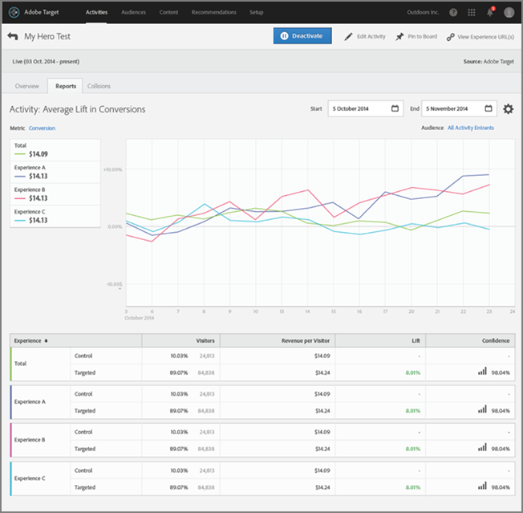

# Auto-Target Summary report{#auto-target-summary-report}

Information about how to interpret the Auto-Target Summary report.

The following illustration shows what a typical summary report looks like when using Auto-Target:

Some tips and considerations as you interpret your Auto-Target reports:

* The various rows in the table help understand activity performance.

    * The top two rows in the table on the reporting page show the results of an A/B test between the visitors who were assigned to the control (i.e. randomly served experiences) and the visitors who were assigned to the personalization algorithm. This information can be used to measure how the personalization algorithm performed compared to the randomly-served control. 
    * The remaining rows show experience-level results. For each experience, there is a comparison between the average response of visitors who were shown that experience as a randomly served control, and the average response of visitors who were shown the experience using the personalization algorithm.

* The green check icon next to each experience in the report indicates that a personalized machine-learning model has been generated for that experience. The clock icon indicates that not enough traffic has been served to build the model.

    * Because the model is built per experience, it is possible to see a model for some experiences with a green check and others with a clock icon. 
    * In this case, to increase the speed of the activity having models built for all experiences, additional traffic is sent to experiences with unbuilt models. 
    * There must be at least two experiences with built models (green checkmark) in order for personalization to begin.

* Comparing the conversion rate of experience A with that of experience B is not the right comparison in Auto-Target. The question is whether experience A performs better when served in an intelligent way versus a random way (in other words, versus the control). Marketers should also use caution about interpreting the lifts of individual experiences because the personalization algorithm is attempting to optimize for the success metric over the entire activity, not over each individual experience. 
* Experiences with the highest lift can be understood as having the highest differentiation within the population. That is the algorithm has found a segment that likes that particular experience the most.

