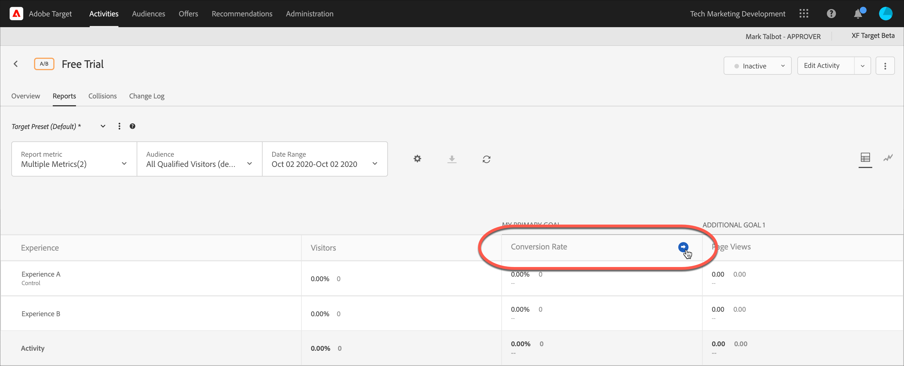

# View multiple metrics in a report{#view-multiple-metrics-in-a-report}

You can select multiple metrics to view in an [!DNL Adobe Target] report.

Be aware of the following information as you work with multiple metrics in reports:

* The ability to view multiple metrics is available for [A/B Test](/help/c-activities/t-test-ab/test-ab.md), [Auto-Allocate](/help/c-activities/automated-traffic-allocation/automated-traffic-allocation.md), [Auto-Target](/help/c-activities/auto-target/auto-target-to-optimize.md), and [Experience Targeting](/help/c-activities/t-experience-target/experience-target.md) (XT) activities only. 
* You cannot add more than 20 metrics to a report for an activity that uses [Analytics for Target](/help/c-integrating-target-with-mac/a4t/a4t.md) (A4T). You can add as many metrics as you have in your activity to reports for activities that do *not* use A4T. 
* You cannot use the [Download option](/help/c-reports/downloading-data-in-csv-file.md) to download reports to CSV if you have selected multiple metrics. You must select a single metric only to enable the [!UICONTROL Download] option. 
* You cannot view multiple metrics for activities created before the July 2015 [!DNL Target] release (July 30, 2015).

**To select multiple metrics to display in the report:**

1. To display a report, click **[!UICONTROL Activities]**, click the desired activity from the list, then click the **[!UICONTROL Reports]** tab. 
1. Click the **[!UICONTROL Report Metric]** drop-down list to display the [!UICONTROL Shown Metrics] and [!UICONTROL Hidden Metrics] lists.

   

   You can use the [!UICONTROL Search] box to quickly find available metrics to add to the [!UICONTROL Shown Metrics] list.

   Note that you can select multiple metrics from both the [!UICONTROL Table View] and [!UICONTROL Graph View] modes of the report. 

1. Hover your mouse pointer over the desired metrics in the [!UICONTROL Hidden Metrics] list, then click **[!UICONTROL Select]** to move them to the [!UICONTROL Shown Metrics] list.

   Or

   Drag and drop the desired metrics from the [!UICONTROL Hidden Metrics] list to the [!UICONTROL Shown Metrics] list.

   There must be at least one metric in the [!UICONTROL Shown Metrics] list.

   You can rearrange the metrics by dragging and dropping them into the desired order in the [!UICONTROL Shown Metrics] list. The selected order will be reflected in the [!UICONTROL Table View] and [!UICONTROL Graph View]. To remove a metric from the [!UICONTROL Shown Metrics] list, hover your mouse pointer over the metric, then click the **X** icon. 

1. Click **[!UICONTROL Save]** when finished. 
1. (Conditional) While viewing the report in the [!UICONTROL Table View], hover your mouse pointer on any metric's column header to display a blue arrow. Click the arrow to expand the table to display the [!UICONTROL Lift] and [!UICONTROL Confidence] for that metric.

   

   You can expand only one metric/column at a time. Click the arrow again to collapse the columns. 

1. (Conditional) While viewing the report in the Graph View, you can select individual metrics to display from the drop-down list:

   

