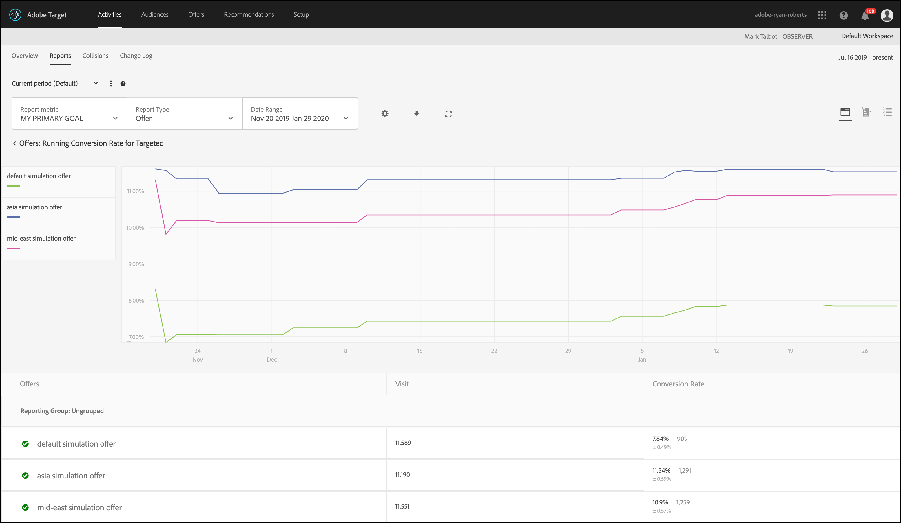

#  Automated Personalization Summary reports

Specialized reports are available to users of [!UICONTROL Automated Personalization] activities in [!DNL Adobe Target].

>[!NOTE]
>
>[!UICONTROL Automated Personalization] is available as part of the [!DNL Target Premium] solution. It is not included with [!DNL Target Standard] without a [Target Premium license](/help/c-intro/intro.md#premium).

1. Click **[!UICONTROL Activities]**, click the desired [!UICONTROL Automated Personalization] activity from the list, then click the **[!UICONTROL Reports]** tab.

   If you have many activities, you can filter the list by selecting [!UICONTROL Automated Personalization] from the [!UICONTROL Type] drop-down list. 

1. (Optional) Click the **[!UICONTROL Download]** icon to download the summary view (for example, comparing Control and Targeted traffic) as broken down by all available success metrics.

[!UICONTROL Automated Personalization] provides the following reports: 

* Activity Level
* Offer Level
* Automated Segments
* Important Attributes

## Activity Level report {#section_6F72FC5C790B4492B3DCECBFFA971337}

The [!UICONTROL Activity Level] report compares the aggregate performance of using an [!UICONTROL Automated Personalization] algorithm to randomly served content (control).

The standard rules of results interpretation for A/B testing still apply, including lift, confidence, trending, duration, and so on. For more information about interpreting results, see [About the Conversion Rate](/help/c-reports/conversion-rate.md#concept_2D9FEDE8F94A485DAC86D611BFBDC844).

## Offer Level report {#section_CAA6409879E349C6906E2BE8156D87A1}

The [!UICONTROL Offer Level] report for the Random Forest experience compares the performance of each algorithm-applied offer to the same randomly served offer (Control). Thus, offers should not be compared against each other in this view.

Click the experience algorithm (Random Forest or control) to view the [!UICONTROL Offer Level] report.

Offers can be shown within report groups, and these report groups can be collapsed and expanded. Select [!UICONTROL Reporting Group] in the drop-down list to view rolled-up information by reporting groups, rather than by offers.

>[!NOTE]
>
>The clock icon indicates that the algorithm model is still building. The check mark icon indicates that the base algorithm has been established.

## Differences in data between the Activity Level and Offer Level reports

**[!UICONTROL Activity Level] report**: Visits recorded on the [!UICONTROL Activity Level] report capture the number of visits to the control experience(s) vs. “targeted” traffic. Targeted traffic includes a mix of exploration traffic and personalized traffic.

**Offer Level report**: Impressions recorded on the [!UICONTROL Offer Level] report capture the number of impressions for each offer. Therefore, in an activity with more than one location, the total number of visits recorded in the [!UICONTROL Offer Level] report across all Reporting Groups is equal to the multiple of the number of visits recorded for Control or Targeted traffic in the [!UICONTROL Activity Level] report times the total number of locations in the activity. Impressions of default content occurring in locations where default content was an available option are recorded in the “Default Content” offer group. Impressions of offers that were unassigned to a reporting group are recorded in the “Ungrouped” offer group.

>[!NOTE]
>
The number of impressions recorded on the [!UICONTROL Offer Level] report might not be an exact integer multiple of the number of visits recorded in the [!UICONTROL Activity Level] report. This is due to minor discrepancies that occur in the capture of reporting data traffic over the internet (typical discrepancy rate is below 5%). Thus, the number of impression will not be an exact multiple when the number of locations available in the activity changed after the activity was activated.

## Automated Segments

Click the [!UICONTROL Automated Segments] icon. This report shows how different visitors respond differently to the offers/experiences in your AP/AT activity. This report shows how different automated segments defined by Target's personalization models responded to the offers/experiences in the activity.

For more information, see [Automated Segments report](/help/c-reports/c-personalization-insights-reports/automated-segments-report.md).

## Important Attributes

Click the [!UICONTROL Important Attributes] icon. This report shows how, in different activities, different attributes are more (or less) important to how the model decides to personalize. This report shows the top attributes that influenced the model and their relative importance.

For more information, see [Important Attributes report](/help/c-reports/c-personalization-insights-reports/important-attributes-report.md).
