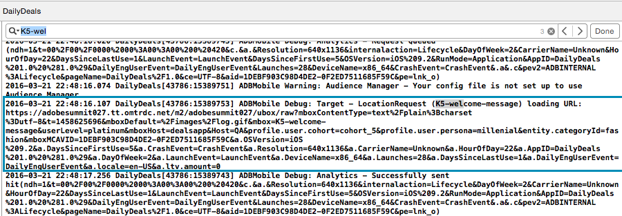

# iOS - send custom user data{#ios-send-custom-user-data}

You can send additional information about the location or the user to Target as name-value pairs.

This information can be used to build custom audiences (for example, users with greater than 25000 miles) and in reporting.

There are two types of parameters that you can send with a Target call:

* mbox parameters

  Mbox parameters are not persistent across sessions. 
* Profile parameters

  Profile parameters are stored in the visitor profile store and are persistent across sessions. Mbox parameters don't persist. While some keys are reserved, both profile and mbox parameters can be custom key-value pairs.

Although there are some reserved keys, both profile and mbox parameters can contain custom key-value pairs. 

1. Create dictionary.

   First, create a dictionary with the values that you send to pass to Target. For the sake of convenience, add this inside the `welcomeMessageCampaign` method so you don't have to worry about scope.

   Following is a sample dictionary. You can copy paste this inside `(void)welcomeMessageCampaign`. The values for keys like `userLevel` and `userMiles` are hard-coded in this example. In general, you pass in the corresponding variables.

   ```
   NSDictionary *targetParams = [[NSDictionary alloc] initWithObjectsAndKeys: 
                                 @"platinum",@"userLevel", 
                                 @26500,@"userMiles", 
                                 @"1067007",@"entity.id", 
                                 @"dealsapp.qa", @"host", 
                                 @"fashion",@"entity.categoryId", 
                                 @"millenial", @"profile.persona", 
                                 @"cohort_5", @"profile.cohort", 
                                 nil];
   ```

   * Keys with the prefix profile (for example, `profile.persona`) are stored on the user's profile.

      These profile attributes can be used across different activities and channels. 

   * Keys that don't have any prefix (for example, `userMiles`) are mbox parameters.

      These parameters are available only during the session. 

   * Keys with the prefix entity (for example, `entity.category.id`) are used for product recommendations.

1. Verify the data.
   1. In application `didFinishLaunchingWithOptions`, uncomment or add `[ADBMobile setDebugLogging:YES];`.

      This prints detailed debug logs. 
   1. Build the app.
   1. Verify that the parameters are passed in the target call.

      Search for your target location name in your debug console. You will see a call to `YOUR-CLIENT-CODE.tt.omtrdc.net`with all the parameters that you just passed.

      

   You can build audiences and restrict or target the display of content using these parameters in Target Standard. 
