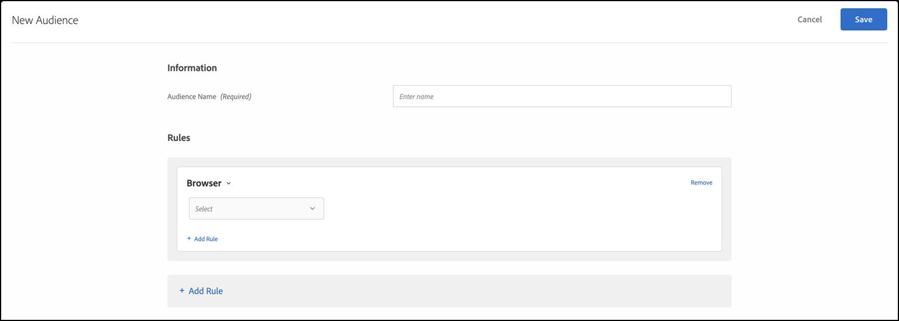

# Browser{#browser}

You can target users who use a specific browser or specific browser options when they visit your page.

The following browsers can be targeted:

* Chrome
* Microsoft Edge
* Firefox
* Opera
* Safari
* iPad
* Internet Explorer
* iPhone|

There are two ways to target browsers:

**Pre-built Audience:** Use the pre-built audience if you want to target only visitors who use a specific browser to visit your site. For example, if you are offering a Chrome extension, you would target only Chrome users.

1. When setting up your activity, select the browser from the audience drop-down list.

   This option targets the activity only to visitors who use the specified browser.

**Customized Browser Audience Rule:** A customized audience enables you to target multiple browsers, or to set up rules or exclusions for specific browsers, browser versions, or browser languages. This provides significant flexibility when targeting a campaign based on browser attributes.

1. In the [!DNL Target] interface, click **[!UICONTROL Audiences]** > **[!UICONTROL Create Audience]**. 
1. Name the audience. 
1. Click **[!UICONTROL Add Rule]** > **[!UICONTROL Browser]**.

   

1. Click **[!UICONTROL Select]**, then select one of the following options:

   * **Type:** Target or exclude a certain browser. See [Type](../../../c-target/c-audiences/c-target-rules/browser.md#section_6ADC758F23F145B3A310151546D83D56). 
   * **Language:** Target or exclude a certain browsers that are set to use specific languages. See [Language](../../../c-target/c-audiences/c-target-rules/browser.md#section_7520D1AA464A45A6843EABE2D2B431A1). 
   * **Version:** Target or exclude certain browser versions. See [Version](../../../c-target/c-audiences/c-target-rules/browser.md#section_37CC8CE45DA04E8682AE6388321BA6EF).

1. (Optional) Click **[!UICONTROL Add Rule]** and set up additional rules for the audience. 
1. Click **[!UICONTROL Save]**.

The following example shows an audience that includes Internet Explorer users on versions 10 or 11:

## Browser Options {#concept_221D8EEF53CC45AEACEB17CF336A3658}

Target or exclude activity entrants based on their browser type, language, or version.

### Type {#section_6ADC758F23F145B3A310151546D83D56}

Target or exclude a certain browser.

Select **[!UICONTROL Type]**, then choose either equals or does not equal.

* Equals: Target the selected browsers. 
* Does not equal: Exclude the selected browsers.

Select one or more browsers. Multiple options are connected with an OR.

### Language {#section_7520D1AA464A45A6843EABE2D2B431A1}

Target or exclude certain browsers that are set to use specific languages.

For example, if an offer is available only in English, you might target browsers with their language set to English. Or, if your page is not double-byte enabled, you might exclude browsers set to East Asian languages.

Including or excluding browser language can provide more accurate visitor targeting than targeting based on geography in cases where language is more important than location. For example, if you are offering an article written in English, you could either target English-speaking countries, or you could target browsers that are set to English. Targeting to the browser makes the article available to English speakers in countries where English is not the primary language.

Select **[!UICONTROL Language]**, then choose either equals or does not equal.

* Equals: Target the selected browser languages. 
* Does not equal: Exclude the selected browser languages.

Select one or more languages. Multiple options are connected with an OR.

The following browser languages can be targeted or excluded:

* English 
* French 
* German 
* Japanese 
* Korean 
* Portuguese 
* Russian 
* Spanish 
* Traditional Chinese

### Version {#section_37CC8CE45DA04E8682AE6388321BA6EF}

Target or exclude certain browser versions.

For example, if your page does not appear correctly in Internet Explorer version 11 or earlier, you can create an audience that excludes those versions. In that case, you would set up a rule where the browser type equals Internet Explorer and add a second rule where the version is less than or equal to 11.

Select **[!UICONTROL Version]**, then choose an operator:

* Equals 
* Does not equal 
* Is greater than 
* Is greater than or equal to 
* Is less than 
* Is less than or equal to

Type the version number.

Only major versions can be entered in the text field. The specified version includes any minor version of that release. For example, if you specify version 10, visitors on version 10.1 are included.

Multiple options are connected with an OR. 

## Training video: Creating Audiences 

This video includes information about using audience categories.

* Create audiences 
* Define audience categories

>[!VIDEO](https://video.tv.adobe.com/v/17392) 