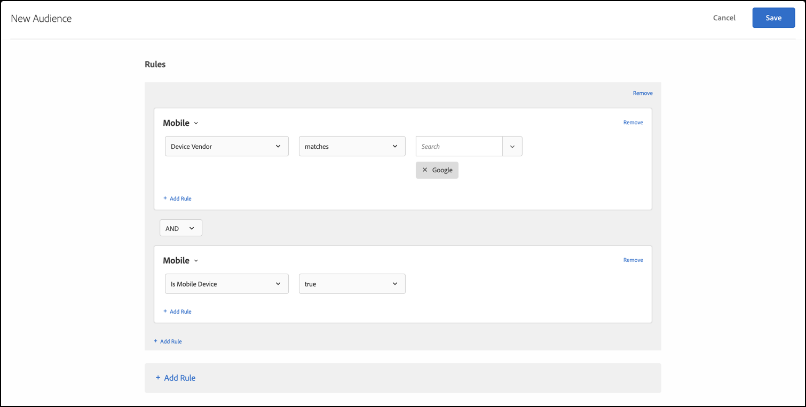

# Mobile{#mobile}

Create audiences to target mobile devices based on parameters such as mobile device, type of device,device vendor, screen dimensions (by pixels), and more.

For example, you might want to show different content to users who enter your page from a phone than you would if they visit from a computer. In that case, you could select the Mobile audience, then select the **[!UICONTROL Is Mobile Phone]** option, then add any specific details that are important to you, such as the type of phone, size of the screen (in pixels), and so on.

Mobile targeting is delivered by [DeviceAtlas](https://deviceatlas.com/device-data/user-agent-tester), a service of DotMobi. DeviceAtlas is a comprehensive database of mobile devices built on data compiled from numerous sources, including manufacturers and network operators. This data is then verified, cross-referenced, and validated to build a large and accurate mobile device database available.

Device detection is accomplished by analyzing User-Agent strings. Some device manufacturers, such as Apple, disable this functionality by not providing enough information in the UA.

For example, Apple devices don't share device model-specific tokens in the UA. The result is that it is not possible to detect iPhone models (such as iPhone 5S, iPhone SE, iPhone 6, and so forth) using a simple keyword-based method.

To solve this, Target collects additional data to accurately detect iPhones and other Apple devices using the following parameters:

| Parameter | Type | Description |
|--- |--- |--- |
|devicePixelRatio|String|Ratio between physical pixels and device-independent pixels (dips) on the browser.  e.g “1.5” or “2”|
|screenOrientation|String|The device and the browser's JavaScript engine support Device Orientation. Can be Landscape or Portrait.|
|webGLRenderer|String|Browser renderer of the graphics driver.|

>[!NOTE]
>
>Customers using the Mobile SDK do not need to do anything to leverage this functionality. Customers using at.js must [upgrade to at.js version 1.5.0](/help/c-implementing-target/c-implementing-target-for-client-side-web/target-atjs-versions.md#reference_DBB5EDB79EC44E558F9E08D4774A0F7A) (or later).

You can choose more than one mobile device property. Multiple selections are joined with an OR.

Customers who are using a custom integration (not using at.js or the Mobile SDK) can collect these parameters themselves and pass them as mbox parameters.

1. In the [!DNL Target] interface, click **[!UICONTROL Audiences]** > **[!UICONTROL Create Audience]**. 
1. Name the audience. 
1. Click **[!UICONTROL Add Rule]** > **[!UICONTROL Mobile]**.
1. Click **[!UICONTROL Select]**, then select one of the following options:

    * Device Marketing Name 
    * Device Model 
    * Device Vendor 
    * Is Mobile Device 
    * Is Mobile Phone 
    * Is Tablet 
    * OS 
    * Screen Height (px) 
    * Screen Width (px)

   >[!NOTE]
   >
   >Due to the new changes introduced in iOS 12.2, creating an audience with rules defined by Device Marketing Name and Device Model that specify iPhone Models is impacted. We can no longer target users who have iPhones with iOS 12.2 installed on them. However, if those users do not have iOS 12.2, then the iPhone Model targeting continues to work correctly.
   >
   >The iOS 12.2 update does not affect the identification of the following models because these models do not support upgrading to iOS 12.2: iPhone, iPhone 3G, iPhone 3GS, iPhone 4, iPhone 4s, iPhone 5, iPhone 5c, iPad, iPad 2, iPad / Retina display, iPad Retina (4th Gen), iPod Touch 4, and iPod Touch 5.

   >[!NOTE]
   >
   >You can target by mobile device carrier using the [Geo settings](/help/c-target/c-audiences/c-target-rules/geo.md#concept_5B4D99DE685348FB877929EE0F942670).

1. (Optional) Click **[!UICONTROL Add Rule]** and set up additional rules for the audience. 
1. Click **[!UICONTROL Save]**.

The following illustration shows an audience targeting visitors using devices manufactured by Google that are a mobile devices.

## Training video: Creating Audiences

This video includes information about using audience categories.

* Create audiences 
* Define audience categories

>[!VIDEO](https://video.tv.adobe.com/v/17392) 
