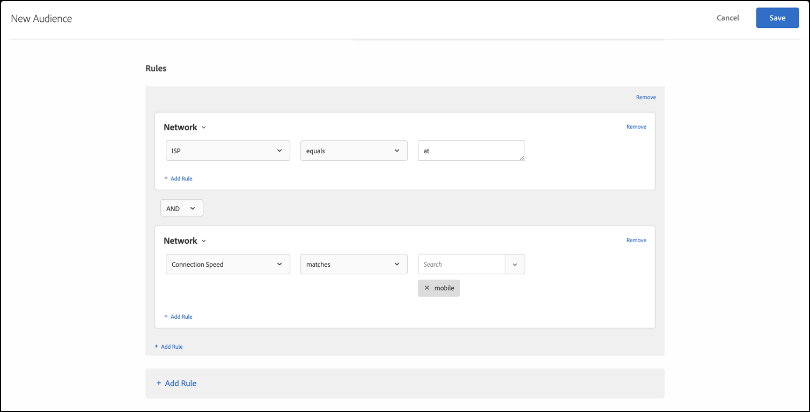

# Network{#network}

You can create audiences based on network details.

1. In the [!DNL Target] interface, click **[!UICONTROL Audiences]** > **[!UICONTROL Create Audience]**. 
1. Name the audience. 
1. Click **[!UICONTROL Add Rule]** > **[!UICONTROL Network]**.
1. Click **[!UICONTROL Select]**, then select one of the following options:

    * **ISP:** An ISP is an organization that provides internet access to its subscribers, usually at a monthly or yearly fee. Many ISPs provide additional services, such as web hosting or email. The ISP field is either a commercial ISP (such as Comcast or TimeWarner) or another entity such as a business or educational institution.

      The following are some examples of popular ISPs in the United States:

      |  Popular Name  | ISP Name  | Domain Name  | Sample IP Address  |
      |---|---|---|---|
      |  Cablevision  | Cablevision Systems Corp.  | &#42;.optonline.net  | 68.196.130.239  |
      |  CenturyLink  | Qwest Communications Company, LLC  | &#42;.centurylink.net  | 64.40.65.0  |
      |  Charter Communications  | Charter Communications  | &#42;.charter.com  | 71.85.225.124  |
      |  Comcast  | Comcast Cable Communications, Inc.  | &#42;.comcast.net  | 76.27.24.28  |
      |  Cox  | Cox Communications Inc.  | &#42;cox.net  | 68.224.174.22  |
      |  Speakeasy  | MegaPath Corporation  | &#42;.speakeasy.net  | 66.93.240.0  |
      |  Time Warner  | Time Warner Cable Internet LLC  | &#42;.res.rr.com  | 72.229.28.185  |
      |  Verizon FiOS  | MCI Communications Services, Inc. d/b/a Verizon Business  | &#42;.fios.verizon.net  | 173.68.112.34  |
      |  Vivint  | Smartrove Inc.  | &#42;.vivintwireless.net  | 170.72.26.105  |
      |  AT&T Wireless  | AT  | &#42;.mycingular.net  |  |
      |  Sprint mobile  | Sprint Personal Communications Systems  | ip address  |  |
      |  T-Mobile  | T-Mobile USA, Inc.  | ip address  | 208.54.86.0  |
      |  Verizon Wireless  | Cellco Parternship DBA Verizon Wireless  | &#42;.myvzw.com  | 70.195.74.199  |

      >[!NOTE]
      >
      >When targeting based on ISP, use the ISP name, not the popular name. Ensure that you build the rule to be case-insensitive or always use lowercase format.

      You can test the ISP and domain name values. [https://www.whoismyisp.org](https://www.whoismyisp.org) is a good resource for targeting purposes. You can use the sample IP addresses given in the table above, or enter your own. Then use the `themboxOverride.browserIp= URL` parameter to mimic that IP address. 
    
    * **Domain Name:** This is the domain name for the visitor's IP address. This is not the domain name of the website you are using with [!DNL Target]. This domain name is related to the visitor's IP address and is sometimes called a hostname. It is usually very similar to the ISP name. Sometimes the hostname references older names of companies that have rebranded their ISP name but not the domain name. 
    * **Connection Speed:** This is the speed of the visitor's connection to the internet. Options include: broadband, cable, dialup, mobile, oc3, oc12, satellite, t1, t2, and wireless, and xdsl.

      This field is based on the type of connection and not the actual speed itself. [!DNL Target] cannot determine the exact connection speeds of connections. The Broadband connection type is used when there is no indication of other connection types so a specific type cannot be chosen.

1. (Optional) Click **[!UICONTROL Add Rule]** and set up additional rules for the audience. 
1. Click **[!UICONTROL Save]**.

The following illustration shows an audience that targets visitors using AT&T with a connection speed of [!UICONTROL Mobile].

## Training Video: Creating Audiences

This video includes information about using audience categories.

* Create audiences 
* Define audience categories

>[!VIDEO](https://video.tv.adobe.com/v/17392)