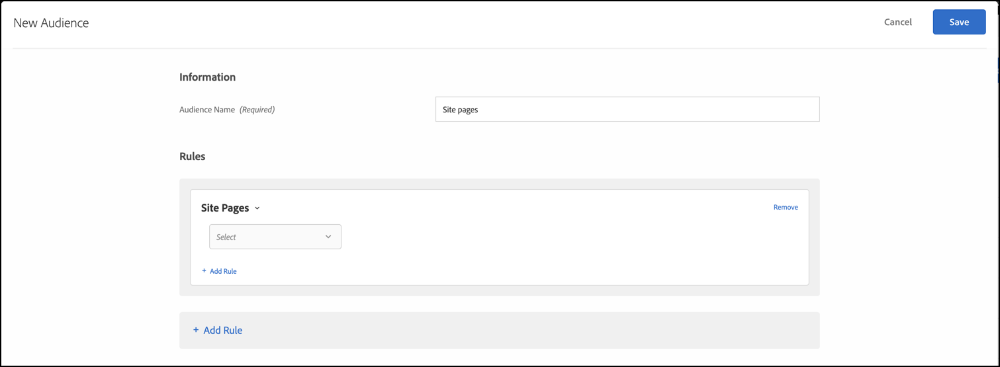

# Site Pages{#site-pages}

Target visitors who are on a specific page or have a specific mbox parameter.

>[!NOTE]
>
>Audience site page types and comparison operators now match types and comparison operators in Target Classic. You can also create site page audiences using you own "user defined query parameter" or "user defined header."

1. In the [!DNL Target] interface, click **[!UICONTROL Audiences]** > **[!UICONTROL Create Audience]**. 
1. Name the audience. 
1. Click **[!UICONTROL Add Rule]** > **[!UICONTROL Site Pages]**.

   

1. Click **[!UICONTROL Select]**, then select one of the following options:

    * **Current Page:** The page the user is currently on, which is the page that contains an mbox in the activity. If you target at the activity level, this could be a page with an mbox that you are using to define entry conditions, or a page that displays content. If you are targeting by experience, then the current page is the page that the display mbox is on. For Success metric or conversion targeting, then it is the page that those mboxes are on. 
    * **Previous Page:** The page the user was on before clicking to the current page. (The user has to click from the previous page to the current page for the page to be tracked. The previous page is not tracked if the user types a new URL in the browser.) The actual content of this page depends on the design of your site. For example, if the current page displays information about a specific product, the previous page might be a category page where the visitor selects the specific item (such as a page displaying several cameras of a certain type), or it might be the home page that leads to the final page. 
    * **Landing Page:** The landing page is the first page the visitor sees when accessing your site. For example, if the visitor clicks a link on Google that leads to a category page, then the category page is the landing page. If the link leads to your home page, then the home page is the landing page. The landing page is remembered for the visitor's session. You can target deeper in the site based on what the visitor's landing page was in this session.

      >[!NOTE]
      >
      >The `landing.url` object is reset on a subdomain change or direct URL replacement.

    * **Mbox:** The mbox you are targeting on. For example, if you want to count orders with an order total of $100 or more, you would pass `orderTotal` as an mbox parameter with that targeting specified here. 
    * **Domain:** The full domain of the page. When specifying a domain, best practice is to use "contains." For example, "Domain equals facebook.com" will not accept `m.facebook.com` or `www.facebook.com`. "Domain contains facebook.com" will accept any variant of facebook.com. 
    * **Query:** The content of the URL after the first question mark (?). For example, the query is shown in bold in the following sample URL:

      `foo.html?e0a72cb2a2c7`

1. (Optional) Click **[!UICONTROL Add Rule]** and set up additional rules for the audience. 
1. Click **[!UICONTROL Save]**.

You can also create site pages audiences using you own "user-defined query parameter" or "user-defined header."

Use a:

* Query parameter if the rule selected by the user is Current Page, Landing Page, or Previous Page. 
* Header if the rule select by the user is an HTTP header.

as illustrated below:

## Training video: Creating Audiences

This video includes information about using audience categories.

* Create audiences 
* Define audience categories

>[!VIDEO](https://www.youtube.com/watch?v=wV9lVTSOxMk) 
