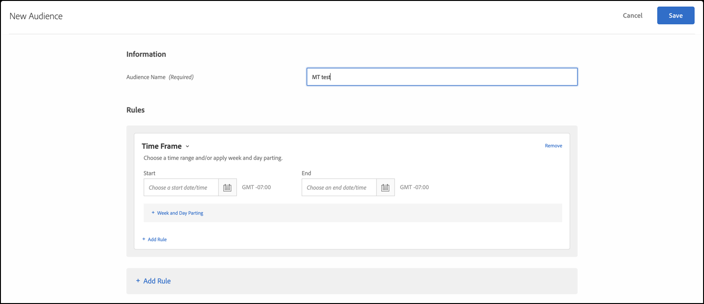

# Time Frame{#time-frame}

You can add start/end dates and times to target users who visit your site during a specific time frame. You can also set Week and Day Parting options to create recurring patterns for audience targeting.

For example, using the [combined, ad-hoc audiences feature](/help/c-target/combining-multiple-audiences.md#concept_A7386F1EA4394BD2AB72399C225981E5), you can target low-spenders with specific content during the three days leading up to Black Friday and other content after Black Friday.

1. In the [!DNL Target] interface, click **[!UICONTROL Audiences]** > **[!UICONTROL Create Audience]**. 
1. Name the audience. 
1. Click **[!UICONTROL Add Rule]** > **[!UICONTROL Time Frame]**.

   

1. Specify the Start and End dates and times for the audience.

   Leave the start date empty to start targeting according to the activity's schedule. Leave the end date empty to continue targeting until the activity's end date and time.

   You can also leave both the start or end dates empty. This lets you use the same audience in multiple activities (without making a copy of the audience) while controlling the start and end dates at the activity level.

   >[!NOTE]
   >
   >The time zone for Start/End dates is displayed as GMT +/- NN:NN, where NN:NN is the offset from GMT and reflects the account-level time zone rather than the visitor's time zone. For example, California's time zone would be displayed as GMT -08:00.

1. (Conditional) Click **[!UICONTROL Week and Day Parting]** to set recurring patterns, including days of the weeks and times.

   

   You could use Week and Day Parting options, for example, to display a "Chat Now" option to visitors only during the days and hours that your call center is staffed.

   Select one or more days of the week, then set the start and end times. Click **[!UICONTROL Add More]** to specify additional patterns, as desired.

   >[!NOTE]
   >
   >The time zone for [!UICONTROL Week and Day Parting] is displayed as GMT +/- NN:NN, where NN:NN is the offset from GMT and reflects the account-level time zone rather than the visitor's time zone. For example, California's time zone would be displayed as GMT -08:00.

1. (Optional) Click **[!UICONTROL Add Rule]** and set up additional rules for the audience.

   Note that you can repeat Step 5 for each rule, if desired. 

1. Click **[!UICONTROL Save]**.

## Training video: Creating Audiences 

This video includes information about using audience categories.

* Create audiences 
* Define audience categories

>[!VIDEO](https://video.tv.adobe.com/v/17392) 
