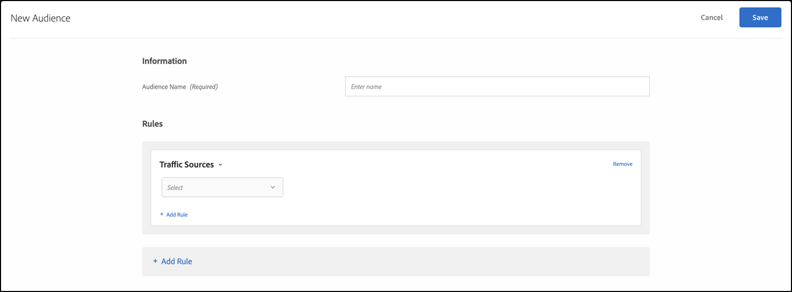

# Traffic Sources{#traffic-sources}

Target visitors based on the search engine or landing page that refers them to your site.

For example, you can target based on the visitor's browser, search engine, or the referring landing page. The referring landing page is the page you clicked from to reach the current site this session. (For example, if you click an ad on Google and it leads you to the [!DNL adobe.com] home page, the referring landing page is [!DNL google.com].)

You can combine multiple traffic sources to create a complex targeting rule.

1. In the [!DNL Target] interface, click **[!UICONTROL Audiences]** > **[!UICONTROL Create Audience]**. 
1. Name the audience. 
1. Click **[!UICONTROL Add Rule]** > **[!UICONTROL Traffic Sources]**.

   

1. Click **[!UICONTROL Select]**, then select one of the following options:

    * From Baidu 
    * From Bing 
    * From Google 
    * From Yahoo 
    * Referring Landing Page: URL 
    * Referring Landing Page: Domain 
    * Referring Landing Page: Query

1. (Optional) Click **[!UICONTROL Add Rule]** and set up additional rules for the audience. 
1. Click **[!UICONTROL Save]**.

You can target users who are referred to your site by a specific search engine or from a specific landing page.

## Training video: Creating Audiences

This video includes information about using audience categories.

* Create audiences 
* Define audience categories

>[!VIDEO](https://video.tv.adobe.com/v/17392) 
