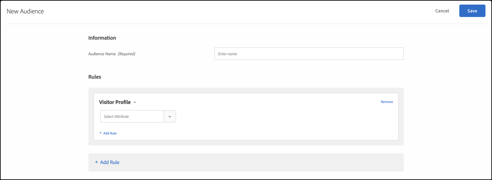

# Visitor Profile{#visitor-profile}

Target visitors who meet specific profile parameters.

1. In the [!DNL Target] interface, click **[!UICONTROL Audiences]** > **[!UICONTROL Create Audience]**. 
1. Name the audience. 
1. Click **[!UICONTROL Add Rule]** > **[!UICONTROL Visitor Profile]**.

   

1. Click **[!UICONTROL Select]**, then select one of the following options:

   Visitor profile parameters are passed via the mbox (profile). You can target either new or returning visitors, or include all users.

    * New Visitor 
    * Returning Visitor 
    * In Other Tests 
    * Not In Other Tests 
    * First Page of Session 
    * Not First Page of Session 
    * Category Affinity

   A visitor profile is created in the local edge memory for each mbox call with new `mboxPC`. After 30 minutes of inactivity, the profile is saved to the Target database and is accessible from other edges.

   When a site visitor logs in mid-session and gets a `3rdpartyId`, all previously-loaded profile attributes tied to the `3rdPartyId` are immediately available.

   You can target custom profile parameters and `user.` parameters. Choose the parameter you use want to use to target your activity. If the desired parameter does not appear, the parameter has not been fired by an mbox. 

1. (Optional) Click **[!UICONTROL Add Rule]** and set up additional rules for the audience. 
1. Click **[!UICONTROL Save]**.

## Training video: Creating Audiences

This video includes information about using audience categories.

* Create audiences 
* Define audience categories

>[!VIDEO](https://video.tv.adobe.com/v/17392) 
