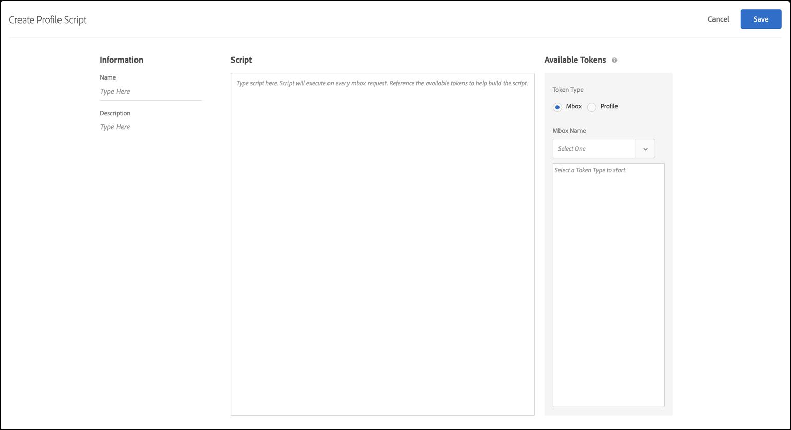
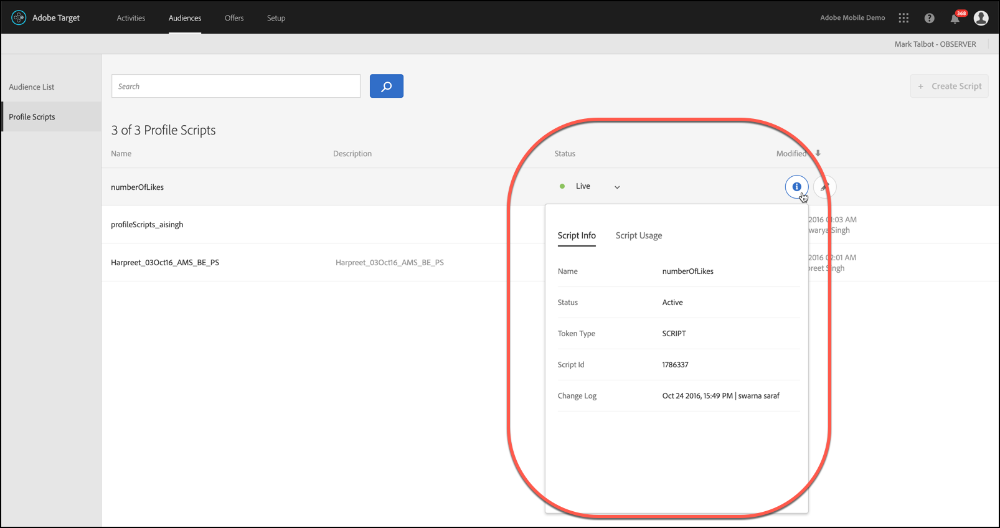
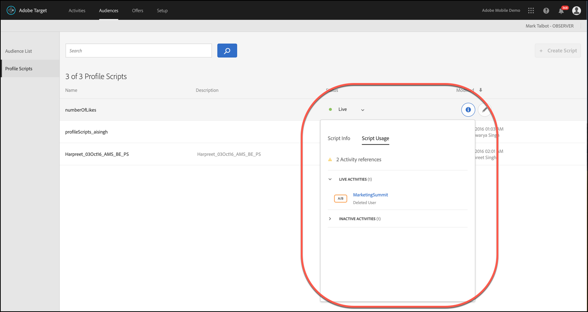
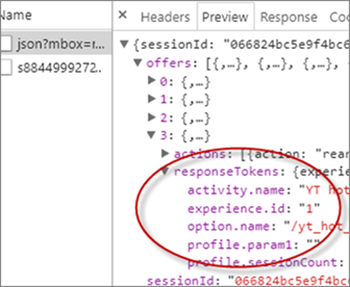
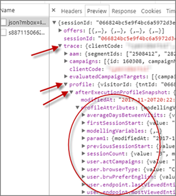

# Profile attributes{#profile-attributes}

Profile attributes are parameters that are specific to the visitor. These attributes are stored in the visitor's profile to provide information about the visitor that can be used in your campaigns.

## Profile attributes {#concept_01A30B4762D64CD5946B3AA38DC8A201}

Profile attributes are parameters that are specific to the visitor. These attributes are stored in the visitor's profile to provide information about the visitor that can be used in your campaigns. 

As the visitor browses, or when the visitor returns for another session, the saved profile attributes can be used to target content, or log information for segment filtering.

To set up profile attributes, click **[!UICONTROL Audiences]** > **[!UICONTROL Profile Scripts.]**

The following types of profile attributes are available:

| Parameter Type | Description |
|--- |--- |
|Mbox|Passed in directly through page code when creating the mbox. See[Pass Parameters to a Global Mbox](/help/c-implementing-target/c-implementing-target-for-client-side-web/t-mbox-download/c-understanding-global-mbox/pass-parameters-to-global-mbox.md).<br>Note:   Target  has a limit of 50 unique profile attributes per mbox call. If you need to pass more than 50 profile attributes to  Target , you can pass them using the  Profile Update  API method. For more information, see[Profile Update  in the Adobe Target API documentation](http://developers.adobetarget.com/api/#updating-profiles).|
|Script|Defined directly with a JavaScript code snippet. These can store running totals like total money spent by consumer and are executed on each mbox request. See Profile Script Attributes below.|

## Profile Script Attributes {#concept_8C07AEAB0A144FECA8B4FEB091AED4D2}

Define a profile script attribute with its associated JavaScript code snippet.

You can use profile scripts to capture visitor attributes across multiple visits. Profile scripts are code snippets defined within Target using a form of server-side JavaScript. For example, you might use a profile script to capture how frequently a visitor visits your site, and when they last visited.

Profile scripts are not the same as profile parameters. Profile parameters capture information about visitors using the mbox code implementation of Target.

>[!NOTE]
>
>[!DNL Target] has a limit of 1,000 profile scripts per account.

## Create Profile Scripts {#section_CB02F8B97CAF407DA84F7591A7504810}

Profile scripts are available under the [!UICONTROL Audiences] tab in the [!DNL Target] interface.

To add a new profile script, click the **[!UICONTROL Profile Scripts]** tab, **[!UICONTROL Create Script]**, then write your script.

Or

To copy an existing profile script, from the [!UICONTROL Profile Scripts] list, hover over the desired script, then click the **[!UICONTROL Copy]** icon: (assets/icon_copy.png)

You can then edit the audience to create a similar audience.



Profile scripts run profile attribute "catchers" on each location request. When a location request is received, Target determines which activity should run and displays content that is appropriate to that activity and that experience, tracks the success of the activity, and runs any relevant profile scripts. This enables you to track information about the visit, such as the visitor's location, time of day, number of times that visitor has been to the site, if they've purchased before and so on. This information is then added to the visitor's profile so you can better track that visitor's activity on your site.

Profile script attributes have the `user.` tag inserted before the attribute name. For example:

```
if (mbox.name == 'Track_Interest') { 
    if (profile.get('model') == "A5" &&; profile.get('subcat') == "KS6") { 
        return (user.get('A5KS6') || 0) + 1; 
    } 
}
```

* Refer to profile script attributes (including itself) in the code with `user.get('parameterName')` 
* Save variables that may be accessed the next time the script is run (on the next mbox request) with `user.setLocal('variable_name', 'value')`.

  Reference the variable with `user.getLocal('variable_name')`. This is useful for situations where you want to reference the date and time of the last request. 

* Parameters and values are case sensitive.

  Match the case of the parameters and values you will receive during the campaign or test. 
* Reference the [JavaScript Expressions for Targeters and Profile Scripts Cheat Sheet](/help/assets/js_expression_cheat_sheet.pdf) for more JavaScript syntax.

## Viewing Profile Script Information Cards {#section_18EA3B919A8E49BBB09AA9215E1E3F17}

You can view profile script information pop-up cards similar to offer information cards. These profile script information cards let you view the list of activities that reference the selected profile script, along with other useful metadata.

For example, the following profile script information card is accessed by hovering over a profile script on the Profile Scripts List (Audiences > Profile Scripts), then clicking the Info icon.

The [!UICONTROL Script Info] tab contains the following information: Name, Status, Token Type, Script ID , Change Log, and Description.



The [!UICONTROL Script Usage] tab lists the activities (and their workspaces) that reference the selected profile script.



>[!Note] 
>
>The Script Usage tab does not display activities that reference the selected profile script in the following situations:
> * The activity is in the Draft state.
> * The content or offer used in the activity uses script variables (either an inline offer within the activity or an offer within the Offer library).


## Target Disables Profile Scripts in Certain Situations {#section_C0FCB702E60D4576AD1174D39FBBE1A7}

[!DNL Target] will automatically disable profile scripts in certain situations, such as if they take too long to execute or have too many instructions.

When a profile script is disabled, a yellow alert icon displays next to the profile script in the Target UI, as illustrated below:


On hover, details on the error display, as illustrated below:


Typical reasons for the system to disable profile scripts include the following:

* An undefined variable to referenced. 
* An invalid value is referenced. This is often caused by referencing URL values and other user-inputted data without proper validation. 
* Too many JavaScript instructions are used. Target has limit of 2,000 JavaScript instructions per script, but this cannot simply be calculated by manually reading the JavaScript. For example, Rhino treats all function calls and "new" calls as 100 instructions. Also, the size of any entry data, such as URL values, can impact the instructions count. 
* Not following items highlighted in the [best practices](../../c-target/c-visitor-profile/profile-parameters.md#section_64AFE5D2B0C8408A912FC2A832B3AAE0) section below.

## Best Practices {#section_64AFE5D2B0C8408A912FC2A832B3AAE0}

The following guidelines are meant to help write simplified profile scripts that are as error-failing-free as possible by writing code that fails gracefully so the scripts are processed without forcing a system-script-halt. These guidelines are a result of best practices that have been proven to run efficiently. These guidelines are to be applied alongside principles and recommendations drawn by the Rhino development community.

* Set current script value to a local variable in the user script, set a failover to blank string. 
* Validate the local variable by ensuring it is not a blank string. 
* Use string based manipulation functions vs. Regular Expressions. 
* Use limited for loops vs. open ended for or while loops. 
* Do not exceed 1,300 characters or 50 loop iterations. 
* Do not exceed 2,000 JavaScript instructions. Target has limit of 2,000 JavaScript instructions per script, but this cannot simply be calculated by manually reading the JavaScript. For example, Rhino treats all function calls and "new" calls as 100 instructions. Also, the size of any entry data, such as URL values, can impact the instructions count. 
* Be mindful of not only the script performance, but the combined performance of all scripts. As best practice, we recommend fewer than 5,000 instructions in total. Counting the number of instructions is not obvious, but the important thing to note is that scripts exceeding 2 KB are automatically disabled. There is no set limit to the number of scripts you can run, but each script is executed with every single mbox call. Run only as many scripts as needed. 
* If all fails, wrap script in a try/catch. 
* See the JS Rhino engine documentation for more information: [https://www.mozilla.org/rhino/doc.html](https://www.mozilla.org/rhino/doc.html).

## Profile Scripts to Test Mutually Exclusive Activities {#section_FEFE50ACA6694DE7BF1893F2EFA96C01}

You can use profile attributes to set up tests that compare two or more activities but do not let the same visitors participate in each activity.

Testing mutually exclusive activities prevents a visitor in one activity from affecting the test results for the other activities. When a visitor participates in multiple activities, it can be difficult to determine whether positive or negative lift resulted from the visitor's experience with one activity, or if interactions between multiple activities affected the results of one or more of the activities.

For example, you can test two areas of your ecommerce system. You might want to test making your Add to Cart button red instead of blue. You might also test a new checkout process that reduces the number of steps from five to two. If both activities have the same success event (a completed purchase), it can be hard to determine whether the red button improves conversions, or whether those same conversions were also increased because of the improved checkout process. By separating the tests into mutually exclusive activities, you can independently test each change.

Be aware of the following information when using one of the following profile scripts:

* The profile script must run before the activity launches and the script must remain unchanged for the duration of the activity. 
* This technique will reduce the amount of traffic in the activity, which might require the activity to run longer. You must account for this fact when you estimate the duration of the activity.

### Setting Up Two Activities

To sort visitors into groups that each see a different activity, you must create a profile attribute. A profile attribute can sort a visitor into one of two or more groups. To set up a profile attribute called "twogroups," create the following script:

```
if (!user.get('twogroups')) { 
    var ran_number = Math.floor(Math.random() * 99); 
    if (ran_number < = 49) { 
        return 'GroupA'; 
    } else { 
        return 'GroupB'; 
    } 
}
```

`if (!user.get('twogroups'))` determines whether the *twogroups* profile attribute is set for the current visitor. If they do, no further action is required.

`var ran_number=Math.floor(Math.random() *99)` declares a new variable called ran_number, sets its value to a random decimal between 0 and 1, then multiplies it by 99 and rounds it down to create a range of 100 (0-99), useful for specifying a percentage of visitors who see the activity.

`if (ran_number <= 49)` begins a routine that determines which group the visitor belongs to. If the number returned is 0-49, the visitor is assigned to GroupA. If the number is 50-99, the visitor is assigned to GroupB. The group determines which activity the visitor sees.

After you create the profile attribute, set up the first activity to target the desired population by requiring that the user profile parameter user.twogroups match the value specified for GroupA.

>[!NOTE]
>
>Choose an mbox early on the page. This code determines whether a visitor experiences the campaign. As long as an mbox is encountered first by the browser, it can be used to set this value.

Set up the second campaign so the user profile parameter `user.twogroups` matches the value specified for GroupB.

### Setting Up Three or More Activities

Setting up three or more mutually exclusive activities is similar to setting up two, but you must change the profile attribute JavaScript to create a separate group for each activity and determine who sees each one. The random number generation is different, depending on whether you create an odd or even number of groups.

For example, to create four groups, use the following JavaScript:

```
if (!user.get('fourgroups')) { 
    var ran_number = Math.floor​(Math.random() * 99); 
    if (ran_number < = 24) { 
        return 'GroupA'; 
    } else if (ran_number < = 49) { 
        return 'GroupB'; 
    } else if (ran_number < = 74) { 
        return 'GroupC'; 
    } else { 
        return 'GroupD'; 
    } 
}
```

In this example, the math used to generate the random number that assigns a visitor to a group is the same as it is with only two groups. A random decimal is generated, then rounded down to create an integer.

If you create an odd number of groups, or any number that 100 does not divide evenly into, you should not round the decimal down to an integer. Not rounding the decimal enables you to specify non-integer ranges. You do this by changing this line:

`var ran_number=Math.floor(Math.random()*99);`

to:

`var ran_number=Math.random()*99;`

For example, to place visitors in three equal groups, use the following code:

```
if (!user.get('threegroups')) { 
    var ran_number = Math.random() * 99; 
    if (ran_number < = 32.33) { 
        return 'GroupA'; 
    } else if (ran_number < = 65.66) { 
        return 'GroupB'; 
    } else { 
        return 'GroupC'; 
    } 
}
```

## Debug Profile Scripts {#section_E9F933DE47EC4B4E9AF2463B181CE2DA}

The following methods can be used to debug profile scripts:

>[!NOTE]
>
>Using [!DNL console.log] within a profile script will not output the profile value, because profile scripts execute server-side.

* **Add Profile Scripts as Response Tokens to Debug Profile Scripts:**

  In Target, click **[!UICONTROL Setup]**, click **[!UICONTROL Response Tokens]**, then enable the profile script you want to debug.

  Any time you load a page for your site with Target on it, part of the response from Target will contain your value for the given profile script, as shown below:

  

* **Use the mboxTrace Debugging Tool to Debug Profile Scripts.**

  This method requires an authorization token that you can generate by clicking **[!UICONTROL Target]** > **[!UICONTROL Setup]** > **[!UICONTROL Implementation]** > **[!UICONTROL Generate Authorization Token]**.

  You then you add these two parameters to your page URL after the "?": `mboxTrace=window&authorization=YOURTOKEN`.

  This is a little more informative than the response token because you get a before-executed snapshot and an after-snapshot of your profile. It will also show all your available profiles.

  

## Profile Script FAQ {#section_1389497BB6D84FC38958AE43AAA6E712}

**Is it possible to use profile scripts to capture information from a page that resides in a data layer?**

Profile scripts are unable to read the page directly because they are executed server side. The data must be passed in through an mbox request or through other [methods of getting data into Target](../../c-implementing-target/c-considerations-before-you-implement-target/c-methods-to-get-data-into-target/methods-to-get-data-into-target.md#concept_0069C0EFB56C4700BB33F2F35C2B9B17). After the data is in Target, profile scripts can read the data as an mbox parameter or profile parameter. 

## Training video: Profile Scripts

This video includes information about using and creating profile scripts.

* Explain what a profile script is 
* Explain how a profile script is different from a profile parameter 
* Create a simple profile script 
* Use the Available Token menu to access available options 
* Enable and disable profile scripts

>[!VIDEO](https://www.youtube.com/watch?v=m0jH2tIR1XQ)