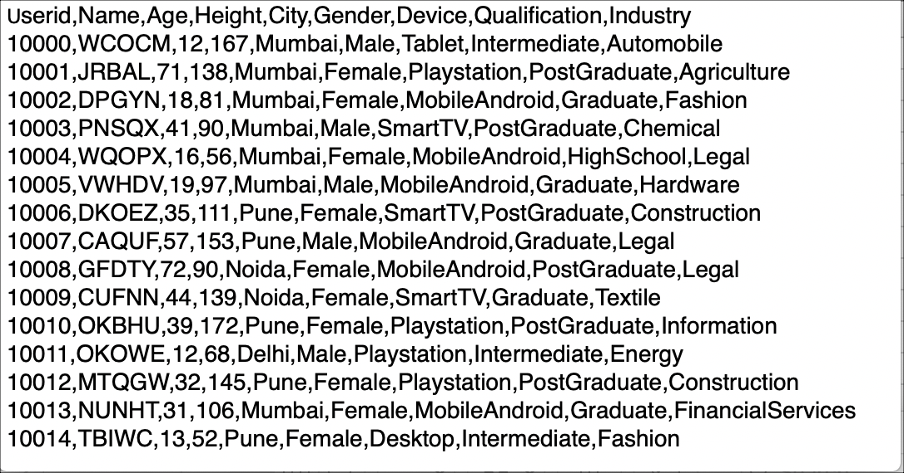
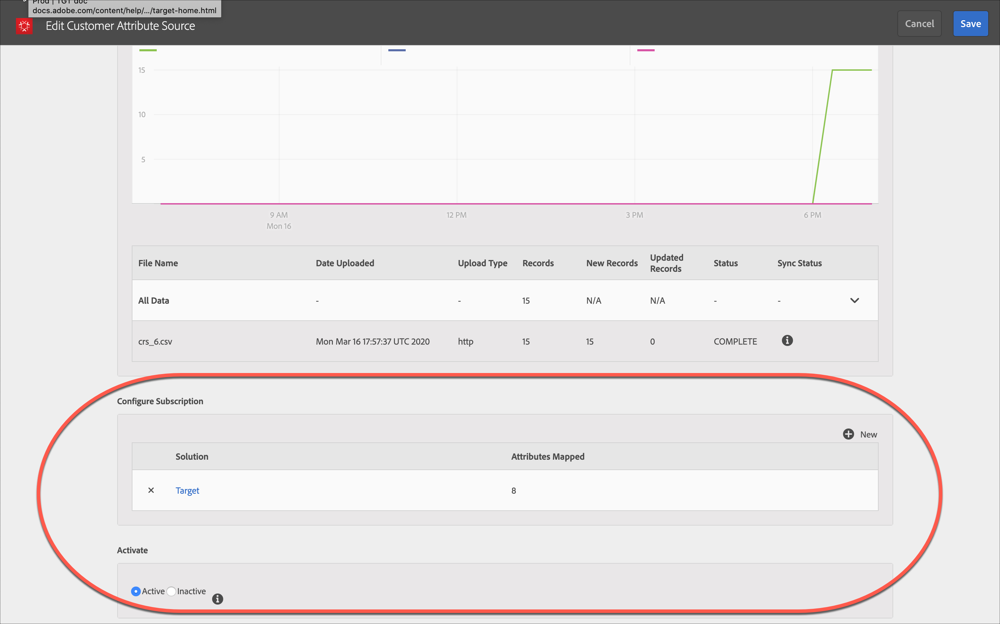

# Customer attributes {#customer-attributes}

Information about using enterprise customer data from a customer relationship management (CRM) databases for content targeting in [!DNL Adobe Target] by using customer attributes in the [!DNL Adobe Enterprise Cloud] core service.

Enterprise customer data collected through multiple sources and stored inside a CRM database can be used in [!DNL Target] to strategically deliver the most relevant content to customers, specifically focusing on returning customers. The [!DNL Audiences] core service (formerly Profiles and Audiences) brings together data collection and analysis with testing and optimization, making data and insights actionable.

## Customer attributes overview {#section_B4099971FA4B48598294C56EAE86B45A}

The Audiences core service is part of the [!DNL Adobe Experience Cloud] and provides enterprises a tool to push their customer data to the [!DNL Experience Cloud] platform. Data onboarded to the [!DNL Experience Cloud] is available for all [!DNL Experience Cloud] workflows. [!DNL Target] uses this data for targeting returning customer based on attributes. [!DNL Adobe Analytics] consumes these attributes and they can be used for analysis and segmentation.


Consider the following information as your work with customer attributes and [!DNL Target]:

* There are some prerequisite requirements that you must meet before you can use the [!UICONTROL Customer attributes] feature in the [!DNL Audiences] core service. For more information, see "Prerequisites for uploading Customer Attributes" in [Customer attributes](https://docs.adobe.com/content/help/en/core-services/interface/customer-attributes/attributes.html) in the *Experience Cloud Product documentation*. 

  >[!NOTE]
  >
  >[!DNL at.js] (any version) or [!DNL mbox.js] version 58 or later is required.

* Adobe does not guarantee that 100% of customer attribute (visitor profile) data from CRM databases will be onboarded to the [!DNL Experience Cloud] and, thus, be available for use for targeting in [!DNL Target]. In our current design, there is a possibility that a small percentage of data might not be onboarded. 
* The lifetime of customer attributes data imported from the [!DNL Experience Cloud] to [!DNL Target] depends on the lifetime of the visitor profile, which is 14 days by default. For more information, see [Visitor Profile Lifetime](../../c-target/c-visitor-profile/visitor-profile-lifetime.md#concept_D9F21B416F1F49159F03036BA2DD54FD). 
* If the `vst.*` parameters are the only thing identifying the visitor, the existing "authenticated" profile will not be fetched as long as `authState` is UNAUTHENTICATED (0). The profile will only come into play if `authState` is changed to AUTHENTICATED (1).

  For example, if the `vst.myDataSource.id` parameter is used to identify the visitor (where `myDataSource` is the data source alias) and there is no MCID or third-party ID, using the parameter `vst.myDataSource.authState=0` won't fetch the profile that might have been created through a Customer Attributes import. If the desired behavior is to fetch the authenticated profile, the `vst.myDataSource.authState` has to have the value of 1 (AUTHENTICATED).

* You cannot send the following characters in `mbox3rdPartyID`: plus sign (+) and forward slash (/).

## Customer attribute workflow for Target {#section_00DAE94DA9BA41398B6FD170BC7D38A3}

Complete the following steps to use CRM data in [!DNL Target], as illustrated below:


Detailed instructions for completing each of the following tasks can be found in [Create a customer attribute source and upload the data file](https://docs.adobe.com/content/help/en/core-services/interface/customer-attributes/t-crs-usecase.html) in the *Experience Cloud Product Documentation*.

1. Create a data file.

   Export customer data from your CRM to CSV format to create a .csv file. Alternately, a zip or gzip file can be created for uploading. Ensure that first row of the CSV file is the header and all rows (customer data) have the same number of entries.

   

   

1. Create the attribute source and upload the data file.

   Specify a Name and Description of the data source and the alias Id. The alias Id is a unique ID to be used in your Customer Attribute code in `VisitorAPI.js`.

   >[!IMPORTANT]
   >
   >The data source name and the attribute name cannot contain a period.

   Data files up to 100 MB can be uploaded using the HTTP method. Files larger than 100 MB, up to 4 GB, can be uploaded through FTP.

    * **HTTPS:** You can drag-and-drop the .csv data file or click **[!UICONTROL Browse]** to upload from your file system. 
    * **FTP:** Click the FTP link to [upload the file through FTP](https://docs.adobe.com/content/help/en/core-services/interface/customer-attributes/t-upload-attributes-ftp.html). First step is to provide a password for the Adobe-provided FTP server. Specify the password, then click **[!UICONTROL Done]**.

      Now transfer your CSV/ZIP/GZIP file to the FTP server. After this file transfer is successful, create a new file with same name and .fin extension. Transfer this empty file to the server. This indicates a End Of Transfer and the [!DNL Experience Cloud] starts to process the data file.

1. Validate the schema.

   The validation process lets you map display names and descriptions to uploaded attributes (strings, integers, numbers, and so on). Map each attribute to its correct data type, display name, and description.

   Click **[!UICONTROL Save]** after the schema validation is complete. The file upload time varies depending on the size.

   

   

1. Configure subscriptions and activate the attribute source.

   Click **[!UICONTROL Add Subscription]**, then select the solution to subscribe these attributes. [Configure subscriptions](https://docs.adobe.com/content/help/en/core-services/interface/customer-attributes/subscription.html) sets up the data flow between the [!DNL Experience Cloud] and solutions. Activating the attribute source allows the data to flow to subscribed solutions. The customer records you have uploaded are matched up with incoming ID signals from your website or application.

   

   

   While performing this step, be aware of the following limitations:

    * The maximum file size for each upload using the HTTP method is 100 MB. 
    * The maximum file size for each upload using the FTP method is 4 GB. 
    * The number of attributes allowed to subscribe: 5 for [!DNL Target Standard] and 200 for [!DNL Target Premium].

## Use customer attributes in Target {#section_107E3A0F0EC7478E82E6DBD17B30B756}

You can use customer attributes in [!DNL Target] in the following ways:

### Creating targeting audiences

In [!DNL Target], you can select a customer attribute from the [!UICONTROL Visitor Profile] section when creating an audience. All customer attributes have the prefix &lt; data_source_name &gt; in the list. Combine these attributes as required with other data attributes to build audiences.


### Creating profile scripts using tokens

Customer attributes can be referenced in profile scripts using format `crs.get('<Datasource Name>.<Attribute name>')`.

This profile script can be used directly in offers for delivering attributes that belong to the current visitor.

### Using mbox3rdPartyID in your website for a successful implementation and usage

Pass `mbox3rdPartyId` as a parameter to the global mbox inside the `targetPageParams()` method. The value of `mbox3rdPartyId` should be set to the customer ID that was present in the CSV data file.

```
<script type="text/javascript">
            function targetPageParams() {
               return 'mbox3rdPartyId=2000578';
            }
</script>
```

### Using the Experience Cloud ID Service

If you are using the Experience Cloud ID service, you need to set a Customer ID and Authentication State to use customer attributes in targeting. For more information, see [Customer IDs and Authentication State](https://docs.adobe.com/content/help/en/id-service/using/reference/authenticated-state.html) in the *Experience Cloud Identity Service Help*.

For more information about using customer attributes in [!DNL Target], see the following resources:

* [Create a customer attribute source and upload the data file](https://docs.adobe.com/content/help/en/core-services/interface/customer-attributes/t-crs-usecase.html) in the *Experience Cloud Product Documentation* 
* [Customer Attributes: The More You Know, The Better You Connect](https://blogs.adobe.com/digitalmarketing/analytics/customer-attributes-know-better-connect/) in the *Digital Marketing Blog*

## Issues frequently encountered by customers {#section_BE0F70E563F64294B17087DE2BC1E74C}

You might encounter the following issues when working with customer attributes and [!DNL Target]:

| Issue | Details |
|--- |--- |
|Customer attributes are removed because the profile is too large|There is no character limit on a particular field in the user's profile, but if the profile gets larger than 64K, it is truncated by removing the oldest attributes until the profile is below 64K again.|
|Attributes not listing in the Audience Library in [!DNL Target], even after several days|This is usually a Pipeline connection problem. As a resolution, ask your Customer Attributes team to republish the feed.|
|Delivery not working based on the attribute|The profile has not been updated on the edge yet. As a resolution, ask your Customer Attributes team to republish the feed.|
|Implementation issues|Be aware of the following implementation issues:<ul><li>The Visitor Id was not passed correctly. The ID was passed in `mboxMCGVID` instead of `setCustomerId`.</li><li>The Visitor Id was passed correctly, but the AUTHENTICATION state was not set to Authenticated.</li><li>`mbox3rdPartyId` was not passed correctly.</li>|
|`mboxUpdate` not performed properly|`mboxUpdate`  was not performed properly with `mbox3rdPartyId`.|
|Customer attributes are not being imported into Target|If you cannot find Customer Attributes data in Target, ensure that the import occurred within the last *x* days where *x* is the Target [Visitor Profile Lifetime](/help/c-target/c-visitor-profile/visitor-profile-lifetime.md) value (14 days by default).|

Issues in rows 1 and 2 above cause approximately 60% of problems in this area. Issues in row 3 cause approximately 30% of problems. The issue in row 4 causes approximately 5% of problems. The remaining 5% are due to miscellaneous issues.

## Training video: Upload Offline Data using Customer Attributes {#section_9A4E0FA0D0934D06BD8D5BFA673E9BD8} 

This video shows you how to import offline CRM, help desk, point-of-sale, and other marketing data into the Experience Cloud People service and associate it with visitors using their known IDs.

>[!VIDEO](https://video.tv.adobe.com/v/17802t1/) 
