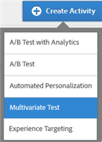
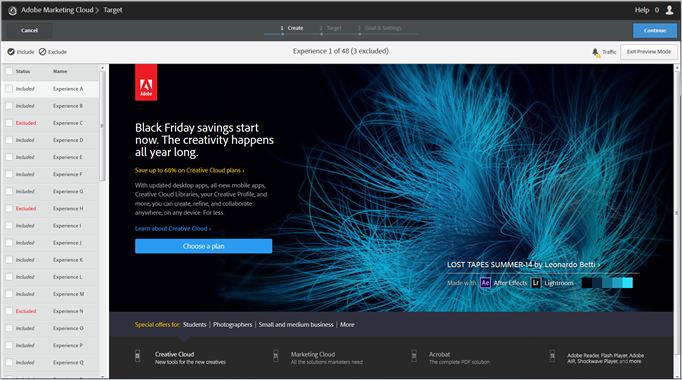

# Create a Multivariate Test

This video demonstrates how to create a multivariate test using the Target three-step guided workflow. 

<table id="table_C56F4BE9B867463380013C584D97DAD2"> 
 <thead> 
  <tr> 
   <th class="entry" colspan="2"> Creating Multivariate Tests </th> 
   <th colname="col3" class="entry"> 9:25 </th> 
  </tr>
 </thead>
 <tbody> 
  <tr> 
   <td colspan="2"> 
 
     
 
      <iframe src="https://www.youtube.com/embed/X8w5IQqEOow/" frameborder="0" webkitallowfullscreen="true" mozallowfullscreen="true" oallowfullscreen="true" msallowfullscreen="true" allowfullscreen="allowfullscreen" scrolling="no" width="550" height="345">https://www.youtube.com/embed/X8w5IQqEOow/</iframe>
     
 
 </td> 
   <td colname="col3"> 
 
     <ul id="ul_B17C3EFA4B664415AE0159E418FF45C4"> 
      <li id="li_916224D2105348BE93D60015B2F43D4F">Define and design a multivariate test </li> 
      <li id="li_0FED234A3A054DEAB62C4F58BAB47F7F">Create a multivariate test </li> 
     </ul> 
 </td> 
  </tr> 
 </tbody> 
</table>

The Target point-and-click editor enables you to pick any location and add multiple offers. 

The multivariate test takes a page-first report. In other words, the test runs on a specific URL, with the experiences you design for that page. 

>1. Click ** [!UICONTROL  Create Activity] ** > ** [!UICONTROL  Multivariate Test] **.

>        
>1. [ Specify the URL](../../c_activities/c_multivariate_testing/t_create_multivariate_test/c_url.md#concept_C12E4A85FF3B4E518E3110F6CF1AF9C0) for the page you want to test, then click ** [!UICONTROL  Create Activity] **.

>        

>       >[!NOTE]
>       >
>       >Use a complete URL, including the HTTP or HTTPS at the beginning.

>       If a message appears, asking you to enable your browser for mixed content, follow the instructions in the message. After enabling your browser for mixed content, begin again at Step 1. 

>       The Visual Experience Composer opens. 

>       For troubleshooting information about the VEC, should you have problems, see [ Troubleshooting the Visual Experience Composer](../../c_experiences/r_troubleshoot_composer.md#reference_77743144F10143A3A89D56E116D296E4). 
>1. Type a name for the activity.

>        

>       The following characters are not allowed in an activity name: 

>       |  Character  | Description  |
>       |---|---|
>       |  /  | Forward slash  |
>       |  ?  | Question mark  |
>       |  #  | Number sign  |
>       |  :  | Colon  |

>1. [ Create the offers in each location](../../c_activities/c_multivariate_testing/t_create_multivariate_test/c_add_offers.md#concept_DCE6B45C30F7419B8EC17AFDEE8D8AA6).

>        

>       You can add the following kinds of offers: 

>    
>    * HTML
>    * Image
>    * Text

>1. [ Preview your experiences](../../c_activities/c_multivariate_testing/t_create_multivariate_test/t_preview_experiences.md#task_21A700587E88453A9FC2210C0DE53A28).

>        

>       You can view each experience, and exclude any you do not want to include in your test. 
>1. [ Use the Traffic Estimator](../../c_activities/c_multivariate_testing/t_create_multivariate_test/t_traffic_estimator.md#task_71AA6922AFD447EA8C5E610A78ABA714) to test the feasibility of your test plan.

>          
>1. Choose the audience and percentage of qualifying visitors that you want to enter the activity.

>        

>       For example, you might limit entries to 50% of all visitors or 45% of your "Californians" audience. 

>       >[!NOTE]
>       >
>       >In addition to selecting an existing audience, you can combine multiple audiences to create ad hoc combined audiences rather than creating a new audience. For more information, see[ Combining Multiple Audiences](../../c_target/c_audiences/c_combining-multiple-audiences.md#concept_A7386F1EA4394BD2AB72399C225981E5). 

>1. [ Review the test summary](../../c_activities/c_multivariate_testing/t_create_multivariate_test/r_test_summary.md#reference_971AB225963A4DC18EEB5B0E20F0A4A7) and make any desired changes, then click ** [!UICONTROL  Continue] **..

>        
>1. [ Specify the goals and settings](../../c_activities/c_multivariate_testing/t_create_multivariate_test/r_goals_and_settings.md#reference_B25389FD6F3A4989801E740364B089CC) for the test.

>        
>1. Click ** [!UICONTROL  Save and Close] ** to create the activity.

