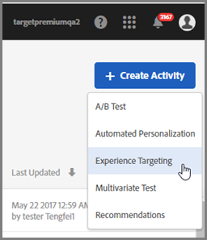
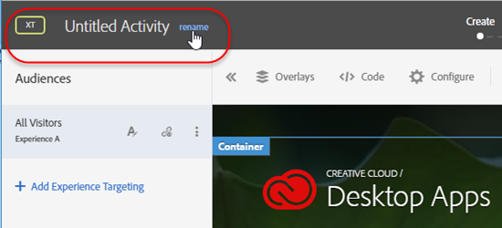

# Create an Experience Targeting Activity

>1. From the [!UICONTROL  Activities] list, click **[!UICONTROL  Create Activity]** > **[!UICONTROL  Experience Targeting]**.

>        

>       >[!NOTE]
>       >
>       >The available activity types depend on your Target account. Some activity types might not appear in your list.

>       For information about the activity types, see [ Activities ](../../c_activities.md#concept_D317A95A1AB54674BA7AB65C7985BA03). 
>1. Enter your [ activity URL ](../../c_activities/t_experience_target/t_xt_create/c_xt_activity_url.md#concept_D28549AAA0A14E3BB5F05F32BE8ABC90), then click **[!UICONTROL  Next]**.

>        

>       If your account is configured with a default URL, that URL appears by default. You can change from the default to another URL. 

>       For troubleshooting information about the VEC, should you have problems, see [ Troubleshooting the Visual Experience Composer ](../../c_experiences/r_troubleshoot_composer.md#reference_77743144F10143A3A89D56E116D296E4). 

>       If you prefer to use the form-based Experience Composer, select that option. See [ Form-Based Experience Composer ](https://marketing.adobe.com/resources/help/en_US/target/target/t_form_experience_composer.html). 

>       The Visual Experience Composer opens, showing the page specified in the URL. 
>1. Type a name for the activity in the space provided.

>        

>       The following characters are not allowed in an activity name: 

>       |  Character  | Description  |
>       |---|---|
>       |  /  | Forward slash  |
>       |  ?  | Question mark  |
>       |  #  | Number sign  |
>       |  :  | Colon  |

>1. [ Create any new experiences ](../../c_activities/t_experience_target/t_xt_create/t_xt_add_experience.md#task_454646F2895242D3B92DC395A0CE1A00) by changing the elements on the page.

>       The Experience Composer (see [ Experiences ](../../c_experiences.md#concept_1D011219034B492BB03C08B3BB80E3F0)) opens the page that is specified in your [ Account Preferences ](https://marketing.adobe.com/resources/help/en_US/target/target/t_account_preferences.html). To display a different page, click the Globe icon and enter the URL in the Select URL box in the Experience Composer and click **[!UICONTROL  Continue]**. If you entered a URL for a site that does not include the Target Standard JavaScript code, you cannot select page elements. 

>       By default, the Visual Experience Composer does not allow changes to elements containing JavaScript, such as rotating banners. You can select to disable JavaScript if you want to be able to alter those elements using the Visual Experience Composer. 

>       >[!NOTE]
>       >
>       >If you change the URL after making changes to a page for one or more experiences, the experience is reset using the new page and the changes you made are lost.

>       As you hover the elements on your page, the elements are highlighted. Any highlighted element can be altered using the Experience Composer. 

>       If you created an mbox on the page using Target Classic (formerly Test&amp;amp;Target), that mbox appears as an element that shows the mbox name, and can be modified like any other element. 

>       >[!NOTE]
>       >
>       >If you deliver an image from a source other than your main page (such as an image hosted on akamai.net and delivered on dell.com), then that image does not display in the thumbnail of the page shown in the flow diagram.

>1. Click **[!UICONTROL  Next]**.

>       The flow diagram opens. 

>        

>       The flow diagram leads you through the steps of choosing the audience for the activity and setting up experiences. 
>1. Mouse over the audience, click the **[!UICONTROL  Edit]** icon (   ) that displays, click **[!UICONTROL  Change Audience]**, then select the audience for the first experience in your activity.

>        

>       The audience library appears. The audience library contains audiences that have previously been defined, including some common audiences that are pre-built as a part of Target. You can either select an audience from the library, or [ create a new audience ](../../c_target/c_audiences.md#concept_65BE870D290E412D8BBF557EEA67C271). To show the same experience to all entrants, choose All Visitors. 

>       >[!NOTE]
>       >
>       >In addition to selecting an existing audience, you can combine multiple audiences to create ad hoc combined audiences rather than creating a new audience. For more information, see[ Combining Multiple Audiences ](../../c_target/c_audiences/c_combining-multiple-audiences.md#concept_A7386F1EA4394BD2AB72399C225981E5). 

>       When creating an audience, you can select a location (mbox) and specify parameters for that location. Under Custom Parameters, select the mbox, then specify the desired parameters. 

>       >[!NOTE]
>       >
>       >Audiences are automatically imported in the background when you open the audience list and the imported audiences are more than 10 minutes old.

>       You can click the [!UICONTROL  Edit] icon (   ) that displays, then click [!UICONTROL  Remove Audience] to remove an existing audience. 
>1. Click **[!UICONTROL  Add Experience Targeting]**.

>       >[!NOTE]
>       >
>       >If you are targeting an experience to an audience, you must select the audience before you can add an experience. A message appears to remind you to choose your audience.

>1. (Optional) Click **[!UICONTROL  Add]** and set up additional targeted experiences.

>        

>       Click **[!UICONTROL  Continue]** when you are finished with this step. 
>1. Specify the [ goals and settings ](../../c_activities/t_experience_target/t_xt_create/r_xt_goals_and_settings.md#reference_B25389FD6F3A4989801E740364B089CC) for the activity.

>        
>1. Click **[!UICONTROL  Save &amp;amp; Close]**.
