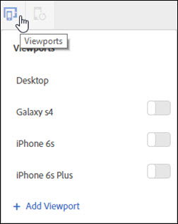

# Create Responsive Experience

>1. Create an activity.
>1. In the Visual Experience Composer, click the ** [!UICONTROL  Settings] ** gear icon, then select ** [!UICONTROL  Add Mobile Viewports] **.
>1. Click the ** [!UICONTROL  Devices] ** icon, then enable each device that should have a mobile viewport.

>        

>       The mobile viewports are listed from smallest to largest according to width. 
>1. Edit the mobile viewports as desired.

>       Any changes you make to the experience (for example, if you change the text in a heading) are applied to the experience on all devices. 

>       Mouse over the name of a viewport to see the viewport's size. 
>1. If desired, toggle between portrait and landscape modes by clicking the orientation icon.

>    <table id="table_63B970F1125A4577B87F8092DF5456F6"> 
 <thead> 
  <tr> 
   <th colname="col1" class="entry"> Mode </th> 
   <th colname="col2" class="entry"> Icon </th> 
  </tr> 
 </thead>
 <tbody> 
  <tr> 
   <td colname="col1"> 
Portrait 
 </td> 
   <td colname="col2"> 
 
 </td> 
  </tr> 
  <tr> 
   <td colname="col1"> 
Landscape 
 </td> 
   <td colname="col2"> 
 
 </td> 
  </tr> 
 </tbody> 
</table>

