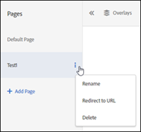

# Multipage Activity

For example, you might want to test an offer for free shipping with purchases above a certain amount. You might want that offer to appear on your landing page, a category page, and certain product pages, but you want it to be a different size and in a different location on each page type. You could display a prominent offer on your home page, then reinforce that offer with smaller offers on other relevant pages. 

You can also use a multipage activity to define different layouts for your desktop and non-responsive mobile sites. If the site has a separate mobile site like [!DNL  m.mysite.com] instead of [!DNL  www.mysite.com], you should instead create a [ multipage activity](../c_experiences/c_multipage_activity.md#concept_277E096063E14813AC5D8EDFA1D2ED48), add [!DNL  m.mysite.com] as separate pages, and then apply mobile editing to make appropriate changes on the desktop version and mobile version in the same experience. For responsive mobile sites, use [ mobile experience editing](../c_experiences/c_mobile_viewports.md#concept_8E45527C4ABC41D59AA3553BEDC76FA5). 

>[!NOTE]
>
>Multipage activities are designed for activities where the same offer has a different appearance on multiple pages. If the offer appears the same on all pages, a[ template test](../c_experiences/t_temtest.md#task_2539D51A18044F82B0D9895636546781) is more efficient. 

You can specify template rules for each page in the multipage test. For example, you can run a multipage test across the home page and all category pages by applying template rules to the category page in the multipage test. See [ Include the Same Experience on Similar Pages](../c_experiences/t_temtest.md#task_2539D51A18044F82B0D9895636546781). 

To add pages to a test: 

1. Click the ** [!UICONTROL  Configure] ** gear icon.
1. Click ** [!UICONTROL  Add Additional Pages] **. A navigation bar appears on the left of the screen. 

    

1. Use that navigational bar to specify your pages and to set the default page. Click ** [!UICONTROL  Add Page] ** to add an additional page. 

   Click the   to display an action menu: 

    

   Use this menu to rename the pages, perform a redirect test from within the multipage activity or delete the page. 

1. Use the Visual Experience Composer to design the way the offer looks on each page.
