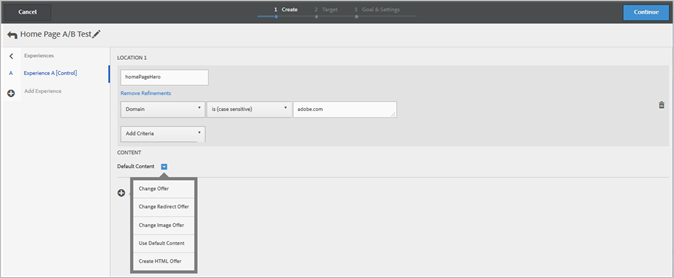
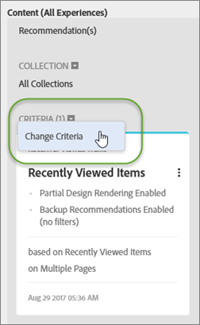

# Form-Based Experience Composer

This feature enables Target Standard A/B tests, Experience Targeting, Automated Personalization, and Recommendations activities to be delivered in emails, mobile apps, kiosks, and other places that don't work with a Visual Experience Composer. 

This video provides a demo of the form-based composer: 

<table id="table_47FED9E4494B4ABB9BBD4D082534BC45"> 
 <thead> 
  <tr> 
   <th class="entry" colspan="2"> Form-Based Experience Composer </th> 
   <th colname="col3" class="entry"> 4:35 </th> 
  </tr>
 </thead>
 <tbody> 
  <tr> 
   <td colspan="2"> 
 
     
 
      <iframe src="https://www.youtube.com/embed/R9hcD9D1VPY/" frameborder="0" webkitallowfullscreen="true" mozallowfullscreen="true" oallowfullscreen="true" msallowfullscreen="true" allowfullscreen="allowfullscreen" scrolling="no" width="550" height="345">https://www.youtube.com/embed/R9hcD9D1VPY/</iframe>
     
 
 </td> 
   <td colname="col3"> 
 
     <ul id="ul_3B9FF13D85254CBF84E539960B764CF0"> 
      <li id="li_317BEB0C637349818D3C1784803C0FE9">Create an activity using the Form-Based Experience Composer </li> 
      <li id="li_996E0C8D914E42DE90F6552B3C1161B9">Understand when to use Form-Based Experience Composer vs. the Visual Experience Composer </li> 
      <li id="li_B5B119535AD3488CAAAD8EEF45AD3418">Use refinements to target a location </li> 
     </ul> 
 </td> 
  </tr> 
 </tbody> 
</table>

If you are creating a Recommendations activity, there are no experiences. Choose your criteria and design. If you choose multiple criteria or designs, Target automatically generates the experiences. 

>1. Click ** [!UICONTROL  Create Activity] **, then select the type of activity you want to create.

>       The Form-Based Experience Composer is available for A/B tests, Experience Targeting, Automated Personalization, and Recommendations activities. 
>1. Select ** [!UICONTROL  Form-Based Experience Composer] ** from the [!UICONTROL  New Activity]dialog box.

>       The Form-Based Experience Composer opens. 

>        

>       This screen is different if you are creating a Recommendations activity. Recommendations activities do not include experiences. 
>1. Name the activity.
>1. Select a location.

>       When you click in the Select Location box, a list of available locations appears. Select one of those locations. To choose the global location delivered via target.js, choose “target-global-mbox.” 

>       You can also enter a location that is not listed here. This can be useful if the mbox has not yet been created or viewed on a page. Type the name of the location. Be careful when entering a location that does not yet exist. If the spelling or capitalization does not match the spelling and capitalization when the mbox call is made, the activity will not deliver. Manually entered locations are saved to the list. 
>1. Click ** [!UICONTROL  Add Audience Refinements] **, then choose one or more [ audience](c_target.md#concept_A782F8481A5041EBA75103CB26376522) for this activity.

>        

>       In the Form-based Experience Composer, Refinements have been replaced with full audience functionality. Refinements for existing activities have been migrated to [ activity-only audiences](creating-activity-only-audience.md#concept_A6BADCF530ED4AE1852E677FEBE68483). 
>1. Select the type of content you want to appear in that location.

>        
>1. For the content type you selected, specify the content.

>    <table id="table_38B1D459A99F4CA695B5D94078402A08"> 
 <thead> 
  <tr> 
   <th colname="col1" class="entry"> Content Type Options </th> 
   <th colname="col2" class="entry"> Instructions </th> 
  </tr> 
 </thead>
 <tbody> 
  <tr> 
   <td colname="col1"> 
Change Offer 
 </td> 
   <td colname="col2"> 
Choose an offer saved in the content library in Target. 
 </td> 
  </tr> 
  <tr> 
   <td colname="col1"> 
Change Redirect Offer 
 </td> 
   <td colname="col2"> 
Choose a redirect offer. 
 </td> 
  </tr> 
  <tr> 
   <td colname="col1"> 
Change Image Offer 
 </td> 
   <td colname="col2"> 
Choose an image saved in the content library in Target. 
 
You can also add a link to an image (click-through, destination, landing, and so forth). 
 
 
     <ol id="ol_9DB0607503124884ACB3823E9BF7DB19"> 
      <li id="li_69308FBB39F2479682D3E768555A8F8D">Click  Change Image Offer. </li> 
      <li id="li_B79C509BF3B6402C835B84C6D30F29CE">Select the desired image, then click  Edit Links. </li> 
      <li id="li_BEBB94C9F3C94678B196E26CDDBF2425">Specify the desired URL or page on your site, then click  Update. </li> 
     </ol> 
 </td> 
  </tr> 
  <tr> 
   <td colname="col1"> 
Use Default Content 
 </td> 
   <td colname="col2"> 
Use the default content. There is no option to select other content. 
 </td> 
  </tr> 
  <tr> 
   <td colname="col1"> 
Create HTML Offer 
 </td> 
   <td colname="col2"> 
Type or paste the HTML offer source code in the Enter HTML field. 
 
For information about using the code editor to create or edit HTML offers, see <a href="c_vec_code_editor.xml#concept_B3A6E9EE3A60406DB640E205EA1745B5" format="dita" scope="local"> Code Editor</a>. 
 </td> 
  </tr> 
 </tbody> 
</table>

>       For a Recommendations activity, the Content drop-down gives you the Add Recommendation option. Click ** [!UICONTROL  Add Recommendation] **, then select the page type. Then follow the usual steps as defined in the interface to [ create a Recommendations activity](https://marketing.adobe.com/resources/help/en_US/target/recs/t_create_recs_activity.html). 

>       While selecting Recommendations criteria in the Form-Based Experience Composer, there is now a direct link to the selected Criteria card so you can quickly and easily edit the criteria. 

>        

>       From the Targeting page of the Target three-step guided workflow: 

>        
>1. (Optional, for AB activities, Automated Personalization, and Experience Targeting) To repeat this process for additional locations, click  and configure the location and content.
>1. Click ** [!UICONTROL  Continue] **, then complete the activity creation steps as usual for your activity type.

>    
>    * [ Create an A/B Test ](t_test_create_ab.md#task_68C8079BF9FF4625A3BD6680D554BB72)
>    * [ Create an Experience Targeting Activity ](t_xt_create.md#task_D6B3429AC31549E1A70EDF04B3DDC765)
>    * [ Create a Recommendations Activity](t_create_recs_activity.md#task_6874328773C64C44A73F0A130AD3F96F)

