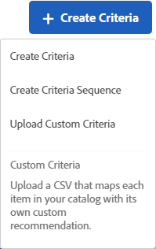
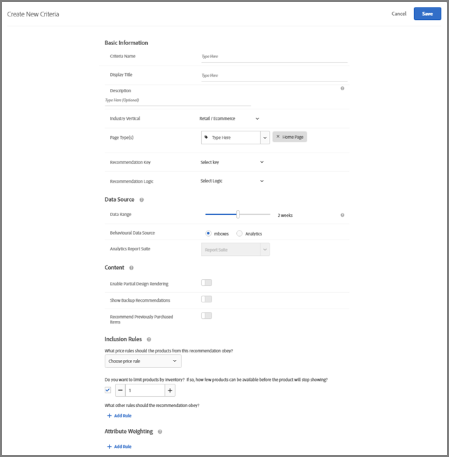
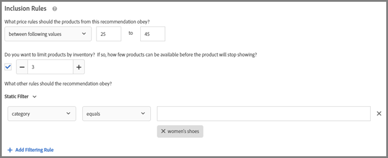
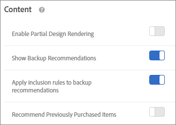
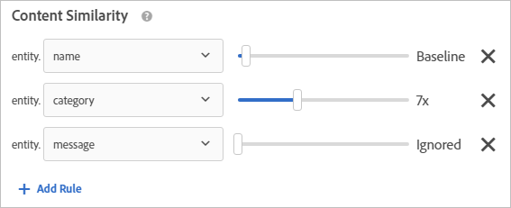

# Creating Criteria

## Creating Criteria {#task_8A9CB465F28D44899F69F38AD27352FE}
>Criteria control the content of your 
<keyword>
  Recommendations 
</keyword> activities. Create criteria to show the recommendations that are most appropriate for your activity.This section contains the following information: 

* [ Creating Criteria ](t_create_new_algorithm.md#task_8A9CB465F28D44899F69F38AD27352FE) 

* [ Base the Recommendation on a Recommendation Key ](t_create_new_algorithm.md#task_2B0ED54AFBF64C56916B6E1F4DC0DC3B) 

* [ Inclusion Rules ](t_create_new_algorithm.md#task_28DB20F968B1451481D8E51BAF947079) 

* [ Attribute Weighting ](t_create_new_algorithm.md#task_2AEDA0DB15B74770B76F6982B24C2E42) 

* [ Content Settings ](t_create_new_algorithm.md#concept_BC16005C7A1E4F1A87E33D16221F4A96) 

There are multiple ways to reach the [!UICONTROL  Create New Criteria] screen. Some screen options vary depending on how you reach the screen. 

* When you are creating a [!DNL  Recommendations] activity, click ** [!UICONTROL  Create New] ** on the [!UICONTROL  Select Criteria] screen. You will have the option to save your new criteria for use with other [!DNL  Recommendations] activities. 

* When you are editing a [!DNL  Recommendations] activity, click in a [!UICONTROL  Recommendations Location] box on your page, and select ** [!UICONTROL  Change Criteria] **. On the [!UICONTROL  Select Criteria] screen, click ** [!UICONTROL  Create New] **. You will have the option to save your new criteria for use with other [!DNL  Recommendations] activities. 

* On the ** [!UICONTROL  Recommendations] ** > ** [!UICONTROL  Criteria] ** library screen, click ** [!UICONTROL  Create Criteria] **. Criteria you create here are automatically made available for all [!DNL  Recommendations] activities. 

>1. Click ** [!UICONTROL  Create Criteria] ** or ** [!UICONTROL  Create New] **.

>        
>1. Select ** [!UICONTROL  Create Criteria] **.

>        
>1. Type a ** [!UICONTROL  Criteria Name] **.

>       This is the "internal" name used to describe the criteria. For example, you might want to call your criteria "Highest margin products," but you don't want that title to display publicly. See the next step to set the public-facing title. 
>1. Type a public-facing ** [!UICONTROL  Display Title] ** to appear on the page for any Recommendations that use this criteria.

>       For example, you might want to display "People who viewed this viewed that" or "Similar products" when you use this criteria to show recommendations. 
>1. Type a short ** [!UICONTROL  Description] ** of the criteria.

>       The description should help you identify the criteria, and might include information about the purpose of the criteria. 
>1. Select an ** [!UICONTROL  Industry Vertical] **.

>       Other criteria options will change based on the industry vertical you select. 
>1. Select a ** [!UICONTROL  Page Type] **.

>       You can select multiple page types. 

>       Together, the industry vertical and page types are used to categorize your saved criteria, making it easier to reuse criteria for other [!DNL  Recommendations] activities. 
>1. Select a ** [!UICONTROL  Recommendation Key] **.

>       For more information about basing criteria on a key, see [ Base the Recommendation on a Recommendation Key ](t_create_new_algorithm.md#task_2B0ED54AFBF64C56916B6E1F4DC0DC3B). 
>1. Select the ** [!UICONTROL  Recommendation Logic] **.

>       For more information about recommendation logic options, see [ Criteria ](c_algorithms.md#concept_4BD01DC437F543C0A13621C93A302750). 

>       >[!NOTE]
>       >
>       >If you select ** [!UICONTROL  Items] **/ ** [!UICONTROL  Media with Similar Attributes] **, you will have the option to set [ content similarity rules ](t_create_new_algorithm.md#concept_5402DAFA279C4E46A9A449526889A0CB). 
>1. Set the ** [!UICONTROL  Data Range] ** to determine the time range of available historical user behavior data to use when determining which recommendations to show.

>       If your site has a lot of traffic and behaviors change frequently, choose a shorter data window. A shorter window enables [!DNL  Recommendations] to be more responsive to changes in the market and in your business. For example, a shorter window means that [!DNL  Recommendations] will detect changes in visitor behavior as your visitors begin seasonal shopping, such as back-to-school shopping or Christmas, and will recommend items appropriate to those shopping seasons. 

>       If you don't have a lot of data, or visitor behavior does not change frequently, you might select a longer window. However, for many sites, a shorter window results in better recommendations. 

>       The available data ranges are: 

>    
>    * Two days
>    * One week
>    * Two weeks
>    * One month
>    * Two months

>1. Select the desired ** [!UICONTROL  Behavioral Data Source] **: [!UICONTROL  mboxes] or [!UICONTROL  Analytics].

>       If you chose [!UICONTROL  Analytics], select the desired report suite. 
>1. Set your ** [!UICONTROL  Content] ** rules.

>       Content rules determine what happens if the number of recommended items does not fill your design. For example, if your design has space for five items, but your criteria causes only three items to be recommended, you can leave the remaining space empty, or you can use backup recommendations to fill the extra space. 

>       Select the appropriate toggles: 

>    
>    * [!UICONTROL  Enable Partial Design Rendering] 

>    * [!UICONTROL  Show Backup Recommendations] 

>    * [!UICONTROL  Recommend Previously Purchased Items] 

>      This setting is based on the ` productPurchasedId`. It is useful if you sell items that people typically purchase only once, such as kayaks. If you sell items that people come back to purchase again, such as shampoo or other personal items, you should disable this option. 

>1. Set your ** [!UICONTROL  Inclusion Rules] **.

>       Inclusion rules determine which items will be included in your recommendations. The options available depend on your industry vertical. 

>       For more details, see [ Inclusion Rules ](t_create_new_algorithm.md#task_28DB20F968B1451481D8E51BAF947079). 
>1. Configure ** [!UICONTROL  Attribute Weighting] **.

>       You can add multiple rules to "nudge" the algorithm based on important description or metadata about the content catalog. For example, you can apply a higher weighting to on-sale items so they appear more often in the recommendation. 

>       See [ Attribute Weighting ](t_create_new_algorithm.md#task_2AEDA0DB15B74770B76F6982B24C2E42). 
>1. When finished, click ** [!UICONTROL  Save] **.

>       If you are creating a new [!UICONTROL  Recommendations] activity or editing an existing one, the ** [!UICONTROL  Save criteria for later] ** check box is selected by default. If you do not want to use the criteria in other activities, clear the check box before saving. 
>## Base the Recommendation on a Recommendation Key {#task_2B0ED54AFBF64C56916B6E1F4DC0DC3B}
>Recommendations based on keys utilize visitor behavior context to show relevant results. 
<draft-comment>
  recs/t_rec_key_recs.xml 
</draft-comment>

There are two types of Recommendations: 

* **Popularity: **Lists items according to Most Viewed, Top Sold, and Top Metric. The key is empty for popularity criteria. 

* **Key-based: **Comprises the rest of the criteria. Recommendations offers a diverse set of choices with regard to the key type. The options range from "current item" to "profile parameters," which allow you to programmatically set the key of the values to recommend. You can test multiple criteria against each other by basing each criteria on a different key. 

Each criteria is defined in its own tab. Traffic is split evenly across your different criteria tests. In other words, if you have two criteria, traffic is divided equally between them. If you have two criteria and two designs, traffic is split evenly between the four combinations. You can also specify a percentage of site visitors who see the default content, for comparison. In that case, the specified percentage of visitors see the default content, and the rest are split between your criteria and design combinations. 

>1. Create a new recommendation, or select an existing recommendation and click ** [!UICONTROL  Edit] **.
>1. To change the recommendation key, select the new key from the [!UICONTROL  Recommendation Key] drop-down list.

>       Because different logic maps to different recommendations keys, different recommendations lend themselves to placement on different types of pages: 

>    <table id="table_D2F606E0723A4A47992CFCF5B5A110E2"> 
 <thead> 
  <tr> 
   <th colname="col1" class="entry"> Key </th> 
   <th colname="col2" class="entry"> Description </th> 
   <th colname="col03" class="entry"> Logic (Criteria) </th> 
   <th colname="col3" class="entry"> Where on Your Site </th> 
  </tr> 
 </thead>
 <tbody> 
  <!-- <row> <entry colname="col1"> 
 <uicontrol>Current Page Activity</uicontrol> 
 </entry> <entry colname="col2"> 
This set of recommendation types is defined by the visitor's activity on the current page. 
 </entry> </row> --> 
  <tr> 
   <td colname="col1"> 
  Current Item  
 </td> 
   <td colname="col2"> 
The recommendation is determined by the item the visitor is currently viewing. Recommendations display other items that might interest visitors who are interested in the specified item. 
 
When this option is selected, the  entity.id  value must be passed as a parameter in the display mbox. 
 </td> 
   <td colname="col03"> 
    <ul id="ul_DCDC1D7C1A184087A7880FE3A49CC812"> 
     <li id="li_C8D237612E6B4F0DB732801302587FCD"> 
Items with similar attributes 
 </li> 
     <li id="li_D1DBE13F53344D2A8ABF455BA883DD08"> 
People Who Viewed This, Viewed That 
 </li> 
     <li id="li_B39E09076D6746B6BF7BC12320A72871"> 
People Who Viewed This, Bought That 
 </li> 
     <li id="li_F31C7BF0AE024D8A8097D79D5ABA94F8"> 
People Who Bought This, Bought That 
 </li> 
     <li id="li_01C45368713E4F3AA26A752F61C6DF05"> 
Overall behavior 
 </li> 
    </ul> </td> 
   <td colname="col3"> 
Single-item pages, such as product pages. 
 
Do NOT use on null search results pages. 
 </td> 
  </tr> 
  <tr> 
   <td colname="col1"> 
  Current Category  
 </td> 
   <td colname="col2"> 
The recommendation is determined by the product category that the visitor is currently viewing. Recommendations display items in the specified product category. 
 
When this option is selected, the  entity.categoryId value must be passed as a parameter to the display mbox. 
 </td> 
   <td colname="col03"> 
    <ul id="ul_6C0145C493DC4D999041824654A3FD0F"> 
     <li id="li_02B9BDAA806C469A8F1B433B205C761F"> 
Top Sellers 
 </li> 
     <li id="li_3BAF37AC41B049968FBB34B2DF0F7BD9"> 
Most Viewed 
 </li> 
    </ul> </td> 
   <td colname="col3"> 
Single-category pages. 
 
Do NOT use on null search results pages. 
 </td> 
  </tr> 
  <tr> 
   <td colname="col1"> 
  Custom Attribute  
 </td> 
   <td colname="col2"> 
Recommendation is determined by an item that is stored in a visitor's profile, using either  user.&amp;lt;x&amp;gt;  or  profile.&amp;lt;x&amp;gt;  attributes. 
 
When this option is selected, the  entity.id  value must be present in the profile attribute. 
 </td> 
   <td colname="col03"> 
    <ul id="ul_362033C0345E40ED888618762B436B45"> 
     <li id="li_2DA5B5EF217F4C56B212E19EE54BDC82"> 
People Who Viewed This, Viewed That 
 </li> 
     <li id="li_C7BEB965C72544E1BA538FBDF696662F"> 
People Who Viewed This, Bought That 
 </li> 
     <li id="li_DA421BF2FD314265A72DECE9E025AE86"> 
People Who Bought This, Bought That 
 </li> 
     <li id="li_4B3B75420FEA481290DC73EDF754F445"> 
Overall behavior 
 </li> 
     <li id="li_66BFF016564749B298B88F6B9638B64E"> 
Most Viewed 
 </li> 
     <li id="li_937FE5C40ED8471391B282D1ACE8C133"> 
Top Sellers 
 </li> 
    </ul> 
If the key is a custom profile attribute and the algorithm type is Most Viewed or Top Sellers, a new drop-down list that displays called "Group By Unique Value Of" that has a list of known entity attributes (except ID, category, margin, value, inventory, and environment). This field is required. 
 </td> 
   <td colname="col3"> 
Can be used on any pages. 
 </td> 
  </tr> 
  <!-- <row> <entry colname="col1"> 
 <uicontrol>Custom Profile Attribute</uicontrol> 
 </entry> <entry colname="col2"> 
For users who use the recommendations and testing and targeting functions of Adobe Target. 
 
The recommendation is based on any profile attribute set up for testing. The value for the attribute must resolve to an<codeph> entity.id</codeph>. For example, you might want to keep track of an item someone abandoned in their cart. You could write a profile script that stores that <codeph>entity.id</codeph>, and then deliver recommendations based on that abandoned cart item the next time the visitor returns to the site. 
 </entry> </row> --> 
  <!-- <row> <entry colname="col1"> 
 <uicontrol>Custom Algorithms</uicontrol> 
 </entry> <entry colname="col2"> 
This set of recommendation types lists any custom algorithms that have been defined. If there are no custom algorithms, this portion of the <wintitle>Recommendation Type</wintitle> list is empty. 
 </entry> </row> --> 
  <!-- <row> <entry colname="col1"> 
 <uicontrol>Past Behavior</uicontrol> 
 </entry> <entry colname="col2"> 
This set of recommendation types is defined by the past behavior of your site visitors. 
 </entry> </row> --> 
  <tr> 
   <td colname="col1"> 
  Last Purchased Item  
 </td> 
   <td colname="col2"> 
The recommendation is determined by the last item that was purchased by each unique visitor. This is captured automatically, so no values need to be passed on the page. 
 </td> 
   <td colname="col03"> 
    <ul id="ul_FE8FD3BB489842739CE545B5F2D6642F"> 
     <li id="li_DE45A9AA40AF4D1B9D88E435B60133F2"> 
Items with similar attributes 
 </li> 
     <li id="li_E789CABB29654586903B151231F39B12"> 
People Who Viewed This, Viewed That 
 </li> 
     <li id="li_B75E693A26FC434E9EDAA700063E9664"> 
People Who Viewed This, Bought That 
 </li> 
     <li id="li_5233971798A041A8B32DD8ECA70EF757"> 
People Who Bought This, Bought That 
 </li> 
     <li id="li_C6760972E028448685373AECF39B311D"> 
Overall behavior 
 </li> 
    </ul> </td> 
   <td colname="col3"> 
Home page, My Account page, offsite ads. 
 
Do NOT use on product pages or pages relevant to purchases. 
 </td> 
  </tr> 
  <tr> 
   <td colname="col1"> 
  Last Viewed Item  
 </td> 
   <td colname="col2"> 
The recommendation is determined by the last item that was viewed by each unique visitor. This is captured automatically, so no values need to be passed on the page. 
 </td> 
   <td colname="col03"> 
    <ul id="ul_59FAA3B61E124E7EACB323328118C5EE"> 
     <li id="li_27C265D3AF6844989EFACF528EB3D05D"> 
Items with similar attributes 
 </li> 
     <li id="li_8522D197C43744D8B7D7F40BCEA3D514"> 
People Who Viewed This, Viewed That 
 </li> 
     <li id="li_24BD56FC2B5842598AF08B78EE670EFE"> 
People Who Viewed This, Bought That 
 </li> 
     <li id="li_ECC258DCD41B48878917E444C9D58B20"> 
People Who Bought This, Bought That 
 </li> 
     <li id="li_0D6E97DE926D409E9D8DB6E905497A09"> 
Overall behavior 
 </li> 
    </ul> </td> 
   <td colname="col3"> 
Home page, My Account page, offsite ads. 
 
Do NOT use on product pages or pages relevant to purchases. 
 </td> 
  </tr> 
  <tr> 
   <td colname="col1"> 
  Most Viewed Item  
 </td> 
   <td colname="col2"> 
The recommendation is determined by the item that has been viewed most often, using the same method as used for favorite category. 
 
This is determined by recency/frequency criteria that works as follows: 
 
 
     <ul id="ul_E61195D2C502460CAA77E9A73103EA33"> 
      <li id="li_5BCA28971F084F8C8CFF8C218E71048B"> 
10 points for first product view 
 </li> 
      <li id="li_F9C6F3319D6E4279AFF3F583A7D8BA67"> 
 5 points for every subsequent view 
 </li> 
      <li id="li_35AAF05DF8E64A8F93B9236F80CDB5C1"> 
 At end of session divide all values by 2 
 </li> 
     </ul> 
 
For example, viewing surfboardA then surfboardB in one session results in A: 10, B: 5. When the session ends, you will have A: 5, B: 2.5. If you view the same items in the next session, the values change to A: 15 B: 7.5. 
 </td> 
   <td colname="col03"> 
    <ul id="ul_AAB6FE5593FE4538AFDD1C8823ACCA6E"> 
     <li id="li_4FA53D2E00124FF6B997BFB9E08C86D2"> 
Items with similar attributes 
 </li> 
     <li id="li_C8ACAB71752C4E6EBD1263E21CA8B4F1"> 
People Who Viewed This, Viewed That 
 </li> 
     <li id="li_EEE10C05CCAF4EC2B6D44AF41DE97452"> 
People Who Viewed This, Bought That 
 </li> 
     <li id="li_48BE7837CB9A4B329400D5B9624A3A96"> 
People Who Bought This, Bought That 
 </li> 
     <li id="li_3C790AA66A8C4515A48625C23E1AC337"> 
Overall behavior 
 </li> 
    </ul> </td> 
   <td colname="col3"> 
General pages, such as home or landing pages and offsite ads. 
 </td> 
  </tr> 
  <tr> 
   <td colname="col1"> 
  Favorite Category  
 </td> 
   <td colname="col2"> 
The recommendation is determined by the category that has received the most activity, using the same method used for "most viewed item" except that categories are scored instead of products. 
 
This is determined by recency/frequency criteria that works as follows: 
 
 
     <ul id="ul_568FB583582546C49479197AC416C4A1"> 
      <li id="li_472876E860A6430DB0F50BAD266BC7BC"> 
 10 points for first category view 
 </li> 
      <li id="li_08E2CE83C7174B69BAFBF992204F1E52"> 
 5 points for every subsequent view 
 </li> 
     </ul> 
 
Categories visited for the first time are given 10 points. 5 points are given for subsequent visits to the same category. With each visit, non-current categories that have been viewed before are decremented by 1. 
 
For example, viewing categoryA then categoryB in one session results in A: 9, B: 10. If you view the same items in the next session, the values change to A: 20 B: 9. 
 </td> 
   <td colname="col03"> 
    <ul id="ul_7C53E286352F419FAFF9FC6F6A000050"> 
     <li id="li_6069417BFB2E4C1FAD7C6548A5FE8919"> 
Top Sellers 
 </li> 
     <li id="li_466F4985D78042248311BCF770F5C74C"> 
Most Viewed 
 </li> 
    </ul> </td> 
   <td colname="col3"> 
General pages, such as home or landing pages and offsite ads. 
 </td> 
  </tr> 
  <tr> 
   <td colname="col1"> 
  Popularity  
 </td> 
   <td colname="col2"> 
The recommendation is determined by the popularity of items on your site. Popularity includes top sellers and top viewed by mbox data and, if you use Adobe Analytics, all of the metrics available in the product report. Items are ranked based on the Recommendation Logic you select. 
 </td> 
   <td colname="col03"> 
    <ul id="ul_098AAF8E66894BE58DE0C391CD9F7BE0"> 
     <li id="li_B15E7309E01A44D885334431FFDBDACB"> 
Top Sellers 
 </li> 
     <li id="li_E05621811A3546699268BAD42646BBD1"> 
Most Viewed 
 </li> 
     <li id="li_53A03302700D44D98C0D6C87BC907492"> 
Product report metrics (if you are using Adobe Analytics) 
 </li> 
    </ul> </td> 
   <td colname="col3"> 
General pages, such as home or landing pages and offsite ads. 
 </td> 
  </tr> 
  <tr> 
   <td colname="col1"> 
  Recently Viewed Items  
 </td> 
   <td colname="col2"> 
Uses the visitor's history (spanning sessions) to present the last <i>x</i> items the visitor has viewed, based on the number of slots in the design. 
 
The Recently Viewed Items criteria now returns results specific to a given <a href="../ov2/c_hosts.xml#concept_516BB01EBFBD4449AB03940D31AEB66E" format="dita" scope="local"> environment </a>. If two sites belong to different environments and a visitor switches between the two sites, each site shows only recently viewed items from the appropriate site. If two sites are in the same environment and a visitor switches between the two sites, the visitor will see the same recently viewed items for both sites. 
 </td> 
   <td colname="col03"> 
None 
 </td> 
   <td colname="col3"> 
General pages, such as home or landing pages and offsite ads. 
 </td> 
  </tr> 
 </tbody> 
</table>

>1. Click ** [!UICONTROL  Save] **.
>## Inclusion Rules {#task_28DB20F968B1451481D8E51BAF947079}
>Several options help you narrow the items that display in your recommendations. You can use inclusion rules while creating criteria or promotions. 
<draft-comment>
  recs/t_data_details.xml 
</draft-comment>Inclusion rules are optional; however, setting these details gives you more control over the items that appear in your recommendations. Each detail you configure further narrows the display criteria. 

For example, you can choose to display only women's shoes that have an inventory of more than 50 and a price between $25 and $45. You can also weight each attribute so those items that are more important to your business are most likely to appear. 

As another example, you can choose to display job openings to visitors who visit your site only from certain cities and who have the required college degrees. 

Inclusion rule options vary by industry vertical. By default, inclusion rules are applied to backup recommendations. 

>[!NOTE]
>
>You should use inclusion rules cautiously. They are useful if, for example, your organization has rules that demand that one brand is not recommended while another brand is being shown. However, there is an opportunity cost to this feature. You could possibly lose a percentage of lift by restricting some items from not showing when they would normally be shown by the activity criteria.

The inclusion rules are joined with an AND. All rules must be met to include an item in a recommendation. 

To create a simple inclusion rule, as mentioned previously, to display only women's shoes that have an inventory of more than 50 and a price between $25 and $45, perform the following steps: 

>1. Set a price range for the products you want to recommend.
>1. Set the minimum inventory amount for the products you want to recommend.
>1. Configure the recommendation to display items only when they meet certain criteria.

>        

>       You can specify that items are included only when one of the attributes in the list meets or does not match one or more specified conditions. 

>       The available evaluators depend on the value you choose in the first drop-down. You can list multiple items. These items are evaluated with OR. 

>       Multiple rules are combined with an AND. 

>       >[!NOTE]
>       >
>       >This option limits the items that are displayed in the recommendation. It does not affect which pages the recommendation is displayed on. To limit where the recommendation displays, select the pages in the experience composer.

>## Attribute Weighting {#task_2AEDA0DB15B74770B76F6982B24C2E42}
>Use attribute weighting to "nudge" the algorithm so certain items are more likely to be shown. Marketers can influence the algorithm based on important description or metadata about the content catalog. 
<draft-comment>
  recs/t_attribute_weighting.xml 
</draft-comment>Apply a higher weighting to these on-sale items so they show more often in the recommendation. Non-sale items are not completely excluded, but they appear less often. Multiple weighted attributes can be applied to the same algorithm, and the weighted attributes can be tested on split traffic in the recommendation.
>1. Choose a value.

>       The value determines the type of item that is more likely to display, based on one of several available criteria. 
>1. Choose an evaluator.
>1. Type the keyword to complete the rule attributes.

>       For example, the complete rule might be "Category contains shoes." 

>        
>1. Select the weight to assign to the rule.

>       Options range from 0 to 100 in increments of 25. 
>1. Add additional rules if desired.
>## Content Settings {#concept_BC16005C7A1E4F1A87E33D16221F4A96}
>The 
<wintitle>
  Content 
</wintitle> settings determine how recommendations display in your design. 
<draft-comment>
  recs/c_content_settings.xml 
</draft-comment>It is possible for [!UICONTROL  Recommendations] criteria to return fewer recommendations than your design calls for. For example, your design may have five available "slots," but the criteria returns only three recommended items. The [!UICONTROL  Content] settings control how recommendations are presented when this happens. 

Content rules determine what happens if the number of recommended items does not fill your design. For example, if your design has space for five items, but your criteria causes only three items to be recommended, you can leave the remaining space empty, or you can use backup recommendations to fill the extra space. 

Select the appropriate toggles: 

* [!UICONTROL  Enable Partial Design Rendering] 

* [!UICONTROL  Show Backup Recommendations] 

* [!UICONTROL  Apply Inclusion Rules to Backup Recommendations] 

* [!UICONTROL  Recommend Previously Purchased Items] 

  This setting is based on the ` productPurchasedId`. It is useful if you sell items that people typically purchase only once, such as kayaks. If you sell items that people come back to purchase again, such as shampoo or other personal items, you should disable this option. 

If you enable ** [!UICONTROL  Show Backup Recommendations] **, the option to apply your [ inclusion rules ](t_create_new_algorithm.md#task_28DB20F968B1451481D8E51BAF947079) to backup recommendations is enabled by default. 

 

<table id="table_C0B893ECCEB4472B848808750C7ADDED"> 
 <thead> 
  <tr> 
   <th colname="col1" class="entry"> Partial Design Rendering </th> 
   <th colname="col2" class="entry"> Backup Recommendations </th> 
   <th colname="col3" class="entry"> Result </th> 
  </tr> 
 </thead>
 <tbody> 
  <tr> 
   <td colname="col1"> Disabled </td> 
   <td colname="col2"> Disabled </td> 
   <td colname="col3"> 
If fewer recommendations are returned than the design calls for, the recommendations design is replaced by default content and no recommendations are displayed. 
 </td> 
  </tr> 
  <tr> 
   <td colname="col1"> Enabled </td> 
   <td colname="col2"> Disabled </td> 
   <td colname="col3"> 
The design is rendered, but may include blank space if fewer recommendations are returned than the design calls for. 
 </td> 
  </tr> 
  <tr> 
   <td colname="col1"> Enabled </td> 
   <td colname="col2"> Enabled </td> 
   <td colname="col3"> 
Backup recommendations will fill available design "slots," fully rendering the design. 
 
If applying inclusion rules to backup recommendations restricts the number of qualifying backup recommendations to the point that the design cannot be filled, the design is partially rendered. 
 
 If the criteria does not return any recommendations, and inclusion rules restrict backup recommendations to zero, the design is replaced with default content. 
 </td> 
  </tr> 
  <tr> 
   <td colname="col1"> Disabled </td> 
   <td colname="col2"> Enabled </td> 
   <td colname="col3"> 
Backup recommendations will fill available design "slots," fully rendering the design. 
 
 If applying inclusion rules to backup recommendations restricts the number of qualifying backup recommendations to the point that the design cannot be filled, the design is replaced by default content and no recommendations are displayed. 
 </td> 
  </tr> 
 </tbody> 
</table>

>## Content Similarity {#concept_5402DAFA279C4E46A9A449526889A0CB}
>Use 
<wintitle>
  Content Similarity 
</wintitle> rules to make recommendations based on item or media attributes. 
<draft-comment>
  recs/c_content_similarity.xml 
</draft-comment>Content similarity compares item attribute keywords and makes recommendations based on how many keywords different items have in common. Recommendations based on content similarity do not require past data to deliver strong results. 

Using content similarity to generate recommendations is especially effective for new items, which are not likely to show up in recommendations using *People Who Viewed This, Viewed That* and other logic based on past behavior. You can also use content similarity to generate useful recommendations for new visitors, who have no past purchases or other historical data. 

When you select ** [!UICONTROL  Items] **/ ** [!UICONTROL  Media with Similar Attributes] **, you have the option to create rules to increase or decrease the importance of specific item attributes in determining recommendations. For items such as books, you might want to boost the importance of attributes like *genre*, *author*, *series*, and so on, to recommend similar books. 

 

Because content similarity uses keywords to compare items, some attributes, such as *message* or *description*, can introduce "noise" into the comparison. You can create rules to ignore these attributes. 

By default, all attributes are set to *Baseline*. You do not need to create a rule unless you want to change this setting. 
