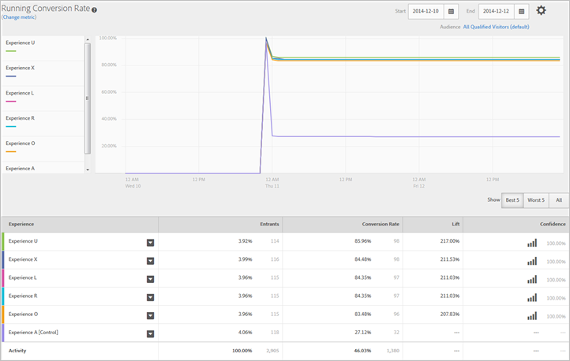

# Experience Performance Report

This video demonstrates how to create a multivariate test using the Target three-step guided workflow. The Experience Performance report is described beginning at 8:20. 

<table id="table_C56F4BE9B867463380013C584D97DAD2"> 
 <thead> 
  <tr> 
   <th class="entry" colspan="2"> Creating Multivariate Tests </th> 
   <th colname="col3" class="entry"> 9:25 </th> 
  </tr>
 </thead>
 <tbody> 
  <tr> 
   <td colspan="2"> 
 
     
 
      <iframe src="https://www.youtube.com/embed/X8w5IQqEOow/" frameborder="0" webkitallowfullscreen="true" mozallowfullscreen="true" oallowfullscreen="true" msallowfullscreen="true" allowfullscreen="allowfullscreen" scrolling="no" width="550" height="345">https://www.youtube.com/embed/X8w5IQqEOow/</iframe>
     
 
 </td> 
   <td colname="col3"> 
 
     <ul id="ul_B17C3EFA4B664415AE0159E418FF45C4"> 
      <li id="li_916224D2105348BE93D60015B2F43D4F">Define and design a multivariate test </li> 
      <li id="li_0FED234A3A054DEAB62C4F58BAB47F7F">Create a multivariate test </li> 
     </ul> 
 </td> 
  </tr> 
 </tbody> 
</table>

You can select one or more experiences to compare them. Click on an experience and select ** [!UICONTROL  Preview] ** to open the experience in a browser tab. 

 

The top of the report shows the metric, start and end dates, and audience used in the report. You can change any of these factors. 

>[!NOTE]
>
>The audience and metric pickers are only available if Analytics is used as the reporting source.

Next, a line graph provides a visual comparison of each experience at specific time intervals. This graph helps you see how well each experience performs, and how the time of day affects performance. 

You can display the best five, worst five, or all experiences. The best and worst five are determined by lift, and include a sixth experience showing the control for comparison. It is suggested that you view the best and worst five to determine the success of your experiences. Viewing all makes it difficult to extract the desired information, and not all experiences can display in the graph. Use View All if you want to look at a specific experience that is not in the best or worst five. 

>[!NOTE]
>
>Multivariate test reports do not show any excluded experiences when either the Best Five or Worst Five filter is selected.

Below the graph, a table shows how many entrants saw each experience, as well as other information relevant to your success metric. 
