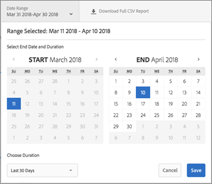
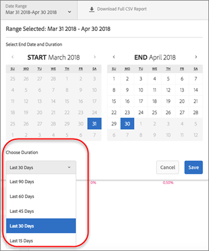
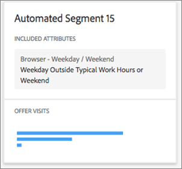
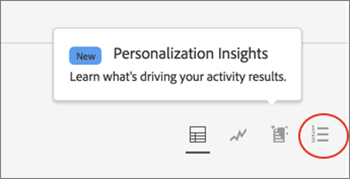

# Personalization Insights Reports

<table id="table_94482816FCA2417A9B0EA7BBCC414715"> 
 <tbody> 
  <tr> 
   <td colname="col1"> 
<b>Notes:</b> 
 
 
     <ul id="ul_D2221BB4EAD54260B69A2E282C789E98"> 
      <li id="li_26617F6F7DB1488CA404E9270596B84D"> 
Personalization Insights is currently offered as a Beta feature available to select customers to obtain feedback to help us improve the feature before making it available to all customers. This documentation is subject to change. 
 </li> 
      <li id="li_E1AC7D9CA0B9418F852B843E3418D898"> 
Personalization Insights is available only for Automated Personalization and Auto-Target activities that use a conversion optimization goal. 
 </li> 
      <li id="li_19AD73402DB54C199EC506D434ABE96C"> 
Automated Personalization and Auto-Target are available as part of the  Target Premium  solution. They are not included with  Target Standard  without a  Target Premium  license. 
 </li> 
     </ul> 
 </td> 
  </tr> 
 </tbody> 
</table>

This section contains the following information: 

* [ Personalization Insights Reporting Overview ](c_personalization-insights-reports.md#section_B47CD4A50FEB43D587F9FACD9FFD6D9D) 

* [ Accessing and Interpreting Automated Segments and Model Attribute Ranking Reports... ](c_personalization-insights-reports.md#section_8E8F997AAAF44A1B9EE06EB6FB652801) 

* [ Interpreting Attributes in Personalization Insights ](c_personalization-insights-reports.md#section_B5C45E723EC941BDA2A7A642EEB30E4D) 

* [ Personalization Insights FAQ ](c_personalization-insights-reports.md#section_740910A52FA646B4AC9452F98C2F5719) 

## Personalization Insights Reporting Overview {#section_B47CD4A50FEB43D587F9FACD9FFD6D9D}

The goal of Personalization Insights is to provide more information on how the Target personalization models behind your AP and AT activities personalize visitor traffic. The [ Random Forest algorithm ](c_algo_random_forest.md#concept_48F3CDAA16A848D2A84CDCD19DAAE3AA) is the basis for Target's personalization models. 

Because the goal of Personalization Insights is to understand how Target's personalization models decided to send which visitor to what piece(s) of content, Personalization Insights reflects only a sub-segment of all the traffic served by your AP or AT activity. Specifically, it is reflective of all traffic that used the personalization model. In other words, Personalization Insights does not consider control traffic or traffic that is served by the overall winner model. 

There are two reports available in Personalization Insights: 

<table id="table_713AAD1ED0A5460580ACA7EBB7986C2A"> 
 <thead> 
  <tr> 
   <th colname="col1" class="entry"> Report </th> 
   <th colname="col2" class="entry"> Details </th> 
  </tr> 
 </thead>
 <tbody> 
  <tr> 
   <td colname="col1"> 
Automated Segments 
 </td> 
   <td colname="col2"> 
Different visitors respond differently to the offers/experiences in your AP/AT activity. This report shows how different automated segments defined by Target's personalization models responded to the offers/experiences in the activity. 
 </td> 
  </tr> 
  <tr> 
   <td colname="col1"> 
Model Attribute Ranking 
 </td> 
   <td colname="col2"> 
In different activities, different attributes are more, or less, important to how the model decides to personalize. This report shows the top attributes that influenced the model and their relative importance. 
 </td> 
  </tr> 
 </tbody> 
</table>

## Accessing and Interpreting Automated Segments and Model Attribute Ranking Reports {#section_8E8F997AAAF44A1B9EE06EB6FB652801}

1. Click ** [!UICONTROL  Activities] **, then click the desired AP or AT activity from the list. 

   If you have many activities, you can filter the list by selecting options from the Type, Status, Reporting Source, Experience Composer, Metrics Type, and Activity Source drop-down lists. 

1. Click ** [!UICONTROL  Reports] **. 

   The Summary report displays, which provides information about the performance of your activities, represented by the first screen icon (   ). The two additional icons represent the two Personalization Insights reports: Automated Segments (   ) and Model Attribute Ranking (   ). Note that Auto-Target has an additional graph icon (   ) for the graphical view of the Summary report. 

    

   >[!IMPORTANT]
   >
   >Automated Segments and Model Attribute Ranking reports won't be available until at least 15 days after you've activated your activity. During this initial period, you won't be able to access these reports or click the Automated Segments and Model Attribute Ranking icons. After 15 days have passed, assuming there is sufficient personalized traffic in your activity, Automated Segments and Model Attribute Ranking reports will be available.

1. After 15 days from activating the activity, you can click the ** [!UICONTROL  Automated Segments] ** icon (   ). 

    

1. Select the desired date range. 

   Unlike the Summary report (performance reporting), Personalization Insights, including Automated Segments, is available only for fixed date ranges: 15 days, 30 days, 45 days, 60 days, and 90 days. These fixed date ranges allow Personalization Insights to use a large enough range of data to reduce the likelihood that you derive insights from a short-lived pattern in your activity. The two decisions you can make for your date range is the "End Date" and the "Duration." You'll notice that the "Start" is greyed out. The start date automatically changes based on your selections for the end date and duration. 

    

   You can access the available fixed date ranges from the "Choose Duration" drop-down list. 

    

1. Review the Automated Segments report data. 

   The following table explains how to interpret the report and describes its elements: 

<table id="table_682258CE61FF476F81656324620FF914"> 
 <thead> 
  <tr> 
   <th colname="col1" class="entry"> Element </th> 
   <th colname="col2" class="entry"> Details </th> 
  </tr> 
 </thead>
 <tbody> 
  <tr> 
   <td colname="col1"> 
Left-hand side panel 
 </td> 
   <td colname="col2"> 
The left-hand side panel lists the 20 largest "automated segments" identified by Target's personalization models for this activity. An "automated segment" is like an audience, but it is defined by Target's personalization models instead of by the marketer. Each automated segment is made up of specific values (or value ranges) of specific attributes. 
 
Note that automated segments can overlap. Automated segments can be defined by one, two, three, or four attributes. See the examples below for more details. 
 
To learn more about Target's personalization models, see <a href="c_algo_random_forest.md#concept_48F3CDAA16A848D2A84CDCD19DAAE3AA" format="dita" scope="local"> Random Forest Algorithm </a>. To learn more about the attributes Target's personalization models use to create the automated segments, see <a href="r_ap_data.md#reference_255BD3DE7AD04DC9B766E0BC78961058" format="dita" scope="local"> Data Collection for Target's Personalization Algorithms </a>. 
 </td> 
  </tr> 
  <tr> 
   <td colname="col1"> 
Center graph 
 </td> 
   <td colname="col2"> 
The center graphs displays how your activity's content performed for the highlighted automated segment. As you click different segments on the left-hand panel, the center graphs update. 
 </td> 
  </tr> 
  <tr> 
   <td colname="col1"> 
Pie charts 
 </td> 
   <td colname="col2"> 
The pie charts at the top of the center panel show the size of the automated segment, as well as the total number of personalized visits in the activity (for example, traffic to this activity that was served by the personalization model. It does not include control traffic or traffic served by the overall winner model). Note that the size of the segment is based only on personalized visits. 
 
  
 </td> 
  </tr> 
  <tr> 
   <td colname="col1"> 
Dual-axis bar chart 
 </td> 
   <td colname="col2"> 
The dual-axis bar chart includes visit and conversion information by the offer or experience for that specific automated segment. 
 </td> 
  </tr> 
  <tr> 
   <td colname="col1"> 
Pink bar 
 </td> 
   <td colname="col2"> 
The pink bar represents the conversion rate, and uses the bottom axis of the graph. You can hover over the bar for more information 
 </td> 
  </tr> 
  <tr> 
   <td colname="col1"> 
Blue bar 
 </td> 
   <td colname="col2"> 
The blue bar represents the number of visits, and uses the top axis of the graph. You can hover over the bar for more information. 
 </td> 
  </tr> 
  <tr> 
   <td colname="col1"> 
Grey dotted line 
 </td> 
   <td colname="col2"> 
 The grey dotted line represents the conversion rate for all personalized visits in the activity, across all offers/ experiences and automated segments. 
 </td> 
  </tr> 
 </tbody> 
</table>

   **Automated Segment Example 1** 

   This automated segment is defined based on only one attribute. Visitors included in this automated segment saw this AP activity on a weekday outside of typical working hours or on a weekend. 

    

   **Automated Segment Example 2** 

   This automated segment is defined based on two attributes. Visitors included in this automated segment who saw this AP activity had fewer than three page views in their current visit and were geographically based within the Latitude 42.57 and 47.29 (approximately between New Hampshire/Oregon and Washington/Maine for a US-based company). 

    

1. (Optional) [ Download the report in CSV format ](c_report-settings.md#section_77E65C50BAAF4AB79242DB3A8778ADEF) for analysis in Excel and other tools. 

   >[!NOTE]
   >
   >The Personalization Insights UI report contains select information. The CSV download for both Automated Segments and Model Attribute Ranking contain additional details. The Automated Segment Insights Report download includes additional Automated Segments beyond the top segments included in the UI, along with how those segments performed against your offers or experiences.

1. After 15 days from activating the activity, you can click the ** [!UICONTROL  Model Attribute Ranking] ** icon (   ). 

    

1. Select the desired date range. 

   The date range for the Model Attribute Ranking works the same way as the Automated Segments report. See Step 4 for more details. If you selected a date range in the Automated Segments report before navigating to the Model Attribute Ranking report, that date range is maintained. 

1. Review the Model Attribute Ranking report data. 

    

   The following table explains how to interpret the report and describes its elements: 

<table id="table_566A87F2F455465589B7C889521B544E"> 
 <thead> 
  <tr> 
   <th colname="col1" class="entry"> Element </th> 
   <th colname="col2" class="entry"> Details </th> 
  </tr> 
 </thead>
 <tbody> 
  <tr> 
   <td colname="col1"> 
Model Attribute Ranking chart 
 </td> 
   <td colname="col2"> 
 The Model Attribute Ranking includes the top 10 attributes that were most important to how Target's personalization model decided what content to show each visitor. The importance score shows, relative to the top 100 attributes, how important a specific attribute was to Target's personalization models in this activity. 
 </td> 
  </tr> 
  <tr> 
   <td colname="col1"> 
Bar graph 
 </td> 
   <td colname="col2"> 
The multi-colored bar graph at the top of the screen allows you to visualize these relative importance scores and maps to the dot's color beside each respective attribute in the table. You can also hover over a specific color in the bar chart to see the attribute it represents. 
 
The importance scores across the top 100 attributes add to 100%. For more information about how to add more attributes that Target's personalization models can use, see <a href="c_uploading-data-for-target's-personalization-algorithms.md#concept_85EA505B37E54514A1C8AB91553FEED6" format="dita" scope="local"> Uploading Data for Target's Personalization Algorithms </a>. 
 </td> 
  </tr> 
 </tbody> 
</table>

1. (Optional) [ Download the report in CSV format ](c_report-settings.md#section_77E65C50BAAF4AB79242DB3A8778ADEF) for analysis in Excel and other tools. 

   >[!NOTE]
   >
   >The UI report contains select information. The CSV download for both Automated Segments and Model Attribute Ranking contain additional details. The Model Attribute Ranking Report download includes the full list of the top 100 attributes, while the UI report includes the top 10 only. If you are looking for a specific attribute on the report but it is not there, that doesn't mean that the attribute didn't influence the activity, it just didn't make the list for the top 100 attributes.

## Interpreting Attributes in Personalization Insights {#section_B5C45E723EC941BDA2A7A642EEB30E4D}

There are two types of attributes represented in Personalization Insights that are used in your AP or Auto Target models: 

* **Attributes automatically collected by Target: **Target uses a base data set to build its personalization algorithms in AP and Auto Target activities that are reflected in Personalization Insights. See [ Data Collection for Target's Personalization Algorithms ](r_ap_data.md#reference_255BD3DE7AD04DC9B766E0BC78961058) for data types, example attributes, and their Personalization Insights naming convention. Note that although these attributes are considered, an individual activity’s models might not use all of these attributes in the final model. 

* **Attributes passed to Target: **See [ Uploading Data for Target's Personalization Algorithms ](c_uploading-data-for-target's-personalization-algorithms.md#concept_85EA505B37E54514A1C8AB91553FEED6). 

Target provides many ways for you to pass in additional data to Target to enrich the base data set used to build its personalization algorithms in AP and Auto Target activities: 

<table id="table_8DAFC42AA43D4AB8A5CE4CF562A5B614"> 
 <thead> 
  <tr> 
   <th colname="col1" class="entry"> Data Type </th> 
   <th colname="col2" class="entry"> Description </th> 
   <th colname="col3" class="entry"> Data Type Naming Convention </th> 
  </tr> 
 </thead>
 <tbody> 
  <tr> 
   <td colname="col1"> 
Profile Attributes, including profile scripts, Profile Update API, and in-page profile attributes 
 </td> 
   <td colname="col2"> 
 
     <ul id="ul_293A93F5B98646BDB9D93C251A4E4915"> 
      <li id="li_E023C6C1AA4C4F5FB1725CDEDE0B0C98"> 
Any information you've decided to include in Target's user profile. 
 </li> 
      <li id="li_978DEF1A5E0F4BCFB995E6D3D41AA140"> 
This information could come from profile scripts, information uploaded using the Profile Update API, or in-mbox profile parameters prefixed with "profile." 
 </li> 
     </ul> 
 </td> 
   <td colname="col3"> 
Custom - Profile - [parameter name] 
 </td> 
  </tr> 
  <tr> 
   <td colname="col1"> 
Page Parameters (also called “mbox parameters”) 
 </td> 
   <td colname="col2"> 
Name/value pairs passed in directly through page code that are not stored in the visitor's profile for future use. 
 </td> 
   <td colname="col3"> 
Custom - Mbox Parameter - [parameter name] 
 </td> 
  </tr> 
  <tr> 
   <td colname="col1"> 
Customer Attributes 
 </td> 
   <td colname="col2"> 
Customer attributes let you upload visitor profile data via FTP to the Experience Cloud. Once uploaded, leverage the data in Adobe Analytics and Adobe Target. 
 </td> 
   <td colname="col3"> 
Custom - Customer Attributes - [parameter name] 
 </td> 
  </tr> 
  <tr> 
   <td colname="col1"> 
Shared Audiences (Adobe Audience Manager or Adobe Analytics) 
 </td> 
   <td colname="col2"> 
Audiences created through Adobe Audience Manager or Adobe Analytics and shared with Target. 
 </td> 
   <td colname="col3"> 
Custom - Experience Cloud Segment - [segment name] 
 </td> 
  </tr> 
  <tr> 
   <td colname="col1"> 
In-Activity Reporting Audiences/ Segments 
 </td> 
   <td colname="col2"> 
Audiences defined in your AP or Auto Target activity during setup in “Goals &amp;amp; Metrics.” 
 </td> 
   <td colname="col3"> 
Custom - Reporting Segment - [segment name] 
 </td> 
  </tr> 
 </tbody> 
</table>

## Personalization Insights FAQ {#section_740910A52FA646B4AC9452F98C2F5719}

** Personalization Insights isn't available yet for my activity. Why is that?** 

There are several reasons why the Personalization Insights report is not yet available for your activity: 

* 15 days has not passed since you activated the activity. Automated Segments and Model Attribute Ranking reports won't be available until at least 15 days after you've started your activity. During this initial period, you won't be able to access these reports or click the Automated Segments and Model Attribute Ranking icons. 

* Your activity has not had sufficient traffic during the specified time frame. After 15 days have passed, assuming there is sufficient personalized traffic in your activity to build the personalization models, Automated Segments and Model Attribute Ranking reports will be available. 

* Your activity has a revenue optimization goal. At this time, Personalization Insights is available only for conversion optimization goal activities. We will be adding support for revenue optimization goal activities in a future release. 

**What is an attribute? ** 

An attribute is information about a visitor or his or her specific visit used by the personalization algorithms to learn how to personalize traffic. For example, an attribute might be browser type, location, time of day of visit, and so forth. 

For more information about what attributes Target uses in its personalization models, see [ Data Collection for Target's Personalization Algorithms ](r_ap_data.md#reference_255BD3DE7AD04DC9B766E0BC78961058). For more information about how to upload new attributes into Target to use in Target's personalization models, see [ Methods to get Data into Target ](c_methods-to-get-data-into-target.md#concept_0069C0EFB56C4700BB33F2F35C2B9B17). 

**What is an automated segment?** 

An "automated segment" is like an audience, but it is defined by Target's personalization models instead of by the marketer. 

An automated segment is made up of specific values (or value ranges) of specific attributes. See Step 5 above for example automated segments. Note that segments can overlap. 

To learn more about the random forest personalization algorithm, which is the basis for Target's personalization models, see [ Random Forest Algorithm ](c_algo_random_forest.md#concept_48F3CDAA16A848D2A84CDCD19DAAE3AA). 

**What decides the order of the automated segments? ** 

A score is computed for each segment, based on its size and how differently it performed to the content in your activity. The combination of these inputs determines the order of the automated segments such that larger segments with larger differences in how they responded to the different content will appear closer to the top of the segment list. 

**Why are only some of my offers / experiences showing up in the Personalization Insights Reports?** 

AP and Auto-Target activities build one model per offer (in the case of AP) and one model per experience (in the case of AT). These activities start serving personalized traffic and create your Personalization Insights with as little as two models built. If you don’t see all of your offers / experiences in Personalization Insights, it is likely you don’t have models built for those specific offers/ experiences. You can check your activity’s Summary report and see if there is a clock icon beside that offer / experience. This icon indicates that models aren’t built yet for that offer / experience. 

**Why are some offers / experiences with a lower conversion rate receiving a larger amount of traffic compared to other offers / experiences for a certain automated segment?** 

There are several potential reasons why you might see more visits to a lower-conversion offer or experience within an automated segment, including: 

* A small number of views for some or all of the offers / experiences for a certain automated segment. 

* Lower-volume activities where certain offers / experiences do not have models built, or where models built sooner for some offers / experiences than others. 

* Targeting rules on a specific offer that limits which visitors can see which offers / experiences. 

**Is the information in the Personalization Insights UI report the same as in the CSV download? ** 

No, the UI report contains select information. The CSV download contains additional details. The Automated Segment Insights report download includes additional Automated Segments beyond the top segments included in the UI, along with how those segments performed against your offers or experiences. The Model Attribute Ranking report includes the top 100 visitor attributes and their relative importance, while the UI only includes the top 10 visitor attributes. 

**Can I see Personalization Insights for a custom date range? ** 

Personalization Insights reporting (both Automated Segments and Model Attribute Ranking) is available only for fixed date ranges: 15 days, 30 days, 45 days, 60 days, and 90 days. These fixed date ranges allow Personalization Insights to use a large enough range of data to reduce the likelihood that you derive insights from a short-lived pattern in your activity. You can select these durations for any end-date (where these is enough data in the activity to satisfy the duration). 

**How is Personalization Insights created? ** 

Personalization Insights is created using an Adobe patent-pending technique called MAGIX (Model Agnostic Globally Interpretable Explanations). You can learn more about MAGIX in the Adobe research team’s published paper on the [ arXiv.org website ](https://arxiv.org/abs/1706.07160). 

**Why does the total visitor traffic data in the Automated Segments report not match my Auto-Target or Automated Personalization summary/performance report? ** 

The Personalization Insights report includes only visitors who saw a piece of content selected by Target’s personalization models (i.e. it does not consider control traffic or traffic that is served by the overall winner model). This traffic type is called “personalized” traffic. The summary performance report in AT/AP includes control versus “targeted” traffic. Targeted traffic includes personalized traffic, as well as traffic that was served using the overall winner model and some randomly served traffic used to continue to learn. 

**Are the automated segments mutually exclusive? ** 

No, there is overlap between the automated segments. 

**Is Personalization Insights available for revenue-based modeling goals/primary goal? ** 

At this time, Personalization Insights is available only for conversion optimization goal activities. We will be adding support for revenue optimization goal activities in a future release. 

**What is the attribute importance score in the Model Attribute Ranking report? ** 

The importance score in the "Attribute Importance Ranking" part of the report provides input into what variables the algorithm used to learn were most important when it determined how to split all the visitors into the segments it identified. It assigned a percentage score to the top 100 attributes used by the model. 

**What are different ways I can leverage the information in Personalization Insights?** 

* Discover new audiences to target: If you see a particular automated segment that performs particularly well, you might consider creating an audience so you can reuse that segment in other reports. 

* Test your hypotheses of what type of visitors will respond to which of your experiences. 

* Derive insight into what content worked for what kind of visitors: What offers were responsible for lift across which visitors. 

* Identify underperforming content. 

* Understand what attributes were most critical to how the model learned. 

* See which attributes are used in the personalization models and how important they are. 

* Identify opportunities for additional data points you can pass into Target to further inform your personalization. 

