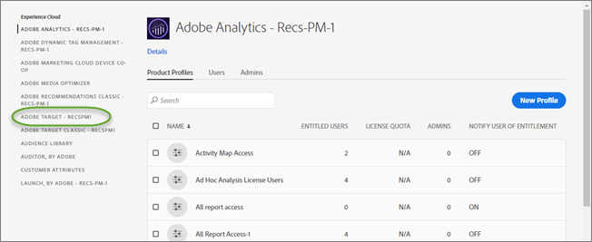
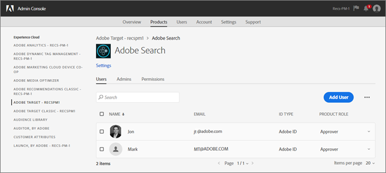

# Users

<table id="table_FD223AA7282243338769C27AC146FD51"> 
 <tbody> 
  <tr> 
   <td colname="col1"> 
 Properties and Permissions functionality is available as part of the  Target Premium solution. They are not available in  Target Standard without a  Target Premium license. 
 
You can tell whether your organization has a Standard or Premium license by clicking the  Setup link at the top of the Target UI. 
 
 
     <ul id="ul_829C5A2E317C40DDAB679A3AC9B67DC3"> 
      <li id="li_DB7A95A7929E457EACE6E8D531E36CA2"> 
<b>Target Standard Customers: </b>If you see the  Users tab ( Setup &gt;  Users), your organization has a Target Standard license. Target Standard customers should follow the instructions in this topic to add users and assign permissions in the Adobe Admin Console. 
 </li> 
      <li id="li_7DA386EFE11F4F5F82125B7E07D0145C"> 
<b>Target Premium Customers: </b>If you see the  Properties tab ( Setup &gt;  Properties), your organization has a Target Premium license. Target Premium customers should follow the instructions in <a href="../c_seting_up_target/property_channel.md#concept_E396B16FA2024ADBA27BC056138F9838" format="dita" scope="local"> Enterprise User Permissions</a> and <a href="../c_seting_up_target/property_channel/properties-overview.md#concept_22F2855DBF0D4754B9460F5D68749C71" format="dita" scope="local"> Configure Enterprise Permissions</a> to add users and assign permissions in the Adobe Admin Console. 
 </li> 
     </ul> 
 </td> 
  </tr> 
 </tbody> 
</table>

Only system admin users can add users and manage their permissions. The system admin role is assigned at the [!DNL  Experience Cloud] level. [!DNL  Experience Cloud] roles are separate from the roles managed in each solution. 

When you get started with [!DNL  Adobe Target], you will find IDs (ending in Adobe.com) pre-populated in your [!DNL  Adobe Experience Cloud] account. These IDs are for members of Adobe teams so that they can assist you with your new account and with your use of [!DNL  Adobe Target], should you need help. To get assistance, reach out to your Adobe teams in the usual way. 

You will not see the new user listed on the [!UICONTROL  Users] page until the user logs in using his or her Adobe Experience Cloud account and then logs in to [!DNL  Target Standard/Premium] by clicking the [!DNL  Target] card. 

By default all [!DNL  Target] users start with observer permissions. 

System admin users are identified in the Users list. Contact one of those system admin users if you need your access level changed. 

This section contains the following information: 

* [ Access the Adobe Admin Console](../c_seting_up_target/c_user_management.md#section_79796E0227D048F59BAE0AB02E544EBE)
* [ Add Users](../c_seting_up_target/c_user_management.md#section_A92AF0F921B743FEB9E9033433BD816A)
* [ Create User Groups](../c_seting_up_target/c_user_management.md#section_5F5CB9AA7A9F4D26953E22016DA59605)
* [ Specify Roles and Permissions](../c_seting_up_target/c_user_management.md#section_8C425E43E5DD4111BBFC734A2B7ABC80)

## Access the Adobe Admin Console {#section_79796E0227D048F59BAE0AB02E544EBE}

For tasks performed in the Adobe Admin Console, access the console by following these steps: 

1. Go to [ https://adminconsole.adobe.com/enterprise/](https://adminconsole.adobe.com/enterprise/) &gt; sign in using your Adobe ID, if you have not already logged in. 

   Or 

   If you are already logged in to the Experience Cloud, go to [ http://www.marketing.adobe.com](http://www.marketing.adobe.com/), then click the [!UICONTROL  App] icon (   ) in the top navigation bar > click **[!UICONTROL  Administration]** on the right side > then click **[!UICONTROL  Launch Admin Console]**. 

1. (Conditional) If you have access to the [!DNL  Admin Console for Enterprise] for more than one organization, click the user avatar in the right corner or the top navigation bar, then select the desired organization. 

## Add Users {#section_A92AF0F921B743FEB9E9033433BD816A}

All user management must be performed in the [!DNL  Adobe Admin Console for Enterprise]. However, all of your existing users in [!DNL  Target] will be migrated from [!DNL  Target] to the [!DNL  Admin Console for Enterprise]. 

1. [ In the Admin Console](../c_seting_up_target/c_user_management.md#section_79796E0227D048F59BAE0AB02E544EBE), click **[!UICONTROL  User Management]** > **[!UICONTROL  Users]** to create new users or to edit existing users. 

1. Follow the instructions in [ Manage Users and Groups in the Experience Cloud](https://helpx.adobe.com/enterprise/help/users.html) in the *Enterprise User Guide*. 

## Create User Groups {#section_5F5CB9AA7A9F4D26953E22016DA59605}

You can create user groups, such as Developers, Analysts, Marketers, Executives, etc., and then assign privileges across multiple Adobe products and workspaces. Assigning a new team member all the appropriate privileges across different Adobe products can be as easy as adding them to a specific user group. 

1. [ In the Admin Console](../c_seting_up_target/c_user_management.md#section_79796E0227D048F59BAE0AB02E544EBE), click **[!UICONTROL  User Management]** > **[!UICONTROL  User Groups]** to create new user groups or to edit existing groups. 

1. Follow the instructions in [ Manage Users and Groups in the Experience Cloud](https://helpx.adobe.com/enterprise/help/users.html) in the *Enterprise User Guide*. 

## Specify Roles and Permissions {#section_8C425E43E5DD4111BBFC734A2B7ABC80}

Only system admins can set user roles in Target. For example, a Standard approver user cannot change an observer to an approver, without also having Experience Cloud Admin rights. 

System admin users must add users to the system. Users are not automatically added. They are invited by email from the Experience Cloud and must confirm their email addresses before their accounts are registered. 

1. [ In the Admin Console](../c_seting_up_target/c_user_management.md#section_79796E0227D048F59BAE0AB02E544EBE), click **[!UICONTROL  Products]**, then select the name of the desired product. 

    

1. Click the name of the desired configuration. 

1. Click **[!UICONTROL  Configuration Users]**. 

   The [!UICONTROL  Configuration Users] tab displays all of the users in that workspace. 

    

1. Select the desired permissions role (Observer, Editor, or Approver) by using the drop-down list for each user in the [!UICONTROL  Product Role] column. 

<table id="table_92B2935FEB0A4DFEAC24C074EDEBD409"> 
 <thead> 
  <tr> 
   <th colname="col1" class="entry"> Role </th> 
   <th colname="col2" class="entry"> Description </th> 
  </tr>
 </thead>
 <tbody> 
  <tr> 
   <td colname="col1"> 
Observer 
 </td> 
   <td colname="col2"> 
Can view activities, but cannot create or edit them. 
 </td> 
  </tr> 
  <tr> 
   <td colname="col1"> 
Editor 
 </td> 
   <td colname="col2"> 
Can create and edit activities before they are live, but cannot approve the launch of an activity. 
 </td> 
  </tr> 
  <tr> 
   <td colname="col1"> 
Approver 
 </td> 
   <td colname="col2"> 
 Can create, edit, and activate or stop activities. 
 </td> 
  </tr> 
 </tbody> 
</table>

For more information, see [ Manage Product Permissions and Roles in the Admin Console](https://helpx.adobe.com/enterprise/help/manage-permissions-and-roles.html) in the *Enterprise User Guide*. 
