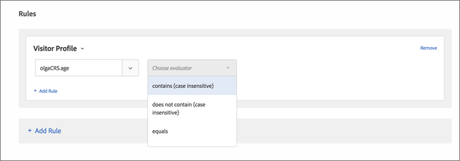

# Creating a Profile Attribute Comparison Audience

>[!NOTE]
>
>This functionality is available for the[ Visitor Profile](c_visitor_profile.md#concept_E972690B9A4C4372A34229FA37EDA38E) category only. 

Audiences are defined by rules that determine who is included or excluded from a Target activity. An audience definition can include multiple rules, and each rule can include multiple parameters. If one of the rules you include uses the Visitor Profile category, you can define a rule based on a visitor profile attribute’s specific value or compare the value of that attribute to another visitor profile attribute. 

For example, let’s assume you work for a furniture company and uploaded two customer propensity scores into Target: 

* Likelihood to buy dining room furniture in the next 90 days 

* Likelihood to buy living room furniture in the next 90 days 

You could create an audience defined as the propensity to buy dining room furniture is greater than the propensity to buy living room furniture. Target would then dynamically compare the dining room and living room propensity scores for a specific visitor to determine if that visitor qualifies for this audience. 

For more information, see [ Methods to get Data into Target](c_methods-to-get-data-into-target.md#concept_0069C0EFB56C4700BB33F2F35C2B9B17). 

**To create a profile attribute comparison audience:** 

1. Click ** [!UICONTROL  Audiences] ** > ** [!UICONTROL  Create Audience] ** > ** [!UICONTROL  Add Rule] ** > ** [!UICONTROL  Visitor Profile] **. 

1. From the ** [!UICONTROL  Visitor Profile] ** drop-down list, choose an attribute: 

    

1. Choose your Evaluator: 

    

1. From the ** [!UICONTROL  Choose Comparison Type] ** drop-down list, choose ** [!UICONTROL  Attribute] **. 

   The "static value" comparison type lets you compare your visitor profile attribute to specific value(s). 

    

   >[!NOTE]
   >
   >If you are using one of the default visitor profile categories in Step 1 (for example, New Visitor or Returning Visitor), you can choose only the static value option. The dynamic comparison options are not available for default categories. Other examples where the dynamic comparison options are not available include "First page of session," "Not in other tests," "Not first page of session," and "Category Affinity."

1. Choose the additional attribute you want to compare to your initial attribute. 

   For example, if the "Kitchen" attribute score for a specific visitor is greater than the score for "Decor," then that visitor would be included in this audience. 

    

