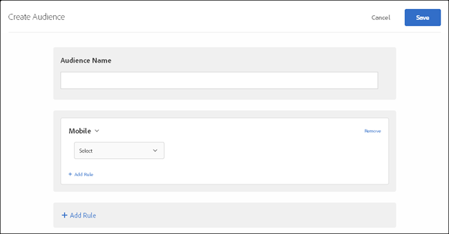

# Mobile

For example, you might want to show different content to users who enter your page from a phone than you would if they visit from a computer. In that case, you could select the Mobile audience, then select the ** [!UICONTROL  Is Mobile Phone] ** option, then add any specific details that are important to you, such as the type of phone, size of the screen (in pixels), and so on. 

Mobile targeting is delivered by [ DeviceAtlas](https://deviceatlas.com/device-data/user-agent-tester), a service of DotMobi. DeviceAtlas is a comprehensive database of mobile devices built on data compiled from numerous sources, including manufacturers and network operators. This data is then verified, cross-referenced, and validated to build a large and accurate mobile device database available. 

Device detection is accomplished by analyzing User-Agent strings. Some device manufacturers, such as Apple, disable this functionality by not providing enough information in the UA. 

For example, Apple devices don't share device model-specific tokens in the UA. The result is that it is not possible to detect iPhone models (such as iPhone 5S, iPhone SE, iPhone 6, and so forth) using a simple keyword-based method. 

To solve this, Target collects additional data to accurately detect iPhones and other Apple devices using the following parameters: 

<table id="table_6349A969CE7249E8BCF70CB6625DCA1A"> 
 <thead> 
  <tr> 
   <th colname="col1" class="entry"> Parameter </th> 
   <th colname="col2" class="entry"> Type </th> 
   <th colname="col3" class="entry"> Description </th> 
  </tr>
 </thead>
 <tbody> 
  <tr> 
   <td colname="col1"> 
devicePixelRatio 
 </td> 
   <td colname="col2"> 
String 
 </td> 
   <td colname="col3"> 
Ratio between physical pixels and device-independent pixels (dips) on the browser. 
 
e.g “1.5” or “2” 
 </td> 
  </tr> 
  <tr> 
   <td colname="col1"> 
screenOrientation 
 </td> 
   <td colname="col2"> 
String 
 </td> 
   <td colname="col3"> 
The device and the browser's JavaScript engine support Device Orientation. Can be Landscape or Portrait. 
 </td> 
  </tr> 
  <tr> 
   <td colname="col1"> 
webGLRenderer 
 </td> 
   <td colname="col2"> 
String 
 </td> 
   <td colname="col3"> 
Browser renderer of the graphics driver. 
 </td> 
  </tr> 
 </tbody> 
</table>

>[!NOTE]
>
>Customers using the Mobile SDK do not need to do anything to leverage this functionality. Customers using ` at.js` must [upgrade to ` at.js` version 1.5.0](../../../c_seting_up_target/c_implementing_target/c_target-atjs-implementation/r_target-atjs-versions.md#reference_DBB5EDB79EC44E558F9E08D4774A0F7A) (or later). 

You can choose more than one mobile device property. Multiple selections are joined with an OR. 

Customers who are using a custom integration (not using at.js or the Mobile SDK) can collect these parameters themselves and pass them as mbox parameters. 

1. In the [!DNL  Target] interface, click ** [!UICONTROL  Audiences] ** > ** [!UICONTROL  Create Audience] **. 

1. Name the audience. 

1. Click ** [!UICONTROL  Add Rule] ** > ** [!UICONTROL  Mobile] **. 

    

1. Click ** [!UICONTROL  Select] **, then select one of the following options: 

    * Device Marketing Name 

    * Device Model 

    * Device Vendor 

    * Is Mobile Device 

    * Is Mobile Phone 

    * Is Tablet 

    * OS 

    * Screen Height (px) 

    * Screen Width (px) 

   >[!NOTE]
   >
   >You can target by mobile device carrier using the[ Geo settings](../../../c_target/c_audiences/c_target_rules/c_geo.md#concept_5B4D99DE685348FB877929EE0F942670). 

1. (Optional) Click ** [!UICONTROL  Add Rule] ** and set up additional rules for the audience. 

1. Click ** [!UICONTROL  Save] **. 

This video includes information about using audience categories. 

<table id="table_A3A70CC0C9F54131BB9F098B4DA8C9D6"> 
 <thead> 
  <tr> 
   <th class="entry" colspan="2"> Creating Audiences </th> 
   <th colname="col3" class="entry"> 9:58 </th> 
  </tr>
 </thead>
 <tbody> 
  <tr> 
   <td colspan="2"> 
    
 
     <iframe src="https://www.youtube.com/embed/wV9lVTSOxMk/" frameborder="0" webkitallowfullscreen="true" mozallowfullscreen="true" oallowfullscreen="true" msallowfullscreen="true" allowfullscreen="allowfullscreen" scrolling="no" width="550" height="345">https://www.youtube.com/embed/wV9lVTSOxMk/</iframe>
    
 </td> 
   <td colname="col3"> 
 
     <ul id="ul_FF4FEC7BC7A34461BAA54FBE18A8E63B"> 
      <li id="li_7D6D4CB2E771430F84D2B658F8611532">Create audiences </li> 
      <li id="li_8529CB01E80B4C89B74287882AE0DA9D">Define audience categories </li> 
     </ul> 
 </td> 
  </tr> 
 </tbody> 
</table>

