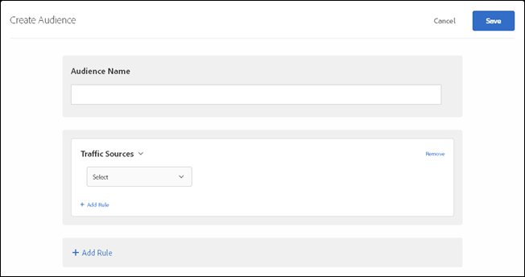

# Traffic Sources

For example, you can target based on the visitor's browser, search engine, or the referring landing page. The referring landing page is the page you clicked from to reach the current site this session. (For example, if you click an ad on Google and it leads you to the ` adobe.com` home page, the referring landing page is ` google.com`.) 

You can combine multiple traffic sources to create a complex targeting rule. 

1. In the [!DNL  Target] interface, click ** [!UICONTROL  Audiences] ** > ** [!UICONTROL  Create Audience] **. 

1. Name the audience. 

1. Click ** [!UICONTROL  Add Rule] ** > ** [!UICONTROL  Traffic Sources] **. 

    

1. Click ** [!UICONTROL  Select] **, then select one of the following options: 

    * From Baidu
    * From Bing
    * From Google
    * From Yahoo
    * Referring Landing Page: URL
    * Referring Landing Page: Domain
    * Referring Landing Page: Query

1. (Optional) Click ** [!UICONTROL  Add Rule] ** and set up additional rules for the audience. 

1. Click ** [!UICONTROL  Save] **. 

You can target users who are referred to your site by a specific search engine or from a specific landing page. 

This video includes information about using audience categories. 

<table id="table_A3A70CC0C9F54131BB9F098B4DA8C9D6"> 
 <thead> 
  <tr> 
   <th class="entry" colspan="2"> Creating Audiences </th> 
   <th colname="col3" class="entry"> 9:58 </th> 
  </tr>
 </thead>
 <tbody> 
  <tr> 
   <td colspan="2"> 
    
 
     <iframe src="https://www.youtube.com/embed/wV9lVTSOxMk/" frameborder="0" webkitallowfullscreen="true" mozallowfullscreen="true" oallowfullscreen="true" msallowfullscreen="true" allowfullscreen="allowfullscreen" scrolling="no" width="550" height="345">https://www.youtube.com/embed/wV9lVTSOxMk/</iframe>
    
 </td> 
   <td colname="col3"> 
 
     <ul id="ul_FF4FEC7BC7A34461BAA54FBE18A8E63B"> 
      <li id="li_7D6D4CB2E771430F84D2B658F8611532">Create audiences </li> 
      <li id="li_8529CB01E80B4C89B74287882AE0DA9D">Define audience categories </li> 
     </ul> 
 </td> 
  </tr> 
 </tbody> 
</table>

