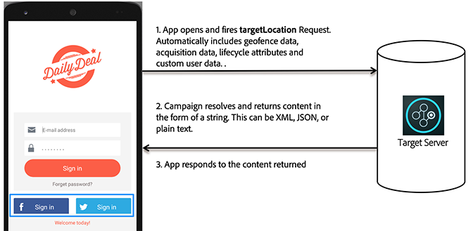

# How Target Works in Mobile Apps

## Target Locations and Success Metrics {#section_A08AAB0ABA9C4568A5AFD4D27EF1CE74}

A *target location* is also referred to as an [ mbox](c_mboxes.md#concept_85E01D9DD0B64BD3A138C2D3DB83BD57). An identified location in the app is enabled for testing or personalization (for example, the welcome message on the home screen). These locations are identified during the test creation process. 

A *[ success metric](r_success_metrics.md#reference_D011575C85DA48E989A244593D9B9924)* is an action performed by the user that identifies if a specific activity was successful (such as signing up, making a purchase, booking a ticket, and so on). 

 

* **Target Location:** The content that shows below the register button. This particular user is offered free shipping until 6 PM. This location can be reused across multiple Target activities to run A/B tests and personalization. 

* **Success Metric:** The action performed by the user where the user taps the register button.

**Understand How Target Works in the SDK** 

 
