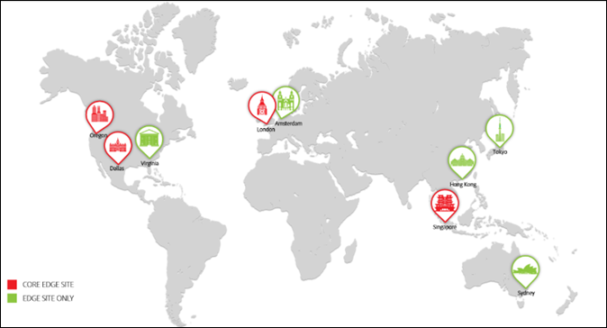

# The Edge Network

To improve response times, Edge environments house only activity logic and cached profile and offer information. Activity and content databases, [!DNL  Analytics] data, APIs, and marketer user interfaces are housed in Adobe’s central data environments. Updates are then sent to the Edge nodes. The central environments and Edge nodes are automatically synched to continually update cached activity data. 1:1 modeling is also stored at each edge, so those more complex requests can also stay on the Edge. 

Each Edge node has all the information required to respond to the user's content request, and track analytics data on that request. User requests are routed to the nearest Edge node. 

 

Core Edge site locations contain both a data collection center and a data processing center. Edge site locations contain only a data collection center. Each report suite is assigned to a specific data processing center. 

Adobe currently has data centers on several continents, including multiple regional locations across North America, Europe, and Asia. 

Rather than respond to all targeting requests from a single location, requests from the Edge environment closest to the point of request mitigate the impact of network/Internet travel time. 

The network also serves as a fail-over mechanism. If one edge node is not functioning, the request is redirected to the next nearest node, to ensure that the user is not served default content (a typical backup response when a request cannot be completed). 
