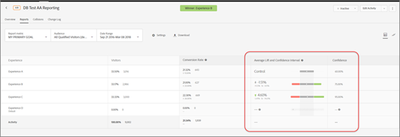

# Average Lift, Lift Bounds, and Confidence Interval

## Average Lift, Lift Bounds, and Confidence Interval {#topic_AFFDC672A8A34D028B100EF6BE5D8129}
>Reports include several data points and visualization representations that help you understand the lift bounds and confidence level associated with your activity. This helps you more accurately determine a winner.
>[!NOTE]
>
>This feature is available only when viewing reports in Table View. This feature is not available for activities that use[ Analytics as the reporting source (A4T)](../c_integrating_target_with_mac/a4t.md#concept_7540C8C04259434AB6EE33B09F47A1DE). 

This section contains the following information: 

* [ Overview](../c_reports/c_report-settings/average-lift-bounds-and-confidence-interval.md#section_62C0D7E76F3D49A7B3C371C82AEF27D5) 

* [ How are Lift Bounds Calculated?](../c_reports/c_report-settings/average-lift-bounds-and-confidence-interval.md#section_1D360781D972483693680BE0F07AEAD1) 

* [ Example Calculation](../c_reports/c_report-settings/average-lift-bounds-and-confidence-interval.md#section_35BD6FB7AFD346E28BA093147C248471) 

* [ When Are Lift Bounds Not Displayed?](../c_reports/c_report-settings/average-lift-bounds-and-confidence-interval.md#section_C5622E1E94684DAD937249B51A9E42CC) 

## Overview {#section_62C0D7E76F3D49A7B3C371C82AEF27D5}

The lift information in the Target reporting UI includes: 

<table id="table_38374EAB34604728AB3495EBDB9078DB"> 
 <thead> 
  <tr> 
   <th colname="col1" class="entry"> Element </th> 
   <th colname="col2" class="entry"> Details </th> 
  </tr>
 </thead>
 <tbody> 
  <tr> 
   <td colname="col1"> 
Lift 
 </td> 
   <td colname="col2"> 
The large number and arrow reflect the expected value of the lift. This number is the midpoint of the range of the lift bounds. The expected lift arrow displays in grey until the confidence passes 95%. After this threshold, the arrow displays as red or green based on negative or positive lift, respectively. 
 </td> 
  </tr> 
  <tr> 
   <td colname="col1"> 
Lift Bounds 
 </td> 
   <td colname="col2"> 
This is the 95% confidence interval of the lift. It displays as a range below the average lift. See <a href="../c_reports/c_report-settings/average-lift-bounds-and-confidence-interval.md#section_35BD6FB7AFD346E28BA093147C248471" format="dita" scope="local"> Example Calculation</a> for an example of how these lift bounds are calculated. 
 </td> 
  </tr> 
  <tr> 
   <td colname="col1"> 
Boxplot Graph 
 </td> 
   <td colname="col2"> 
The boxplot graph in the Target interface represents the expected value and 95% confidence interval of the success metric in question. Think of it as a graphical way to view the lift and lift bounds information. 
 
There are a few key ways Target helps you interpret the confidence information, one of which is color. The graph displays any overlap in the confidence interval of a specific experience with the confidence interval of the control in grey, and any range of a specific experience’s confidence interval that is above or below that of the control confidence interval as green or red, respectively. 
 
The length of the boxplot bar represents how large the confidence interval is in an easily understood way. As you collect more data in your activity, the bar shifts and changes. The confidence interval is derived from the variance and the sample size (number of visitors). The smaller the variance and the larger the sample size, the narrower your confidence interval. 
 </td> 
  </tr> 
  <tr> 
   <td colname="col1"> 
Confidence 
 </td> 
   <td colname="col2"> 
The confidence of an experience or offer represents the probability that the lift of the associated experience/offer over the control experience/offer is “real” (not caused by random chance). Typically, 95% is the recommended level of confidence for the lift to be considered significant. 
 </td> 
  </tr> 
 </tbody> 
</table>

The following illustration shows Lift Bounds and Confidence Level information: 

 

## How are Lift Bounds Calculated? {#section_1D360781D972483693680BE0F07AEAD1}

The lift bounds represent the 95% confidence intervals of the lift that the specific experience or offer has over the control experience or offer. Loosely speaking, it means the actual lift has about a 95% chance of being between these bounds. 

The lift bounds are calculated using the following formula: 

 

There is some additional calculation to arrive at the input to our lift bounds: 

* **t-value: **The critical statistic for our 95% confidence level is 1.96. You can learn more about [ t-values here](https://en.wikipedia.org/wiki/T-statistic). 

* **Lift Variance: **The Standard Error of Experience N’s success metric and the Standard Error of the Control Experience’s success metric are needed to determine the lift variance, which is calculated using the following formula (illustrated in the case the success metric is conversion). 

   

* **Conversion Rate / Success Metric Standard Error: **Standard error is calculated in the same way for Experience N and the Control, using the following formula (illustrated in the case the success metric is conversion). You can learn more about [ standard error here](https://en.wikipedia.org/wiki/Standard_error). 

   

  >[!NOTE]
  >
  >The standard error for revenue success metric activities is based on the sample variance of the revenue.

## Example Calculation {#section_35BD6FB7AFD346E28BA093147C248471}

Let’s consider an example activity with two experiences and the following results: 

<table id="table_484C2AC096034CCDB1223D5216C28277"> 
 <thead> 
  <tr> 
   <th colname="col1" class="entry"> Experience </th> 
   <th colname="col2" class="entry"> Visitors </th> 
   <th colname="col3" class="entry"> Conversions </th> 
   <th colname="col4" class="entry"> Conversion Rate </th> 
  </tr>
 </thead>
 <tbody> 
  <tr> 
   <td colname="col1"> 
Experience A (Control) 
 </td> 
   <td colname="col2"> 
219, 328 
 </td> 
   <td colname="col3"> 
2,466 
 </td> 
   <td colname="col4"> 
1.12% 
 </td> 
  </tr> 
  <tr> 
   <td colname="col1"> 
Experience B 
 </td> 
   <td colname="col2"> 
218, 362 
 </td> 
   <td colname="col3"> 
3,040 
 </td> 
   <td colname="col4"> 
1.39% 
 </td> 
  </tr> 
 </tbody> 
</table>

Based on our formulas, we can calculate the inputs we need for the lift bounds. 

**Standard Error for Experience A (Control)** 

 

**Standard Error for Experience B** 

 

**Lift Variance for Experience B** 

 

**Lift Bounds for Experience B** 

Expected Lift for Experience B: 

 

Therefore, the lift bounds for Experience B would be: 

 

## When Are Lift Bounds Not Displayed? {#section_C5622E1E94684DAD937249B51A9E42CC}

In certain cases, Target does not display lift bounds: 

* For any activity, when the total number of visits or visitors is fewer than 30. 

* For Auto-Allocate activities, no lift bounds are displayed until one experience has attained 60% confidence. 

